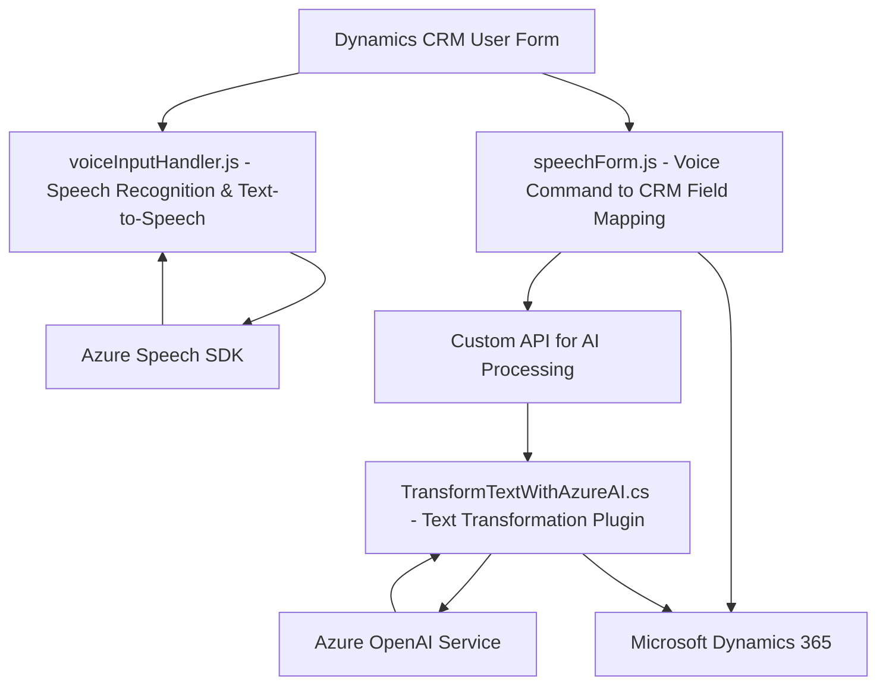

### Breve Resumen Técnico

El repositorio describe una solución que combina frontend basado en Javascript y plugins desarrollados en C# para la integración con Microsoft Dynamics 365, mediante APIs de Azure Speech y Azure OpenAI. El enfoque general está alineado con la automatización de procesos empresariales y reconocimiento de voz en formularios de Dynamics 365 con opciones de inteligencia artificial.

---

### Descripción de la Arquitectura

La solución se organiza en módulos independientes destinados a sus respectivos dominios, lo cual es indicativo de una **arquitectura modular de estilo n-capas**:

1. **Capa de Interfaz de usuario (UI)**: Los archivos en el directorio `FRONTEND/JS` representan la integración de la solución con la interfaz de Dynamics 365, proporcionando funcionalidades avanzadas basadas en reconocimiento de voz y síntesis de texto a voz.
  
2. **Capa de Servicios**: El uso de servicios externos como Azure Speech y Azure OpenAI organiza las funciones específicas de síntesis de texto a voz y procesamiento semántico de texto.
   
3. **Capa de Integración con CRM**: El plugin C# en el directorio `Plugins` actúa como mediador entre los datos de Dynamics 365 y los servicios de procesamiento externo, siguiendo un enfoque de SOA (Service-Oriented Architecture).

4. **Elementos de Adaptadores y Facade**: Reflejado en varios niveles, con funciones en `voiceInputHandler.js` y el plugin `TransformTextWithAzureAI`. Son utilizados para interactuar con APIs externas (Azure Speech y Azure OpenAI).

Globalmente, la solución sigue los principios de separación de responsabilidades, delegación de tareas y modularidad.

---

### Tecnologías utilizadas

1. **Frontend:**
   - **JavaScript**: Programación dinámica y modular.
   - **Dynamics 365 JavaScript API**: Contextos del formulario (`executionContext`), uso de atributos y controles.
   - **Ajax/Fetch**: Comunicación con APIs como Azure Speech y Azure OpenAI.

2. **Backend:**
   - **C#/.NET Framework**: Desarrollo de plugins para Microsoft Dynamics 365.
   - **Microsoft.Xrm.Sdk** y **Query**: Extensiones y servicios para la integración directa con CRM.
   - **System.Net.Http** y **System.Text.Json**: Para interactuar con APIs externas, incluido el entorno de Azure.

3. **Servicios Externos:**
   - **Azure Speech SDK**: Reconocimiento de voz y síntesis de texto a voz.
   - **Azure OpenAI Service**: Transformación de texto regular a estructuras escalables en JSON.

4. **Design Patterns:**
   - **Facade Pattern**: Simplifica la interacción con APIs complejas como Azure Speech y Azure OpenAI.
   - **Delegación de Tareas**: Modularización mediante funciones específicas por responsabilidad.
   - **Command Pattern (C# Plugin)**: Implementación del método `Execute` dentro del flujo de Dynamics CRM.

---

### Diagrama Mermaid válido para GitHub Markdown

---

### Análisis de Solución

1. **Tipo de solución:** La solución está diseñada para habilitar un flujo empresarial que combina una **integración* de frontend con Dynamics CRM y la comunicación con servicios externos de Azure. Esto está específicamente destinado al manejo de formularios y comandos mediante **reconocimiento de voz** y **texto a voz**, y al procesamiento basado en inteligencia artificial para manipulación de datos.

2. **Tecnologías, frameworks y patrones utilizados:** 
   - **Frontend tecnológicamente ligado a Dynamics 365** para la interacción con formularios y atributos.
   - **Azure Speech SDK** y **Azure OpenAI** para síntesis de voz y procesamiento avanzado de texto.
   - **Patrón Façade** para encapsular la complejidad de las interfaces API.
   - **Arquitectura SOA** con microservicios y plugins para conectar diferentes procesos y ecosistemas.

3. **Arquitectura:** Modular con estilo **n-capas**, incluyendo:
   - **Frontend (UI)** para entrada/salida de usuarios.
   - **SERVICIOS API** (Azure Speech/AI y Custom APIs).
   - **BACKEND INTEGRADO**: Interacción a través de plugins con Dynamics CRM.

4. **Dependencias externas:** 
   - Azure Speech SDK.
   - Azure OpenAI Service.
   - Dependencias relacionadas con Dynamics CRM (`Microsoft.Xrm.Sdk`, `Query`, etc.)
   - HTTP requests para integración con APIs.

---

### Conclusión Final

La solución es una combinación bien organizada de integración con Dynamics CRM y servicios habilitados por Azure para inteligencia artificial y procesamiento de voz. Opta por patrones de diseño sólidos (Facade, SOA, y Command Pattern), emplea la estructura modular de n-capas, y aprovecha tecnologías clave como el SDK de Azure Speech y OpenAI.

Para una mayor seguridad y escalabilidad, se recomienda gestionar las claves de acceso a servicios externos mediante variables de entorno y considerar una capa de manejo de excepción más robusta, especialmente en el plugin de C#.