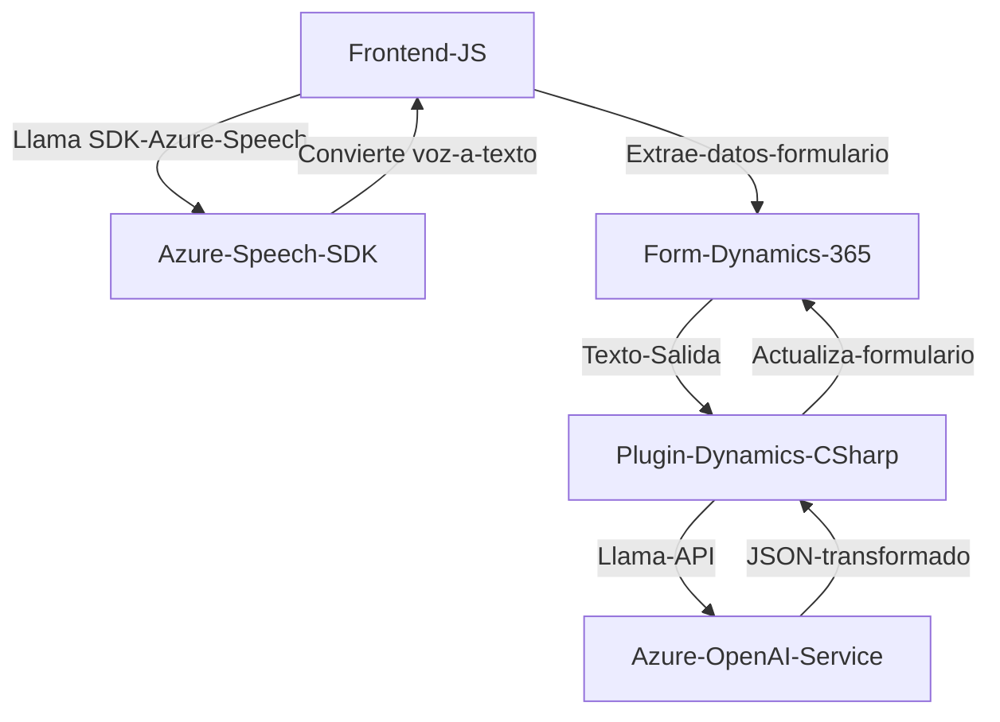

## Breve resumen técnico

El repositorio representa elementos relacionados con una solución que integra funcionalidades de entrada, procesamiento y salida de datos de Dynamics 365 utilizando diversas tecnologías externas, como **Azure Speech SDK** y **Azure OpenAI API**. La implementación está distribuida entre funcionalidades para frontend (JavaScript) y plugins de Dynamics CRM (C#).

---

## Descripción de arquitectura

### Tipo de solución
La solución es una combinación de sistemas:
1. **Frontend interactivo**: Gestiona entrada por voz, manipulación de formularios y procesamiento de texto.
2. **Extensión en Dynamics 365**: Amplía la funcionalidad dinámica mediante un plugin basado en C#, que utiliza Azure OpenAI para manipulación avanzada de datos.

### Arquitectura
La solución adopta un enfoque **modular** con componentes desacoplados que interactúan con servicios externos (Speech SDK y OpenAI API). Los siguientes patrones se encuentran:
1. **N capas**:
   - **Presentación (JS)**: Interacción con el usuario (entrada de voz, extracción de datos visibles).
   - **Negocio (Plugins)**: Procesamiento y transformación de datos.
   - **Acceso a datos**: Interacción con Dynamics 365 API para leer/escribir en formularios y llamar a APIs externas.
2. **Hexagonal / Ports & Adapters**:
   - El plugin con Azure OpenAI encapsula la lógica de negocio y su integración con servicios externos según reglas predefinidas.
   - El frontend también delega tareas específicas a SDKs externos, manteniendo una interfaz desacoplada.

### Tecnología utilizada
#### **Frontend (JavaScript):**
- **Dynamics 365 API** para manipulación de formularios y llamadas a la API personalizada.
- **Azure Speech SDK** para entrada de voz y síntesis.
- **Async/Await**: Para control de flujo asíncrono.

#### **Backend (C# Plugin):**
- **Dynamics CRM SDK**: Gestión del contexto de ejecución.
- **Azure OpenAI API**: Procesamiento avanzado de texto.
- **HttpClient**: Para comunicación de red.
- **Newtonsoft.Json / System.Text.Json**: Serialización y deserialización de JSON.

---

## Dependencias y componentes externos
1. **Azure Speech SDK**: Cargado dinámicamente en el frontend para entrada/salida de voz.
2. **Azure OpenAI API**: Para interpretación avanzada de texto transformado en el plugin.
3. **Dynamics 365 SDK**:
   - Form API: Acceso a datos y lógica en formularios.
   - Custom API: Llamadas a endpoints definidos en Dynamics 365.
4. **Bibliotecas de terceros (C#)**:
   - **Newtonsoft.Json**, **System.Text.Json**: Formateo de datos para Azure APIs.
   - **HttpClient**: Manejo de peticiones externas.

---

## Diagrama **Mermaid**

---

## Conclusión final

La solución es una implementación especializada para extender la funcionalidad de Dynamics 365 mediante servicios avanzados de IA y entrada por voz. El diseño sigue patrones de modularidad y desacoplamiento, lo que facilita la integración con SDKs y APIs externas (Azure Speech y OpenAI). La arquitectura n-capas con elementos de Hexagonal Architecture asegura separación de conceptos y escalabilidad. Es una solución adecuada para entornos corporativos que requieren ampliación de datos interactivos y procesamiento inteligente directo integrado en su CRM.