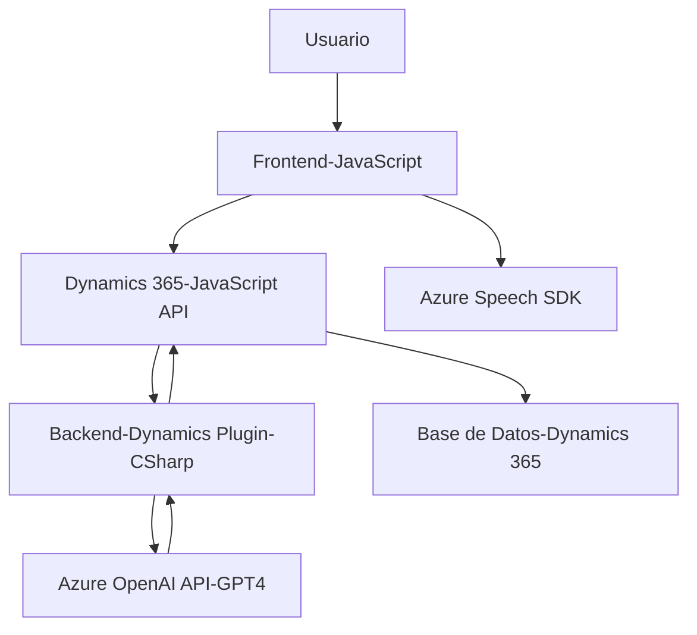

### Breve resumen técnico

El repositorio contiene archivos relacionados con diferentes componentes de una solución orientada a la interacción entre usuarios y formularios mediante voz, texto y servicios de inteligencia artificial. La solución utiliza tecnologías de Microsoft Azure Speech SDK y Azure OpenAI integradas con la plataforma Dynamics 365 CRM. El sistema parece estar diseñado para ayudar a los usuarios a interactuar de manera más eficiente con los formularios, permitiendo captura de datos y transformación de texto mediante reconocimiento de voz, síntesis de voz y procesamiento de texto.

---

### Descripción de la arquitectura

La arquitectura combina tres componentes principales:
1. **Frontend (JavaScript):** Los archivos `readForm.js` y `speechForm.js` implementan funciones para la interacción del usuario con formularios mediante reconocimiento y síntesis de voz. Incluyen lógica modular de captura de datos y mapeo de valores desde y hacia los atributos del formulario. Estas funcionalidades cargan dinámicamente librerías externas como el Azure Speech SDK y procesan los datos del formulario.
2. **Backend/Plugin (C#):** El archivo `TransformTextWithAzureAI.cs` implementa un plugin de Dynamics CRM que usa el servicio Azure OpenAI para transformar texto en JSON estructurado. Se conecta a Dynamics CRM mediante la arquitectura de plugins y utiliza APIs externas para la integración con Azure.
3. **External Services:** Se integran servicios externos como Azure Speech SDK y Azure OpenAI. Esto permite realizar tanto reconocimiento y síntesis de voz como procesamiento avanzado de texto hablado, utilizando APIs de inteligencia artificial.

Por lo tanto, la arquitectura sigue un enfoque híbrido **Service-Oriented Architecture (SOA)**, en donde el backend y el frontend están desacoplados, pero trabajan junto con servicios externos de Azure y Dynamics CRM. Aunque estas son piezas integradas, la presencia de un plugin y APIs sugieren una posible evolución hacia microservicios en el futuro.

---

### Tecnologías y herramientas utilizadas

1. **Frontend:**
   - **JavaScript:** Desarrollo basado en funciones para interactuar con los formularios y sintetizar texto con Azure Speech SDK.
   - **Azure Speech SDK:** Reconocimiento y síntesis de voz en tiempo real.
   - **Dynamics 365 JavaScript API (`Xrm.WebApi`):** Gestión de datos y comunicaciones con APIs personalizadas en Dynamics CRM.
   - **Patrones arquitectónicos:**
     - Modularización: Funciones independientes para facilitar la reutilización y el aislamiento lógico.
     - Lazy Loading: Carga dinámica del SDK de Azure solo si no está presente.

2. **Backend:**
   - **C# en Plugins de Dynamics CRM:** Extensión plug-and-play para ejecutar lógica personalizada.
   - **Azure OpenAI API:** Transformación y comprensión de texto con inteligencia artificial (GPT-4).
   - **Patrones arquitectónicos:**
     - Integración de servicios: Lógica diseñada para interactuar con APIs externas mediante servicio REST.
     - Dependency Injection: Uso de servicios de Dynamics para trabajar en un entorno desacoplado.

3. **Servicios externos:**
   - **Azure Speech SDK:** Tecnología de Microsoft para reconocimiento y síntesis de voz.
   - **Azure OpenAI API:** Procesa texto y realiza transformaciones usando el modelo GPT-4.

---

### Diagrama Mermaid válido para GitHub

### Conclusión final

La solución analizada es una integración de un **Frontend basado en JavaScript** junto a un **Backend basado en Plugins de Dynamics CRM** que interactúan con servicios de **Azure Speech SDK** y **Azure OpenAI API**. La arquitectura es híbrida (SOA) y está orientada a conectar módulos funcionales con APIs externas y servicios de inteligencia artificial para la interacción con usuarios, mediante reconocimiento de voz y transformación de texto.

Aunque la arquitectura actual es modular, hay oportunidad de evolucionarla hacia **microservicios** para un mayor aislamiento y escalabilidad. Además, podría beneficiarse del uso más explícito de patrones como Factory para el manejo de dependencias y Adapter para integraciones externas, lo que haría que el código sea más robusto y escalable para entornos complejos.