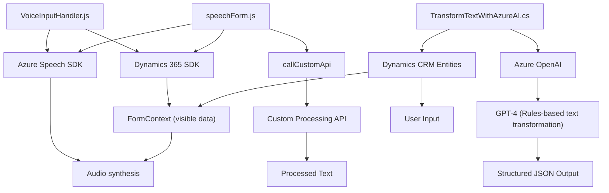

# Análisis Técnico

## Breve Resumen Técnico
El repositorio contiene tres archivos principales que giran en torno a la integración de Microsoft Dynamics 365 con servicios en la nube de Azure, para el procesamiento de formularios mediante voz, texto, y transformación avanzada usando IA. La solución incluye capacidades como síntesis y reconocimiento de audio, integración con APIs personalizadas, y procesamiento y transformación dinámica de datos. Técnicamente, la solución mezcla frontend con plugins de backend para extender funcionalidades específicas de Dynamics CRM.

---

## Descripción de Arquitectura
### Tipo de Solución
- **Combinación de Frontend y Plugins de Backend personalizados.**  
El código ofrece una lógica centrada en la interacción de usuarios con formularios dinámicos mediante voz y texto, junto con procesamiento en segundo plano por medio de un plugin que interactúa con Azure OpenAI para transformación avanzada, creando una solución híbrida.

### Arquitectura Detectada
1. **Frontend:**
   - Modular con funciones y clases JavaScript organizadas (n niveles según las funcionalidades).
   - Client-side scripting con integración directa del Azure Speech SDK y de Dynamics 365.
   
2. **Backend Plugin:**
   - Arquitectura tipo **Plugin CRM** basada en la interfaz `IPlugin`.
   - Acoplado a reglas de negocio y APIs externas (Azure OpenAI) ejecutadas bajo demanda cuando ciertas entidades de CRM interactúan, siguiendo el patrón RESTful.

En conjunto, esta solución tiene una **arquitectura híbrida basada en capas**, con integración fuerte entre frontend dinámico, backend basado en lógica CRM, y servicios externos que potencian capacidades inteligentes.

---

## Tecnologías y Frameworks Utilizados
1. **Frontend:**
   - **JavaScript:** Base principal con funciones y métodos para lógica del cliente.
   - **Azure Speech SDK:** Para síntesis y reconocimiento de voz.
   - **Dynamics 365 SDK:** Interacción con formularios y datos de CRM.
   
2. **Backend Plugin:**
   - **C# (.NET Framework):** Backend desarrollado como plugins de Dynamics CRM.
   - **Azure OpenAI:** API REST para procesamiento inteligente del lenguaje con GPT-4o.
   - **Newtonsoft.JSON y System.Text.Json:** Manejo de datos estructurados en JSON.
   - **System.Net.Http:** Comunicación HTTP con servicios externos.

---

## Dependencias o Componentes Externos
1. **Azure Speech SDK:** Procesamiento de voz en frontend.
2. **Dynamics 365 SDK:** Base de interacción con formularios y entidades del CRM.
3. **Azure OpenAI:** Procesamiento avanzado de lenguaje natural con GPT-4o.
4. **Custom API (speechForm.js):** API externa que procesa texto transcrito.
5. **Potential Lookup APIs in Dynamics CRM:** Para resolver referencias relacionadas a entidades de tipo lookup.

---

## Diagrama Mermaid

---

## Conclusión Final
La solución en este repositorio es una implementación avanzada pero robusta de interacción entre formularios de Dynamics CRM y servicios en la nube, aprovechando tanto capacidades de Azure Speech como OpenAI. La arquitectura utiliza módulos bien definidos en frontend para entrada y salida de voz, apoyados por plugins backend para lógica avanzada de negocio. Aunque funcional, podrían introducirse mejoras como manejar claves sensibles a través de variables de entorno y optimizar el diseño para una mayor desacoplación entre capas.