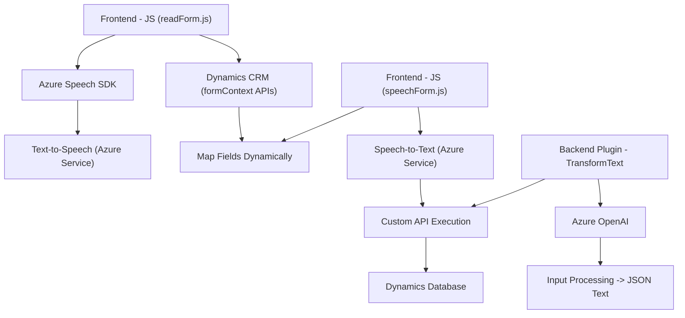

### Breve resumen técnico

El repositorio combina tecnologías relacionadas con voz, texto y APIs corporativas en un entorno Dynamics CRM. Los archivos mencionados muestran diversas funciones y plugins para manejar voz como entrada o salida con Azure Speech SDK y para transformar texto mediante Azure OpenAI. Se utiliza una arquitectura modular enfocada en la integración con Dynamics CRM, APIs externas (Azure), y manejo dinámico del contexto de un entorno empresarial.

---

### Descripción de arquitectura

La solución articula tres elementos principales:
1. **Frontend (arquitectura en capa)** basado en archivos `JS`:
   - Implementa lógica de negocio para convertir texto de formularios en voz (lectura) o, inversamente, extrapolar datos de la voz para asignarlos dinámicamente a formularios en Dynamics CRM usando Azure Speech SDK.
   - Combina modularidad y delegación de responsabilidades.

2. **Backend - Dynamics CRM Plugin (basado en extensiones plugin)**:
   - Utiliza la plataforma de **Dynamics CRM** para extender escenarios específicos con lógica personalizada.
   - El plugin transforma texto en JSON estructurado con integración directa a Azure OpenAI.

3. **Dependencias como servicios externos**:
   - Azure Speech SDK: Procesa síntesis y reconocimiento de voz en la interfaz usuario.
   - Azure OpenAI: Realiza transformaciones avanzadas de texto como parte del plugin de backend.
   - Dynamics CRM Web APIs: Utilizadas para la manipulación de los datos del formulario y objetos relacionados.

La solución emplea una arquitectura híbrida:
  - Componente **en capas** (frontend y plugins backend) para interactuar con clientes y servicios externos.
  - Capacidad **orientada a servicios** debido al uso de APIs que transforman datos y la dependencia en SDKs (Azure Speech, OpenAI).

---

### Tecnologías usadas

1. **Frontend**:
   - JavaScript.
   - Azure Speech SDK (para síntesis y reconocimiento de voz).
   - Web APIs (para manejo dinámico de SDKs en el navegador).

2. **Backend - Plugins**:
   - C#.
   - Dynamics CRM SDK (Microsoft.Xrm.Sdk).
   - Azure OpenAI API.
   - External libraries: `Newtonsoft.Json`, `HttpClient`, `Regex`.

3. **Conectividad**:
   - APIs as-a-Service aseguradas con claves y regiones Azure.
   - Mapeo dinámico y asignación mediante Web APIs (Dynamics CRM).

---

### Diagrama Mermaid

---

### Conclusión final

La arquitectura de este repositorio evidencia una solución flexible y dinámica diseñada para entornos empresariales (Dynamics CRM). Los elementos frontend utilizan JavaScript para sintetizar voz y reconocer entradas de voz, mientras que los plugins backend manejan procesamiento avanzado de texto mediante APIs de Azure. 

La orientación a servicios y la modularidad aseguran una escalabilidad adecuada, mientras que la dependencia en SDKs externos simplifica la integración de capacidades avanzadas como IA y reconocimiento de voz.