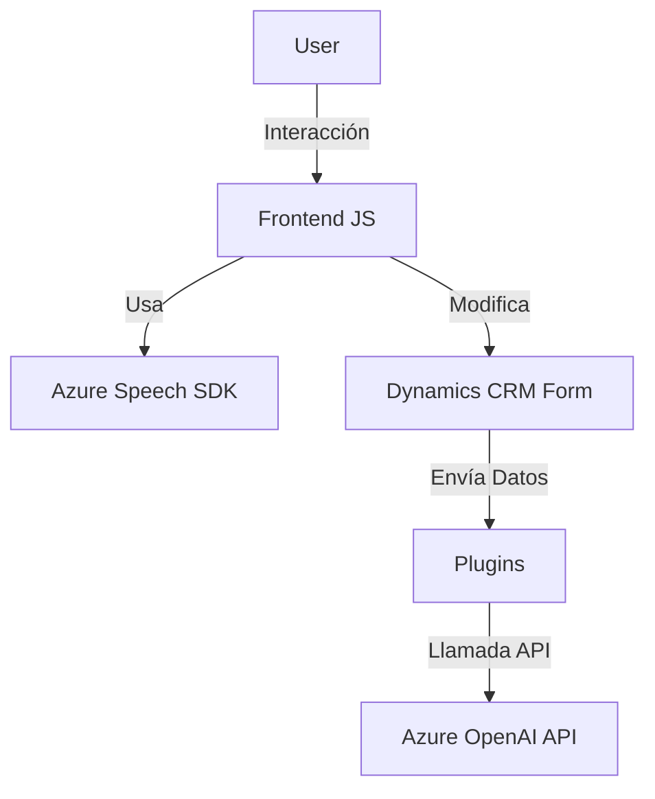

### Breve Resumen Técnico
El repositorio define una solución para la interacción dinámica de formularios en un entorno Microsoft Dynamics 365 con funcionalidades basadas en voz y texto. Utiliza integraciones con el **Azure Speech SDK**, para síntesis y reconocimiento de voz, y **Azure OpenAI API** para procesamiento y transformación de texto mediante inteligencia artificial (GPT).

---

### Descripción de Arquitectura
- **Tipo de solución**: Híbrida que combina frontend JavaScript con backend en la forma de plugins para Microsoft Dynamics CRM. Los scripts de JavaScript controlan la interacción en los formularios, y un plugin basado en C# se comunica con una **API externa** para transformar datos.
- **Arquitectura empleada**: 
  - **Modelo Plugin** para la extensión de Dynamics CRM.
  - **SOA (Service-Oriented Architecture)** debido a la integración directa con servicios externos como Azure Speech SDK y Azure OpenAI.
  - **Event-driven architecture** en el frontend, ejecutando acciones en función de eventos del formulario.
  
La solución no es estrictamente un monolito ni un microservicio. El componente de Dynamics CRM se asemeja a un plugin monolítico dentro de una arquitectura más amplia basada en servicios.

---

### Tecnologías, Frameworks y Patrones Utilizados
1. **Lenguajes Utilizados**:
   - **JavaScript**: Para control de lógica del frontend y manipulación de formularios.
   - **C#**: Para implementación de plugins en Dynamics CRM.

2. **Frameworks/Bibliotecas**:
   - **Azure Speech SDK**: Usado para síntesis y reconocimiento de voz en los scripts de frontend.
   - **Microsoft Dynamics CRM SDK**: Base del plugin para extender la funcionalidad de Dynamics.
   - **Azure OpenAI API**: Usado para transformaciones de texto mediante GPT utilizando prompts personalizados.

3. **Patrones Arquitectónicos**:
   - **Plugin Pattern**: Extiende eventos en Dynamics CRM.
   - **SOA**: Conexión con servicios externos para procesamiento de datos.
   - **Event-driven Architecture**: Respuestas basadas en eventos.
   - **Modularidad**: Separación de responsabilidades en funciones específicas dentro de los scripts de JavaScript y complementos de C#.

---

### Dependencias o Componentes Externos Presentes
1. **Azure Speech SDK**:
   - Sintetización y reconocimiento de voz.
   - Dependencia de scripts del navegador para cargar la SDK dinámica.
   
2. **Azure OpenAI API**:
   - Endpoint para transformar texto (usando GPT).
   - Clave de autenticación para interacción segura.
   
3. **Microsoft Dynamics SDK**:
   - Extensiones y plugins para gestionar eventos y ejecutar lógica en el sistema CRM.
   
4. **System.Net.Http**:
   - Enviado por el plugin para realizar llamadas a APIs externas (Azure OpenAI).
   
5. **System.Text.Json** y **Newtonsoft.Json.Linq**:
   - Manipulación de objetos JSON para estructurar y procesar los datos que provienen del API.

---

### Diagrama Mermaid

---

### Conclusión Final
Este repositorio ofrece una implementación eficaz para interactuar con formularios en Dynamics CRM usando voz y texto. El diseño está basado en la modularidad, con una clara separación de responsabilidades entre frontend (JavaScript), el plugin de CRM (C#), y servicios externos (Azure SDK y Azure OpenAI). La arquitectura es híbrida, combinando un enfoque orientado a servicios y plugins con una lógica que responde a eventos.