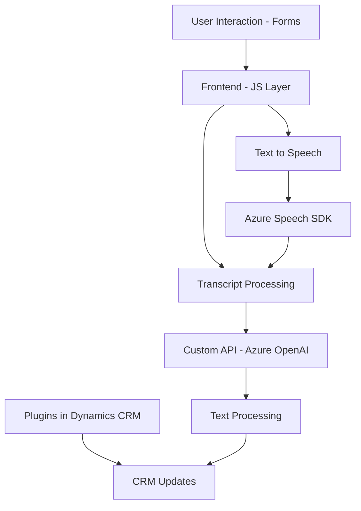

### Breve resumen técnico

El repositorio combina elementos de frontend en JavaScript, integración de voz basada en **Azure Speech SDK**, y un plugin para Microsoft Dynamics CRM con soporte para **Azure OpenAI**. Está diseñado para capturar datos de formularios visibles, sintetizar texto en audio y procesar reconocimiento de voz para actualizar estos formularios dinámicamente. La estructura sugiere una solución orientada a mejorar **accesibilidad** e **automatización** en entornos empresariales.

---

### Descripción de arquitectura

El sistema utiliza una arquitectura **híbrida** que combina componentes de frontend interactivo (JavaScript) con integraciones de voz y plugins en Microsoft Dynamics CRM (C#). Los principales patrones identificados incluyen:

1. **Arquitectura N-capas**: Descomposición en capas con una capa de presentación (frontend), lógica de negocio (plugins y llamadas a Azure OpenAI/Custom API), y almacenamiento en Dynamics CRM.
   
2. **Integración con servicios externos**: Uso intensivo de SDK y API de Azure, como **Speech SDK** para reconocimiento y síntesis de voz, y Azure OpenAI para procesamiento de texto avanzado.

3. **Modularidad**: Componentes independientes diseñados con responsabilidades específicas, como síntesis de texto a voz, reconocimiento de voz, y transformación de texto.

4. **Plugin-based Architecture**: Integración con Dynamics CRM mediante plugins que ejecutan acciones específicas en eventos desencadenados.

---

### Tecnologías usadas

1. **Frontend**:
   - **JavaScript**: Código para trabajar con formularios dinámicos.
   - **Azure Speech SDK**: Reconocimiento y síntesis de voz.
   - **REST API Integration**: Comunicaciones HTTP para invocar Azure Custom APIs.

2. **Backend/CRM Plugins**:
   - **C#**: Código del plugin para Dynamics CRM.
   - **Azure OpenAI Service**: Para transformar texto en JSON estructurado.
   - **Dynamics 365 Web API**: Gestión de datos en entornos CRM.

3. **Utility Libraries**:
   - **JSON Libraries (System.Text.Json / Newtonsoft.Json)**: Serialización y deserialización de datos estructurados.
   - **System.Net.Http**: Realización de solicitudes HTTP hacia servicios externos.

4. **Cloud Services**:
   - **Azure Speech SDK**: Para reconocimiento y síntesis de voz en tiempo real.
   - **Azure OpenAI API**: Procesamiento basado en IA.

---

### Diagrama **Mermaid**

---

### Conclusión final

El repositorio representa una solución de **accesibilidad** e integración con formularios dinámicos. Combina datos procesados por voz (Frontend) con flujos avanzados de transformación textual soportados por **Azure OpenAI**. La arquitectura en capas y el uso de servicios externos como **Speech SDK** y **OpenAI** refuerzan su flexibilidad y escalabilidad. Sin embargo, por la especificidad de las dependencias (Dynamics CRM y Azure), esta solución está muy vinculada a entornos Microsoft. Finalmente, el proyecto refleja un diseño modular pensado para **automatización**, **usabilidad**, y **IA aplicada**.