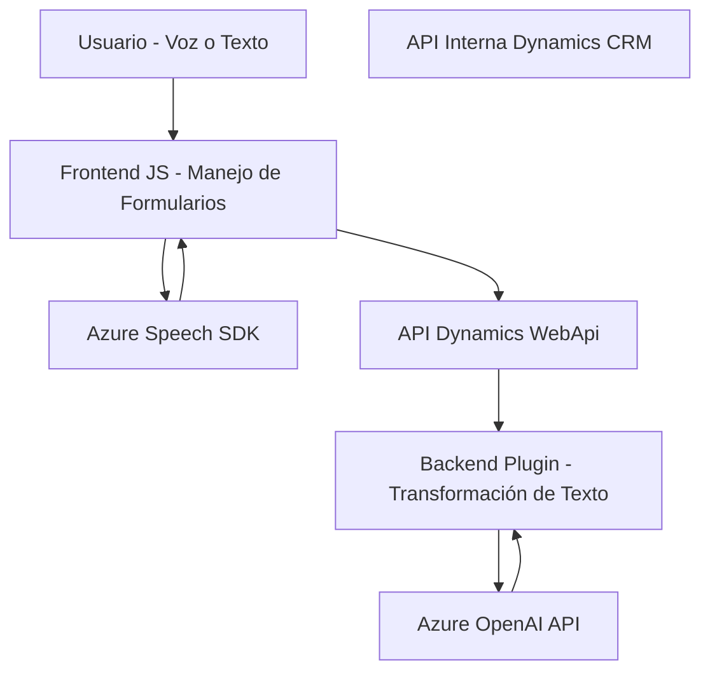

### Breve resumen técnico
El repositorio analiza varios módulos relacionados con el procesamiento de voz y texto utilizando el servicio Azure Speech SDK y Microsoft Dynamics CRM. Los archivos expuestos definen funcionalidades orientadas a:
- Convertir formularios en texto hablado (línea frontend).
- Transcribir voz a texto y mapear el resultado en dispositivos cliente (frontend vinculado a Dynamics 365).
- Plugin backend para procesar texto mediante Azure OpenAI y generar datos estructurados en Dynamics CRM.

### Descripción de arquitectura
1. **Tipo de solución**: API y frontend integrado con un sistema CRM (Dynamics CRM) y servicios de nube en Azure. Contiene componentes como SDK (Azure Speech SDK) y plugins de Dynamics CRM.
2. **Tipo de arquitectura**: N-capas con integración basada en eventos:
   - **Frontend** (JavaScript):
     - Gestión de interacciones con el usuario.
     - Procesamiento inicial de la entrada de voz y/o texto.
     - Comunicación con APIs externas (Azure Speech SDK y Dynamics WebApi).
   - **Backend** (C#):
     - Plugin como capa específica en Dynamics CRM para la transformación de texto con Azure OpenAI.
   - **Servicios externos**:
     - Azure Speech SDK: Síntesis de voz y transcripción de voz.
     - Azure OpenAI API: Procesamiento de texto.
3. **Patrones usados**:
   - Encapsulación funcional en métodos modulares.
   - Gestión dinámica de dependencias.
   - Integración orientada a servicios (Azure Speech SDK / Azure OpenAI).
   - Separación de responsabilidades entre frontend y backend.

### Tecnologías, frameworks y patrones
1. **Frontend**:
   - **Tecnologías**: JavaScript (vanilla JS), Dynamics 365 SDK.
   - **Frameworks externos**: Azure Speech SDK desde un CDN.
   - **Patrones**: Modularidad, patrón observador en eventos, gestión dinámica de dependencias.
2. **Backend**:
   - **Tecnologías**: C#, Dynamics CRM Plugin SDK.
   - **Frameworks externos**: Azure OpenAI API para el procesamiento textual.
   - **Patrones**:
     - Plugin para Dynamics CRM.
     - Separación lógica mediante métodos estáticos y modulares.

### Dependencias externas
El proyecto utiliza las siguientes dependencias externas clave:
1. **Azure Speech SDK**:
   - Usado en JavaScript para síntesis y transcripción de voz.
   - Cargado dinámicamente desde un CDN.
2. **Azure OpenAI API**:
   - Consumido por el plugin de backend en Dynamics CRM para transformar el texto a estructuras JSON.
3. **Microsoft Dynamics SDK**:
   - Utilizado en frontend para contexto de formularios (`Xrm.WebApi`).
   - Backend para ejecución de plugins mediante `IPlugin`.
4. **Newtonsoft.Json (backend)**: Manejo de estructuras JSON para serialización y deserialización.

---

### Diagrama Mermaid

### Conclusión final
El repositorio implementa una solución basada en N-capas, con capacidades frontend para procesamiento de formularios y síntesis de voz, integrándose con APIs externas como Azure Speech SDK y Dynamics 365 APIs. El diseño modular facilita la separación de responsabilidades y extensibilidad, mientras que el uso de servicios externos (Azure Speech y OpenAI) permite aprovechar recursos avanzados en la nube. Este modelo es ideal para entornos profesionales donde se demanda la automatización de flujos vinculado al CRM y procesamiento de datos dinámicos.