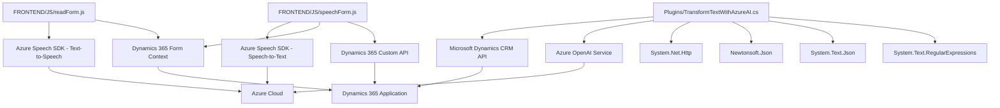

### Breve Resumen Técnico

El repositorio contiene distintos archivos que implementan funcionalidades relacionadas con generación y reconocimiento de voz, manipulación de formularios en una plataforma (probablemente Dynamics 365), y procesamiento de texto utilizando la API de Azure OpenAI. Los archivos sugieren un enfoque modular con lógica distribuida y diferentes tecnologías asociadas a la comunicación entre sistemas.

---

### Descripción de Arquitectura

1. **Tipo de Solución:**  
   Este repositorio implementa una solución híbrida que funciona como parte de una integración más amplia de Microsoft Dynamics CRM y Azure Cloud. Las principales funcionalidades incluyen:
   - **Frontend APIs:** Manejo de interacción entre usuario y formulario (JavaScript).
   - **Backend Plugins:** Extensión de capacidades de Dynamics 365 mediante el SDK de plugins (C#) y Azure OpenAI.

2. **Tipo de Arquitectura:**  
   La arquitectura utilizada sigue el patrón **n capas**, con separación entre frontend (interacción con el usuario) y backend utilizando plugins y APIs que interactúan con Dynamics 365 y servicios externos como Azure Speech SDK y Azure OpenAI.

3. **Patrones utilizados:**
   - **Modularidad:** Cada módulo (archivo) implementa una funcionalidad definida, como manejo de formularios, reconocimiento de voz, o procesamiento de texto.
   - **Dependency Injection:** Configuración y acceso a servicios externos (Azure Speech SDK, Dynamics CRM, OpenAI Service) a través de parámetros inyectados y configuraciones estáticas.
   - **Adapter Pattern:** Las integraciones con Azure Speech SDK y OpenAI Service actúan como adaptadores que traducen datos entre los sistemas.
   - **Suspense Loading Pattern:** Uso de carga dinámica del SDK para optimizar el desempeño mediante la función `ensureSpeechSDKLoaded`.

4. **Dependencias y Componentes Externos:**
   - Frontend:
     - Azure Speech SDK (Text-to-Speech y Speech-to-Text).
     - Microsoft Dynamics CRM context (`formContext`, `Xrm.WebApi`).
   - Backend:
     - Microsoft Dynamics CRM SDK.
     - Azure OpenAI Service (modelo GPT a través de API REST).
     - Librerías como Newtonsoft.Json.Linq y System.Text.Json para el manejo de JSON.
     - HTTP Client (System.Net.Http) para comunicación con servicios externos.

---

### Tecnologías Usadas

1. **Backend:**
   - C#: Lenguaje principal para implementar los plugins.
   - Microsoft Dynamics CRM SDK.
   - SaaS/API Services:
     - Azure OpenAI Service (GPT API).
     - Azure Speech SDK via browser SDK.

2. **Frontend:**
   - Javascript: Para las funciones de manejo de interacción de voz y manipulación de formularios.
   - Azure Speech SDK: Comunicación y síntesis de voz.
   - Dynamics 365 Web API: Integración directa con formularios y datos empresariales.

3. **Frameworks y Librerías:**
   - Newtonsoft.Json.
   - System.Text.Json.
   - System.Net.Http.
   - Azure Speech SDK: Reconocimiento de voz y síntesis de voz.

---

### Diagrama **Mermaid** Compatible con GitHub Markdown:

---

### Conclusión Final

El análisis del repositorio sugiere una solución basada en el uso conjunto de Microsoft Dynamics 365, el Azure Speech SDK y el servicio Azure OpenAI para facilitar la interacción entre usuarios y formularios mediante entrada de voz, síntesis de texto a voz, y procesamiento avanzado de texto. La arquitectura puede clasificarse como **n capas** debido a la separación de responsabilidades entre frontend (para manejo de formularios y voz) y backend plugins (para integración de sistemas y transformación de datos). La implementación utiliza patrones de diseño como modularidad, adaptadores y carga diferida de servicios. Esta arquitectura es adecuada para entornos empresariales orientados a servicios API en la nube, ofreciendo capacidades avanzadas con tecnologías modernas.