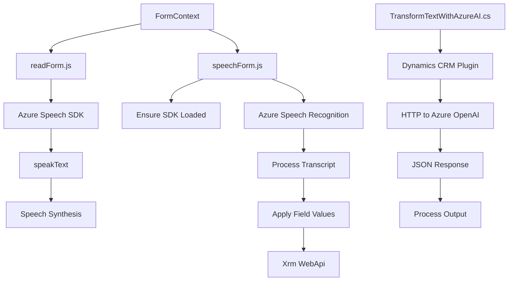

## Análisis del repositorio

### Breve resumen técnico
El repositorio implementa una solución para integración vocal y accesibilidad. Se apoya en tecnologías como el **Azure Speech SDK** para síntesis y reconocimiento de voz, y en APIs de **Dynamics CRM** para mapeo y actualización de datos. Además, incorpora un plugin escrito en **C#** que usa **Azure OpenAI** para transformar texto con reglas predefinidas.

---

### Descripción de arquitectura

1. **Solución**: Multi-componente enfocada en accesibilidad y procesamiento vocal.
   - **Frontend JavaScript**: Gestión de datos desde formularios y síntesis/reconocimiento de voz.
   - **Plugins en C#**: Transformación inteligente de texto utilizando Azure OpenAI.

2. **Arquitectura global**:
   - **N capas**: Distribución en capas funcionales, específicamente:
     - **Capa de presentación**: Código JavaScript para accesibilidad (voz/formularios).
     - **Capa lógica**: Procesamiento textual con IA (plugins Azure OpenAI + Dynamics CRM).
     - **Capa externa**: SDKs y APIs (Azure Speech, OpenAI).

3. **Componentes clave**:
   - **Frontend**:
     - Modularización de funciones para síntesis y reconocimiento de voz.
     - Integración con `formContext` para mapeo dinámico de campos.
   - **Backend/Plugin**:
     - Plugin Dynamics CRM para procesamiento de texto transformado con IA.
     - Validación y generación de respuestas desde la API OpenAI.

4. **Patrones observados**:
   - **Modularización Funcional**: Organización del código en funciones especializadas y de bajo acoplamiento.
   - **Facade**: Simplicidad en interacción con servicios externos (e.g., Speech SDK y OpenAI).
   - **Adapter para SDK/API**: Adaptación de servicios externos para que encajen en el flujo interno.

---

### Tecnologías usadas

1. **Frontend**:
   - JavaScript.
   - Azure Speech SDK para síntesis y reconocimiento de voz.
   - Dynamics CRM APIs (`Xrm.WebApi.online.execute`).

2. **Backend**:
   - C# (.NET Framework/SDK).
   - Azure OpenAI REST API para procesamiento transformativo de texto.
   - Dynamics CRM Plugin Architecture (`IPlugin`).
   - JSON Libraries:
     - `Newtonsoft.Json` o `System.Text.Json` (deserialización de respuesta OpenAI).

---

### Diagrama **Mermaid**

---

### Conclusión final

Este repositorio representa una solución integrada que aprovecha tecnologías de accesibilidad vocal y IA para mejorar la interacción con formularios en sistemas como Dynamics CRM. La arquitectura **n capas** facilita la separación por responsabilidades: presentación en JavaScript, lógica de negocio en plugins, y procesamiento externo en Azure (Speech SDK y OpenAI). Se observa una buena modularización del código y el uso de patrones adecuados para la interacción entre los distintos componentes.