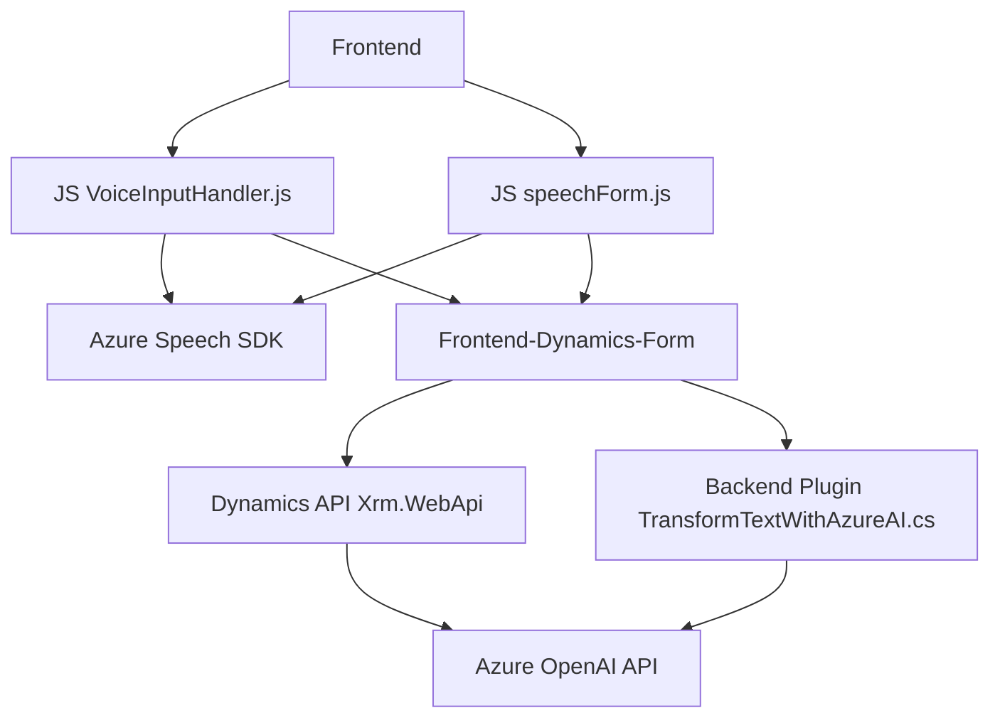

## Resumen técnico

Este repositorio combina múltiples funciones enfocadas en la integración de procesamiento de voz con **Azure Speech SDK** y procesamiento avanzado de texto mediante **Azure OpenAI API**. Específicamente, las funcionalidades están centradas en aplicaciones y plugins vinculados a formularios de Dynamics 365, mejorando la interacción con los datos mediante voz, reglas de negocio y transformación de texto a JSON.

---

## Descripción de arquitectura

La solución usa una arquitectura **modular y orientada a eventos**. Está diseñada para facilitar la reutilización de componentes (por ejemplo, manejo de SDK, entrada de voz, transformación de datos). Los módulos están organizados para integrarse con plataformas externas (Azure y Dynamics 365), y ciertas responsabilidades están claramente segregadas mediante funciones específicas. Por otra parte:
- **Dinamismo:** Carga dependencias a demanda, como el Azure SDK, lo que optimiza el rendimiento inicial.
- **Separación de capas:** Aunque no está explícitamente segmentada en capas como un **monolito n-capas**, la solución sigue una implementación basada en **eventos**, con módulos para realizar tareas específicas y aisladas.

### Tipo de arquitectura y solución
1. **Tipo de solución:** Una combinación de frontend para formularios con lógica dinámica, interacción con APIs externas, y plugins backend para procesamiento de datos.
2. **Tipo de arquitectura:**
   - **Event-Driven Architecture** para eventos de cliente en el frontend.
   - **Integración SaaS**: Backend consume servicios de Azure AI.
   - **Modularidad:** Lógica separada entre voz, API y plugins.

---

## Tecnologías utilizadas

1. **Frontend:**
   - **HTML/JavaScript:** Manejo de formularios y lógica cliente
   - **Azure Speech SDK:** Procesa texto a voz y voz a texto directamente en el navegador.
   - **Dynamics Web API (`Xrm.WebApi.online`)**: Interacciones con datos y formularios de Dynamics 365.

2. **Backend (Plugins):**
   - **C#.NET:** Implementación de plugins para Dynamics 365 que interactúan con APIs y manipulan datos.
   - **Azure OpenAI API:** Procesamiento avanzado de texto mediante GPT.
   - **Microsoft Dynamics SDK:** Comunicación directa con el entorno CRM (Query, atributos, etc.).

3. **Dependencias adicionales:**
   - **Newtonsoft.Json.Linq:** Manipulación de datos JSON en C#.
   - **System.Net.Http**: Llamadas HTTP al servicio Azure AI.

---

## Diagrama Mermaid

---

## Conclusión final

Esta solución presenta un enfoque optimizado para aplicaciones que necesitan integrar datos dinámicos mediante voz e inteligencia artificial dentro del ecosistema de Microsoft Dynamics CRM. La arquitectura modular y la separación de responsabilidades, junto con la integración de servicios en la nube como Azure Speech SDK y OpenAI API, permiten que el sistema se adapte fácilmente a nuevas capacidades y escalabilidad.

Por último, aunque este diseño es robusto y alineado con sistemas modernos, se podrían implementar mejoras en:
1. Manejo asíncrono para reducir la posible latencia en las operaciones críticas (como llamadas a Azure).

Esto sugiere una arquitectura adaptable, orientada a eventos y diseñada para combinar tareas avanzadas de procesamiento de datos con tecnologías de IA.