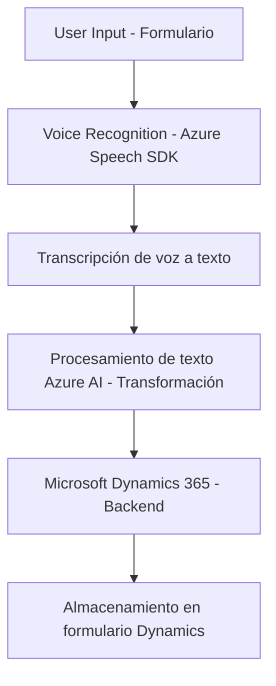

### Breve resumen técnico
Este repositorio implementa una solución tecnológica que combina una gestión avanzada de formularios con procesamiento de datos mediante reconocimiento de voz y transformación de textos utilizando Azure Speech SDK y Azure OpenAI. Se integra profundamente con Microsoft Dynamics 365.

### Descripción de arquitectura
La arquitectura del repositorio refleja un modelo **multicapas integrado con API externas**, diseñado para capturar datos desde la interfaz del usuario (formularios), procesarlos en múltiples etapas (transformación, síntesis de voz y reconocimiento de voz), y finalmente interactuar con el backend a través de plugins y servicios de Dynamics 365.

#### Componentes principales:
1. **Frontend modular**:
   - Archivos de JavaScript que gestionan la interacción con formularios y la integración con SDKs externos (Azure Speech).
   - Incluye patrones como lazy-loading de dependencias y delegación.
2. **Plugin backend**:
   - Código C# que amplía la funcionalidad de Dynamics 365 mediante el uso de Azure OpenAI para transformación del texto según reglas específicas.
   - Encapsula lógica para consumir APIs externas y devolver datos estructurados.

---

### Tecnologías usadas
1. **Frontend**:
   - JavaScript moderno.
   - Azure Speech SDK: Reconocimiento de voz y síntesis de texto a voz.
   - Gestión de formularios en Dynamics 365 (ejecución del contexto).
2. **Backend**:
   - Microsoft Dynamics 365 SDK (Microsoft.Xrm.Sdk).
   - Azure OpenAI para procesamiento avanzado de texto.
   - `Newtonsoft.Json` y `System.Text.Json` para manipulación estructurada de JSON.
   - `System.Net.Http` para consumo de APIs externas.

---

### Tipo de arquitectura
Esta solución utiliza:
1. **N Capas**: Separación lógica entre capa de presentación (frontend), capa de procesamiento (SDK y API externos), y capa de datos (Dynamics 365).
2. **Complementos (Plugins)**: El backend extiende Dynamics CRM con plugins personalizados basados en eventos predefinidos.
3. **Integración con servicios externos**: La solución interactúa con SDKs y APIs como Azure Speech y OpenAI.

---

### Dependencias o componentes externos
1. **Azure Speech SDK**: Procesamiento de reconocimiento de voz y síntesis de texto a voz.
   - URL de SDK en el navegador: `https://aka.ms/csspeech/jsbrowserpackageraw`.
2. **Azure OpenAI API**: Transformación avanzada de texto según normas estructuradas.
3. **Microsoft Dynamics 365**: Framework de backend para manejar datos y formularios.
4. **HTTP Services**:
   - `System.Net.Http` para consumo de REST APIs.
   - Configuración de API Keys y URLs para conectar con servicios externos.
5. **JSON Manipulation**: Dependencias para serialización/deserialización como `Newtonsoft.Json` y `System.Text.Json`.

---

### Diagrama Mermaid válido para GitHub

---

### Conclusión final
Este repositorio representa una solución tecnológica orientada a la integración avanzada entre frontend y backend mediante herramientas de Microsoft y Azure. La arquitectura basada en capas y plugins garantiza escalabilidad, flexibilidad en el procesamiento de datos de voz y texto, y permite extender funcionalidades en el ecosistema de Dynamics 365.