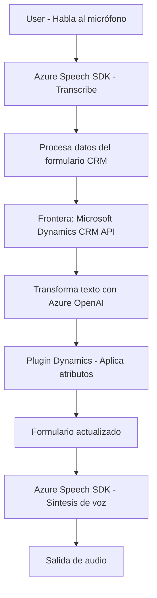

### Breve resumen técnico:
Los archivos analizados forman parte de un sistema que combina **Microsoft Dynamics CRM** y servicios externos como **Azure Speech SDK** y **Azure OpenAI**, con el propósito de transformar entradas de voz y textos en acciones ejecutables en formularios empresariales. Incluyen funciones específicas para obtener datos de formularios, sintetizar voz y procesar transformaciones de texto mediante inteligencia artificial.

---

### Descripción de arquitectura:
La solución presenta una forma híbrida entre **arquitectura de n-capas** y un enfoque **service-oriented architecture (SOA)**.  
1. **Front-end basado en JavaScript**: Código modular enfocado en la integración dinámica de servicios (Azure Speech SDK) y el sistema de formularios de Dynamics CRM. Implementa lógica de negocio y flujo de entrada/salida de datos.  
2. **Back-end con plugins en Dynamics CRM:** Código escrito en C# que sirve como punto de extensión, interactuando con el core de Dynamics CRM para recibir transformaciones realizadas por **Azure OpenAI**.

---

### Tecnologías usadas:
1. **Front-end:**
   - **JavaScript** (ES6): Utilizado para desarrollar funciones modulares.
   - **Azure Speech SDK**: Servicio de reconocimiento y síntesis de voz.
   - **Microsoft Dynamics CRM Web API**: Para manejar datos del sistema CRM (formularios, atributos).
2. **Back-end:**
   - **C#**: Desarrollo del plugin extendiendo Dynamics CRM mediante la interfaz `IPlugin`.
   - **Azure OpenAI API**: Uso directo para transformar datos textuales bajo ciertas reglas.
   - **JSON Libraries**: Manejo de estructuras JSON; incluye `System.Text.Json` y `Newtonsoft.Json`.
3. **Arquitectura/Patrones:**
   - **SOA**: Interacción con Azure APIs.
   - **Callback Pattern**: Carga dinámica de librerías en Frontend.
   - **Plugin Architecture**: Integración directa con Dynamics CRM.

---

### Dependencias o componentes externos:
- **Externas:**
  - **Azure Speech SDK**: Para reconocimiento de voz y síntesis de texto.
  - **Azure OpenAI API**: Para transformar texto según reglas específicas.
  - **Microsoft Dynamics CRM Web API**: Para interactuar con formularios CRM.
  - **Bing Speech Endpoint** (posiblemente incluido en Azure Speech SDK).
- **Internas:**
  - Atributos y métodos de Dynamics CRM `formContext` y `executionContext`.
  - `VoiceInputHandler.js` y `speechForm.js` dependen de funciones locales para trabajar con formularios.

---

### Diagrama Mermaid:

---

### Conclusión final:
Esta solución es una **integración avanzada con Dynamics 365 CRM**, que utiliza servicios en la nube (Azure Speech SDK y OpenAI) para habilitar interacción por voz y procesamiento inteligente de texto. La arquitectura es modular y extensible con una clara división entre la lógica de entrada/salida de datos en el cliente (frontend en JavaScript) y la transformación de datos y ejecución de acciones en el servidor (backend en C#). Esta práctica asegura escalabilidad y flexibilidad al utilizar componentes especialistas en servicios de voz, IA y CRM, favoreciendo su adecuación para entornos empresariales complejos que requieren múltiples capas de interacción entre usuarios y sistemas.