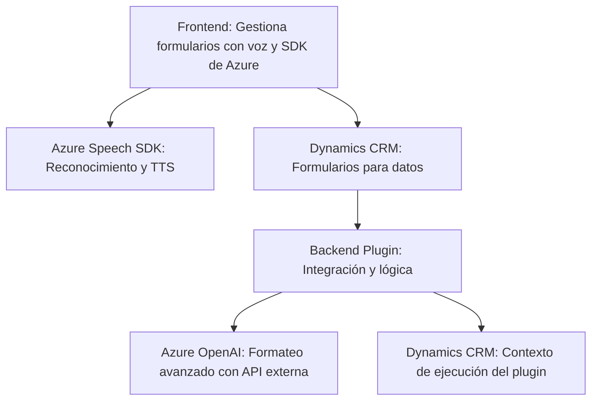

### Breve resumen técnico:
El repositorio parece ser una solución híbrida con funcionalidades combinadas: una interfaz de usuario interactiva (frontend) en JavaScript que trabaja con formularios de Dynamics CRM, y una integración backend basada en plugins para Microsoft Dynamics. Además, utiliza servicios externos como Azure Speech SDK y Azure OpenAI para inteligencia artificial y voz. 

---

### Descripción de arquitectura:
La solución sigue una arquitectura **orientada a servicios** con varias capas:
1. **Frontend:** Diseñado para operar sobre formularios de Dynamics CRM, implementa funciones modulares para la síntesis de voz y reconocimiento de datos mediante servicios externos (Azure Speech SDK). Se percibe un patrón modular funcional aquí.
2. **Backend:** Implementa lógica de negocio extensible para transformar texto con servicios AI mediante un plugin en el entorno de Dynamics CRM. Este backend actúa como mediador, usando el contexto CRM y delegando tareas a otras APIs como Azure OpenAI.

La arquitectura podría clasificarse como **n-capas**, debido a:
- La separación del frontend y backend.
- Dependencias de servicios externos para encapsular la lógica de negocio adicional.

---

### Tecnologías usadas:
1. **Frontend:**
   - **JavaScript:** Lenguaje base.
   - **Azure Speech SDK:** Para reconocimiento de voz, síntesis de texto a voz, y otros servicios relacionados.
   - **Dynamics SDK (e.g., `Xrm.WebApi`)**: Para la comunicación con los elementos del formulario relacionados con Dynamics.
2. **Plugins Backend:**
   - **C# con Microsoft Dynamics SDK:** Para interacción con el CRM y plugin logic.
   - **Newtonsoft.Json / System.Text.Json:** Para manipulación de datos JSON estructurados.
   - **Azure OpenAI:** Soluciones para transformación avanzada de texto con IA.
   - **HttpClient:** Para llamadas API externas.

---

### Diagrama Mermaid válido para GitHub:

---

### Conclusión Final:
Esta solución combina procesamiento frontend dinámico sobre formularios de Dynamics CRM con backend basado en plugins para integración con servicios externos, como Azure OpenAI y Speech SDK. Su arquitectura, aunque sencilla, es robusta para sistemas empresariales. Patrones funcionales y orientados a servicios se destacan, logrando modularidad y extensibilidad.