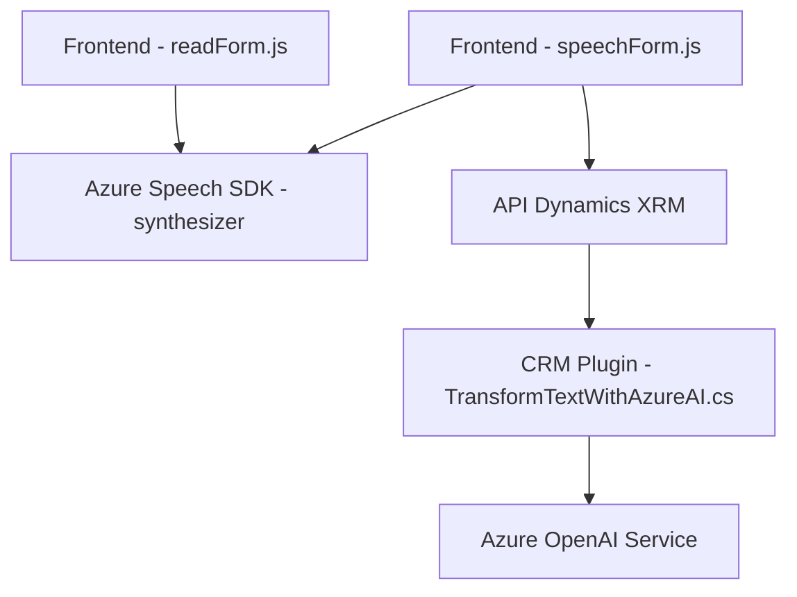

### Breve resumen técnico
El repositorio contiene varios componentes relacionados con la integración de formularios CRM (posiblemente Dynamics 365) con servicios en la nube, específicamente Azure Speech SDK y Azure OpenAI Service. Los archivos están orientados a:
1. Procesar y sintetizar voz para leer datos visibles en formularios.
2. Realizar reconocimiento de voz desde el micrófono y rellenar automáticamente los campos de un formulario.
3. Extender el CRM mediante un plugin que transforma texto usando Azure OpenAI basado en reglas predefinidas.

### Descripción de arquitectura
- **Tipo de solución**: 
  - **Frontend/Form Interaction**: Los archivos relacionados con JavaScript (e.g., `readForm.js`, `speechForm.js`) implementan funcionalidad en el lado del cliente, manipulando el DOM del formulario dentro de un CRM.
  - **Backend/Plugin**: El componente en C# (`TransformTextWithAzureAI.cs`) actúa como un plugin de Dynamics CRM para integración y procesamiento mediante el servicio Azure OpenAI.
- **Arquitectura general**: 
  - **N Capas**: La solución parece estructurada en capa cliente (frontend) y capa de negocio (plugin con acceso directo a Dynamics, más integración con Azure OpenAI Service).
  - **SDK Integration**: Ambas capas interactúan con servicios externos de Azure, conformando una arquitectura híbrida basada en microservicios.
  - **Patrones específicos**:
    - **SDK On-Demand Loading**: El modelo por el cual se cargan los SDK de Azure Speech en el frontend es asincrónico y basado en eventos (callback).
    - **Extensibilidad en Dynamic CRM**: Uso del estándar `IPlugin` para modificar el comportamiento del CRM en el servidor.

---

### Tecnologías usadas
1. **Azure Speech SDK**: Captura, síntesis y reconocimiento de voz.
2. **Azure OpenAI Service**: Procesamiento avanzado de lenguaje natural en el plugin.
3. **Microsoft Dynamics CRM**:
   - Uso de objetos como `executionContext` en el frontend Javascript para interactuar con formularios.
   - Dependencia del ensamblado `Microsoft.Xrm.Sdk` en el plugin C#.
4. **Frontend**:
   - JavaScript (ES6).
   - Dependencia de APIs RESTful para comunicación con servicios Azure (OpenAI y Speech).
5. **Backend**:
   - C# (.NET Framework o .NET Core).
   - Newtonsoft.Json para manejar objetos JSON.
   - HTTP Client para consumir servicios externos.

---

### Diagrama Mermaid

---

### Conclusión final
La solución combina interacción avanzada de usuario con recogida de datos en tiempo real y transformación mediante inteligencia artificial, con una integración efectiva entre cliente (javascript) y servidor (plugin). Gracias a la separación de responsabilidades entre frontend y plugin, la arquitectura mantiene la flexibilidad para una funcionalidad orientada a servicios en una plataforma CRM. Esto sugiere que se diseñó pensando en la escalabilidad y la facilidad de integración con tecnologías de Microsoft Azure.