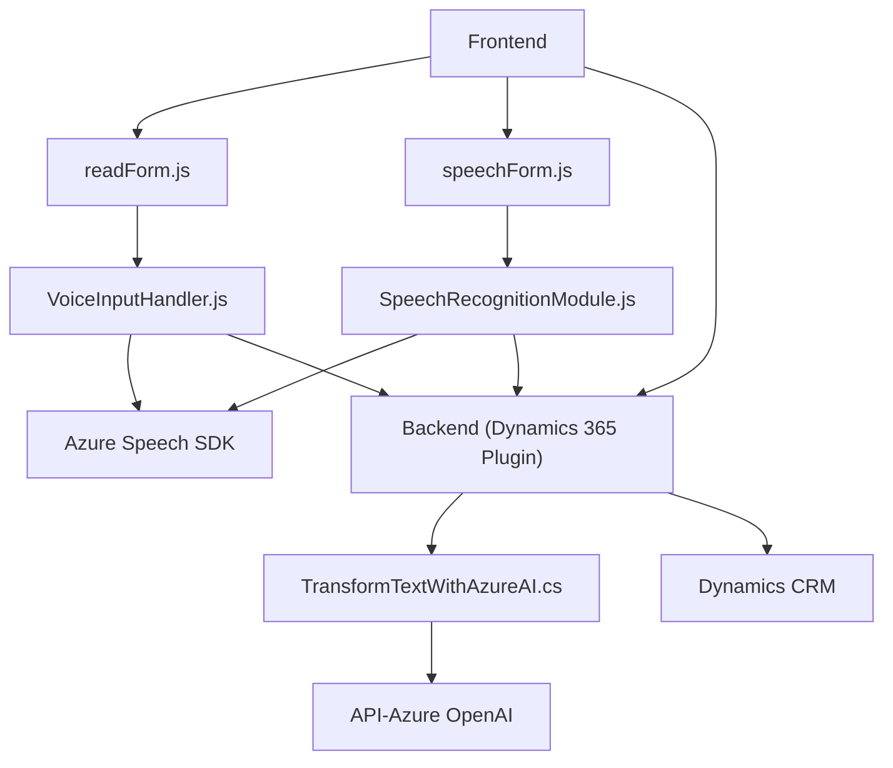

### Breve resumen técnico

El repositorio parece ser parte de un sistema que combina front-end y back-end enfocado en la interacción con formularios y servicios de reconocimiento de voz y texto basados en Azure, probablemente implementado en un ecosistema Microsoft Dynamics CRM. Incluye archivos JavaScript para manejo de formularios y integración con Azure Speech SDK del lado cliente y un archivo C# para plugins en Dynamics CRM que integran Azure OpenAI para transformar texto.

---

### Descripción de arquitectura

1. **Solución:** Este repositorio forma parte de una aplicación híbrida con interacción cliente-servidor. Combina funcionalidad de:
   - Una **web frontend** en JavaScript que utiliza el SDK de Azure Speech para reconocimiento y síntesis de voz.
   - Un **plugin backend** (.NET, C#) que utiliza Azure OpenAI para transformación avanzada de texto en el ecosistema de Dynamics CRM.

2. **Arquitectura:**
   - **Cliente (JavaScript)**
     - Modular con funciones independientes para interacción con formularios y servicios de Azure.
     - Comunicación directa con APIs de terceros (Azure Speech).
   - **Backend (C# Plugin)**
     - Arquitectura orientada a componentes, con integración de API externa (Azure OpenAI).
     - Basado en la arquitectura de **plugins de Dynamics CRM**.
   - **General:** Empieza a mostrar características de integración entre capas (cliente, plugin, servicios externos) con patrones como Gateway y Callback.

3. **Patrones usados:**
   - **Single Responsibility Principle (SRP):** Cada función en los archivos de JavaScript y métodos en C# tienen una responsabilidad específica.
   - **Gateway Pattern:** Llamadas a servicios de Azure (Speech SDK, OpenAI) actúan como puertas de enlace hacia esos sistemas externos.
   - **Callback Pattern (Frontend):** Manejo de eventos y carga dinámica de SDK externo.
   - **Plugin Architecture (Backend):** Encapsulación de lógica en una clase asociada a Dynamics CRM.
   - **Integration Pattern:** Uso de APIs externas para operaciones especializadas.

---

### Tecnologías usadas

1. **JavaScript:** En archivos del frontend para la conexión con servicios Azure, manejo de lógica del formulario, y speech-to-text/speech synthesis.
2. **Azure Speech SDK:** Reconocimiento y síntesis de voz.
3. **Microsoft Dynamics CRM SDK (`Xrm.WebApi`)** para integración con formularios y entidades CRM.
4. **Azure OpenAI API** desde C# para transformar texto en JSON estructurado.
5. **C# y .NET:** Para lógica avanzada en el servidor como parte de un plugin CRM.
6. **Newtonsoft.Json:** Para manejo de JSON en .NET y procesamiento de datos obtenidos desde Azure OpenAI.
   
---

### Diagrama Mermaid válido para GitHub

---

### Conclusión final

Este repositorio integra tecnologías modernas para el reconocimiento y síntesis de voz junto con la gestión de formularios dinámicos en un entorno Microsoft Dynamics CRM. Desde una perspectiva arquitectónica, combina un frontend modular que interactúa con APIs externas (Azure Speech SDK) y un backend con un plugin que utiliza servicios avanzados de procesamiento de lenguaje (Azure OpenAI). Aunque funcionalmente cumple criterios importantes de modularidad y separación de responsabilidades, podría beneficiarse de estandarizar patrones en el frontend y backend por completo, como la arquitectura hexagonal para abstraer servicios externos.