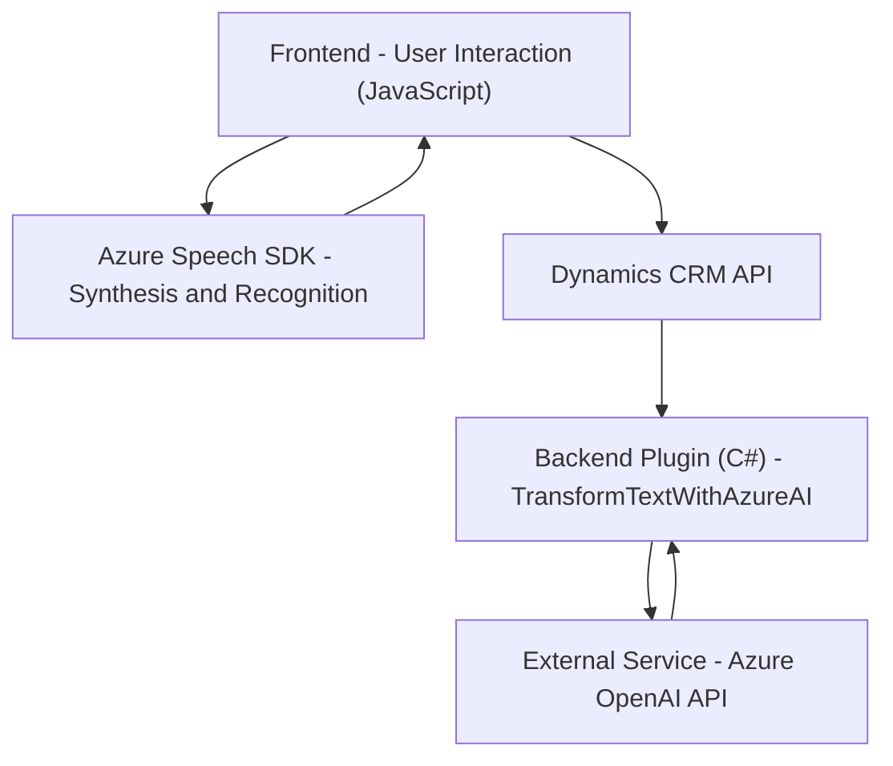

### Breve resumen técnico:
El repositorio presentado implementa una solución integrada para formularios de Dynamics 365 con capacidades de entrada por voz, síntesis de voz y procesamiento avanzado de texto mediante servicios de Azure, como Speech SDK y OpenAI. Combina el frontend (interacción con usuarios) con complementos en el backend (plugin en Dynamics CRM) para un flujo automatizado y eficiente basado en servicios cloud.

---

### Descripción de arquitectura:
La arquitectura es un híbrido que combina una **arquitectura n-capas** y **microservicios externos**. Los componentes están desacoplados:
- **Frontend**: Funciones en JavaScript que procesan interacción con usuarios y SDK de Azure.
- **Backend**: Plugin desarrollado en C# proporciona interacción entre Dynamics CRM y el servicio de Azure OpenAI.
El diseño promueve modularidad y separación de responsabilidades: la capa cliente gestiona SDKs web y la lógica de síntesis/reconocimiento de voz, mientras la capa del servidor maneja el procesamiento avanzado vía OpenAI.

---

### Tecnologías usadas:
1. **Frontend**:
   - **JavaScript**: Lenguaje principal para interacción con SDK y clientes.
   - **Azure Speech SDK**: Para síntesis y reconocimiento de voz.
   - Dynamics 365 JavaScript API (`executionContext`): Para manipulación de formularios.

2. **Backend**:
   - **C#**: Lenguaje para el desarrollo de plugins en Dynamics CRM.
   - **Dynamics CRM SDK (Microsoft.Xrm.Sdk)**: Manejo del plugin y contexto de eventos.
   - **Newtonsoft.Json**: Manejo de estructuras JSON entre la API y Dynamics.
   - **System.Net.Http & System.Text.Json**: Solicitudes HTTP a Azure OpenAI.

3. **Servicios Cloud**:
   - **Azure Speech API**: Reconocimiento y síntesis de voz.
   - **Azure OpenAI API**: Transformación del texto usando modelos GPT.

---

### Diagrama Mermaid:

---

### Conclusión final:
La solución demuestra un diseño eficiente y robusto con el uso de servicios en la nube (Azure Speech SDK y Azure OpenAI) para satisfacer sus objetivos de interacción avanzada basada en voz e inteligencia artificial en formularios de Dynamics 365. La arquitectura modular permite una alta escalabilidad, fácil mantenimiento y adaptabilidad. Este diseño es ideal para modernizar sistemas CRM mediante la integración de IA y interfaces de usuario intuitivas.