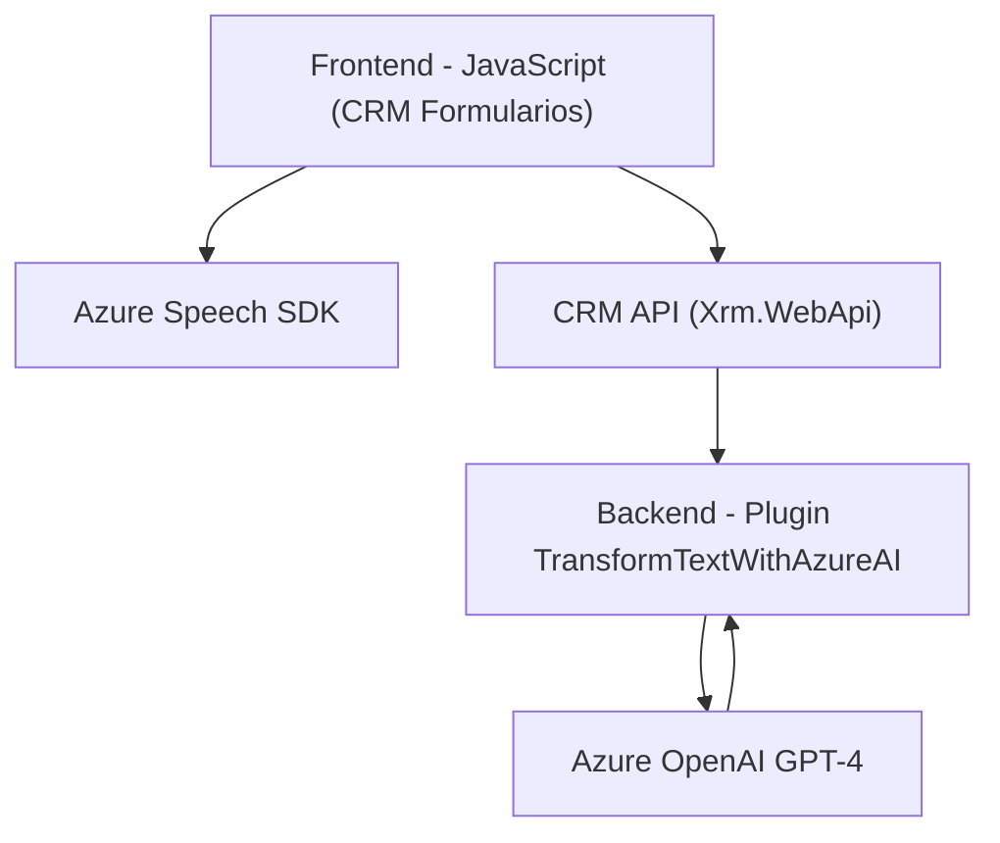

### Breve Resumen Técnico
Este repositorio contiene varios archivos distribuidos en diferentes directorios y tecnologías, con el objetivo de interactuar con formularios de Microsoft Dynamics CRM mediante funciones dinámicas, Azure Speech SDK y Azure OpenAI. Abarca funciones de síntesis y reconocimiento de voz y transformación de texto utilizando modelos IA avanzados como GPT-4.

### Descripción de Arquitectura
La solución tiene una arquitectura **híbrida**:
1. **Frontend dinámico**: JavaScript funciona como una extensión de los formularios de Dynamics CRM, integrando la síntesis de voz mediante Azure Speech SDK y realizando transcripciones habilitadas por IA.
2. **Backend basado en plugins**: En el lado del servidor, se emplea un plugin (TransformTextWithAzureAI) utilizando el SDK de Dynamics CRM para ejecutar lógica de procesamiento avanzada mediante llamadas a Azure OpenAI.

Arquitecturalmente, esto se basa en:
- **Integración de n-capas**: Comunicación entre Frontend y Backend a través del CRM.
- **Servicio externo especializado**: Uso de Azure servicios (Speech SDK y OpenAI) para funcionalidad avanzada.
- **Desacoplamiento bajo plugins**: El plugin divide responsabilidades y conecta dinámicamente las solicitudes CRM con un servicio externo de IA.

### Tecnologías Usadas
1. **Frontend**:
   - JavaScript (Azure Speech SDK).
   - APIs de Dynamics CRM (`executionContext`, `Xrm.WebApi`).
   - Desarrollo modular y dinámico cargando dependencias según necesidad.

2. **Backend**:
   - C# (Microsoft Dynamics CRM SDK).
   - API REST para Azure OpenAI (interacción con GPT-4).
   - Newtonsoft.Json para manejo avanzado de JSON.

3. **Servicios Externos**:
   - **Azure Speech SDK**: Para síntesis y reconocimiento de voz.
   - **Azure OpenAI**: Para transformación de texto y lógica IA en plugins.

### Dependencias Externas y Componentes
- **Azure Speech SDK**: Para interacción vocal.
- **Azure OpenAI**: Para procesamiento de texto.
- **Microsoft Dynamics CRM SDK**: Gestión de datos y contexto de formularios.
- **REST API**: Para conectarse con servicios de Microsoft y Azure.
- **Newtonsoft.Json**: Manejo JSON en backend.

### Diagrama Mermaid

### Conclusión Final
Esta solución parece ser una integración avanzada entre un sistema CRM (Microsoft Dynamics) y servicios en la nube de Azure (Speech SDK y OpenAI), proporcionando capacidades como síntesis de voz, reconocimiento de comandos y procesamiento dinámico mediante IA. La arquitectura está bien segmentada entre un **Frontend dinámico** basado en tecnologías web y un **Backend extensible basado en plugins**, con una clara separación de responsabilidades y un enfoque modular, lo que facilita la escalabilidad y mantenimiento.