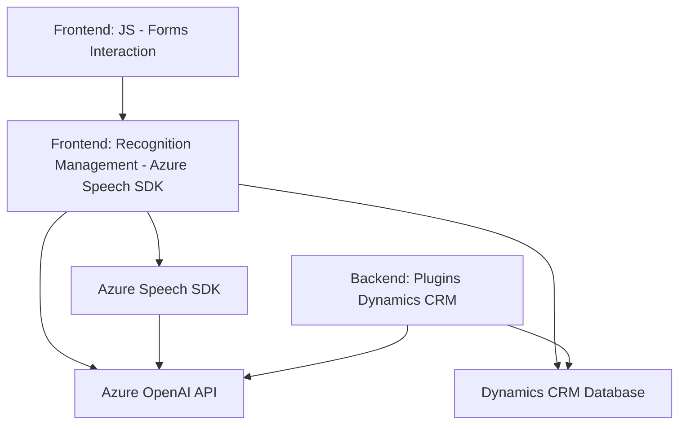

### **Resumen técnico**
El repositorio contiene múltiples archivos, cada uno abarcando distintas funcionalidades integradas en una solución técnica orientada hacia la interacción por voz y procesamiento de datos en formularios, apoyada por servicios de inteligencia artificial de Azure. La solución abarca componentes frontend y backend, con integración directa en Microsoft Dynamics CRM y Azure services. Es modular, utiliza software basado en eventos y se apoya en el SDK de Azure Speech y APIs personalizadas.

---

### **Descripción de arquitectura**
La arquitectura es híbrida, con elementos claros de **n capas**:
1. **Capa de presentación**: Los archivos **frontend/JS** gestionan interacción de usuario con voz y visualización de datos en formularios.
2. **Capa de aplicación**: Procesa interacción y aplica la lógica para transformar texto y voz a datos estructurados.
3. **Capa de integración**: Utiliza Azure Speech SDK y llama a APIs dinámicas (backend y OpenAI).
4. **Backend en forma de plugin**: Implementa un **plugin extendible en Dynamics CRM** que orquesta la interacción con Azure AI.

Adicionalmente, el sistema utiliza servicios externos como microservicios (por ejemplo, Azure Speech SDK y Azure OpenAI), ofreciendo escalabilidad y modularidad.

---

### **Tecnologías utilizadas**
- **Frontend**:
  - Azure Speech SDK: Manipulación de voz, transcripciones y síntesis de texto hablado.
  - JavaScript: Modular para manejo de formularios y reconocimiento de voz.
  - Integración con Dynamics 365 para modificar entidades a través del contexto.

- **Backend**:
  - Plugins de Dynamics CRM (C#): Orquestan eventos CRM y generan JSON estructurado mediante Azure OpenAI.
  - Azure OpenAI API: Modelos de transformación avanzada de texto.
  - Frameworks .NET: Para implementar el `IPlugin`.
  - Newtonsoft.Json y System.Net.Http: Manipulación y comunicación de datos JSON.

- **Servicios externos**:
  - APIs de Azure Speech y OpenAI para inteligencia artificial.

---

### **Diagrama Mermaid**

---

### **Conclusión final**
1. La solución está orientada hacia **transformación de voz en datos estructurados** y manipulación de formularios de Dynamics CRM mediante capacidades AI modernas.
2. La arquitectura es híbrida y modular, combinando elementos de **n capas** (frontend, integración y backend) con características de **microservicios externos** basados en Azure (Speech SDK, OpenAI API).
3. El sistema usa patrones claros como modularidad, procesamiento basado en eventos e integración SDK/API, adecuado para escalar soluciones empresariales.

Te recomiendo consolidar esta solución en un ecosistema integrado como Azure para aprovechar servicios más avanzados de monitorización y diagnóstico.