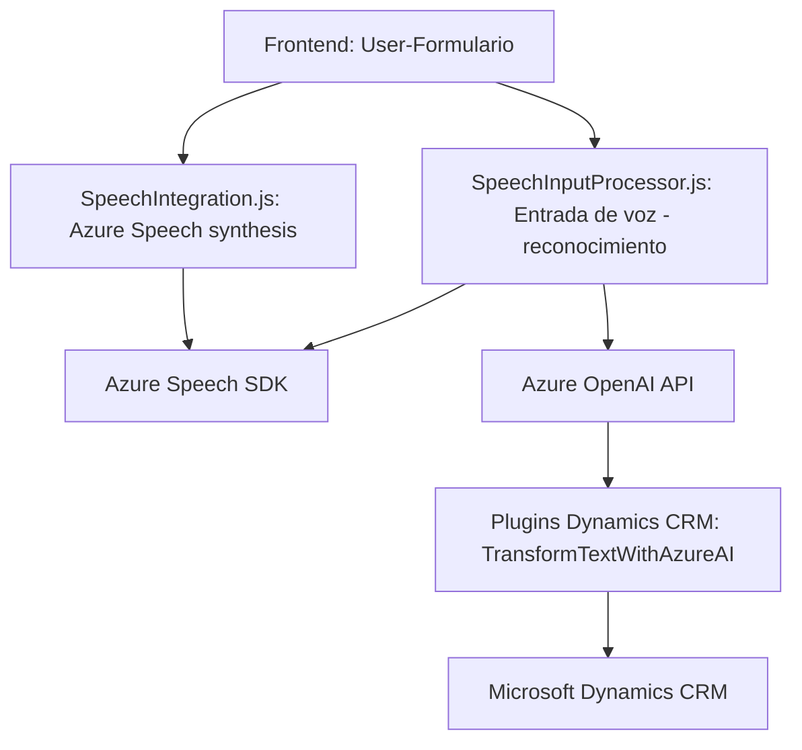

### Resumen técnico
El repositorio contiene una solución orientada al manejo y procesamiento de formularios en plataformas CRM, utilizando Azure Speech y OpenAI para reconocer comandos de voz, sintetizar texto, y transformar contenido textual. La solución está dividida en tres partes principales: un **frontend** basado en JavaScript para interacción con el usuario, un conjunto de **plugins** en C# como parte de Dynamics CRM, y API/SDKs externas como Azure Speech SDK y Azure OpenAI API.

---

### Descripción de arquitectura
La solución aplica una arquitectura en **capas** con roles claramente definidos:
1. **UI Layer**: Archivos como `speechIntegration.js` y `SpeechInputProcessor.js` gestionan la interacción de usuarios en formularios dinámicos y manejan datos visuales con integración a Azure Speech.
2. **Plugin Layer**: `TransformTextWithAzureAI.cs` extiende la funcionalidad Dynamics CRM al ejecutar extensiones que interactúan con datos y transforman contenido textual mediante Azure OpenAI.
3. **Service Integration Layer**: Se gestionan servicios externos (Azure Speech SDK y Azure OpenAI) como dependencias para generar síntesis de voz, reconocimiento y transformación de datos mediante IA.

El repositorio muestra lógica para integrarse con servicios externos y realizar tareas específicas en contextos de CRM.

---

### Tecnologías usadas
1. **Frontend:**
   - Lenguaje: JavaScript (con capacidades ES6/ES2020). 
   - Framework/API: Azure Speech SDK.
   - Web APIs: DocumentAPI, WindowAPI, DOM Manipulation.
   
2. **Plugins y Backend:**
   - Lenguaje: C# .NET.
   - Plataforma: Microsoft Dynamics CRM SDK (`Microsoft.Xrm.Sdk`, `Microsoft.Xrm.Sdk.Query`).
   - API Integration: Azure OpenAI (via HttpClient, JSON payload).

3. **Patrones arquitectónicos:**
   - Integración de APIs externas y SDKs.
   - Modularidad para encerrar lógicas independientes en funciones y clases.
   - Plugin-based extensions para la arquitectura de Dynamics CRM.
   - Capas de abstracción según rol: interfaz (frontend), procesamiento (CRM plugins), y servicios externos (Azure Speech/OpenAI).

---

### Dependencias externas
1. **Azure Speech SDK**: Integración mediante un script dinámico cargado desde la web de Azure (`https://aka.ms/csspeech/jsbrowserpackageraw`).
2. **Azure OpenAI**: Uso de la API para transformar datos textuales según modelos de Inteligencia Artificial (`gpt-4o`).
3. **Dynamics CRM SDK**: Dependencias estándar del SDK (`IPlugin`, `IOrganizationService`, entre otros).
4. **JavaScript APIs**:
   - Document API: Para acceder y manipular elementos de HTML (formularios dinámicos).
   - Window API: Gestiones globales como carga dinámica de scripts.
5. **C# NuGet dependencies**:
   - `System.Net.Http` (HTTP requests).
   - `Newtonsoft.Json` / `System.Text.Json` (manejo de JSON).

---

### Diagrama Mermaid
Este diagrama describe la interacción entre los componentes principales de la solución:

---

### Conclusión final  
El repositorio está diseñado para interacción dinámica entre usuarios y sistemas CRM mediante voz y texto procesado por IA. La arquitectura utiliza una integración en **capas** con servicios externos como Azure Speech y OpenAI para extender funcionalidades. Los patrones arquitectónicos son consistentes y bien estructurados, pero sería conveniente revisar aspectos como la seguridad (para evitar exposición de claves de API) y la optimización en la gestión de llamadas HTTP.

Además, el diseño modular facilita la mantenibilidad y escalabilidad, siendo ideal para entornos CRM que demanden extensibilidad basada en datos procesados y capacidades IA.