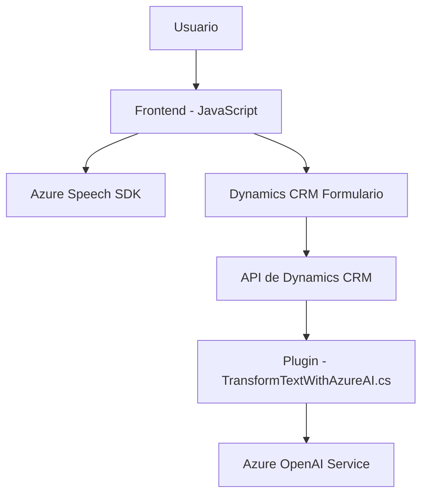

### Resumen técnico
El repositorio presentado implementa funcionalidades de integración entre Dynamics CRM y servicios de Azure, como Azure Speech SDK y Azure OpenAI Service. Estas funcionalidades están diseñadas para mejorar la interfaz y operaciones de un formulario web, utilizando entrada de voz, síntesis de texto y procesamiento de datos en base a inteligencia artificial.

---

### Descripción de arquitectura
1. **Solución:**  
   - **Tipo:** Una solución híbrida compuesta por componentes frontend (JavaScript integrados en la interfaz del formulario) y backend (plugin en .NET para Microsoft Dynamics CRM).   
   - Los componentes frontend gestionan la interacción del usuario con el formulario mediante el uso de reconocimientos de voz y síntesis de texto (Azure Speech SDK). Adicionalmente, el backend, mediante un plugin de Dynamics CRM, realiza análisis de texto con Azure OpenAI Service.

2. **Arquitectura:**  
   - **N-capas:** Está organizado con una separación entre el frontend y backend, donde cada capa tiene responsabilidades definidas. La capa de presentación permite la interacción directa con el usuario, mientras que el backend maneja la lógica empresarial del CRM.  
   - **Integración con servicios externos:** El sistema hace uso de componentes SaaS (Azure) mediante APIs para realizar tareas especializadas como reconocimiento y síntesis de voz, así como procesamiento inteligente de texto.

---

### Tecnologías usadas
1. **Frontend (JavaScript):**  
   - Integración con SDK externo: Azure Speech SDK.  
   - Framework de Dynamics CRM (API del `executionContext`).  
   - Técnicas de modularización y manejo de eventos asincrónicos.

2. **Backend (.NET):**  
   - Desarrollo del plugin bajo el framework estándar de Dynamics CRM (`IPlugin`).  
   - Serialización y manipulación de JSON (Newtonsoft.Json, System.Text.Json).  
   - Sistema de consultas HTTP (`HttpClient`) para integrar servicios de Azure OpenAI.  
   - Microsoft.Xrm.Sdk para interactuar con la API de Dynamics CRM.

3. **Servicios externos:**  
   - **Azure Speech SDK:** Para reconocimiento y síntesis de voz.  
   - **Azure OpenAI Service:** Para procesamiento de texto mediante modelos GPT.  

4. **Patrones utilizados:**  
   - **Modularización funcional:** Cada función realiza una responsabilidad específica claramente separada.  
   - **Facade y Abstract Factory:** La creación de configuraciones y encapsulación de funciones para simplificar operaciones como la integración con Azure SDK.  
   - **Event-driven:** Uso de callbacks y suscripciones para manejar eventos asincrónicos.  
   - **Plugin Pattern:** El diseño sigue la estructura estándar definida para plugins en Dynamics CRM.  

---

### Diagrama Mermaid válido para GitHub Markdown

---

### Conclusión final
Este repositorio presenta una solución orientada a la extensión de funcionalidades nativas de Dynamics CRM mediante integración directa con servicios avanzados de Azure, como el Speech SDK y OpenAI Service. La arquitectura está basada en un enfoque de capas (frontend y backend), utilizando patrones como la modularización funcional, eventos asincrónicos, y la orientación a servicios. Es ideal para escenarios empresariales donde la interacción de usuarios necesita ser simplificada mediante entradas de voz y procesamiento inteligente de texto.