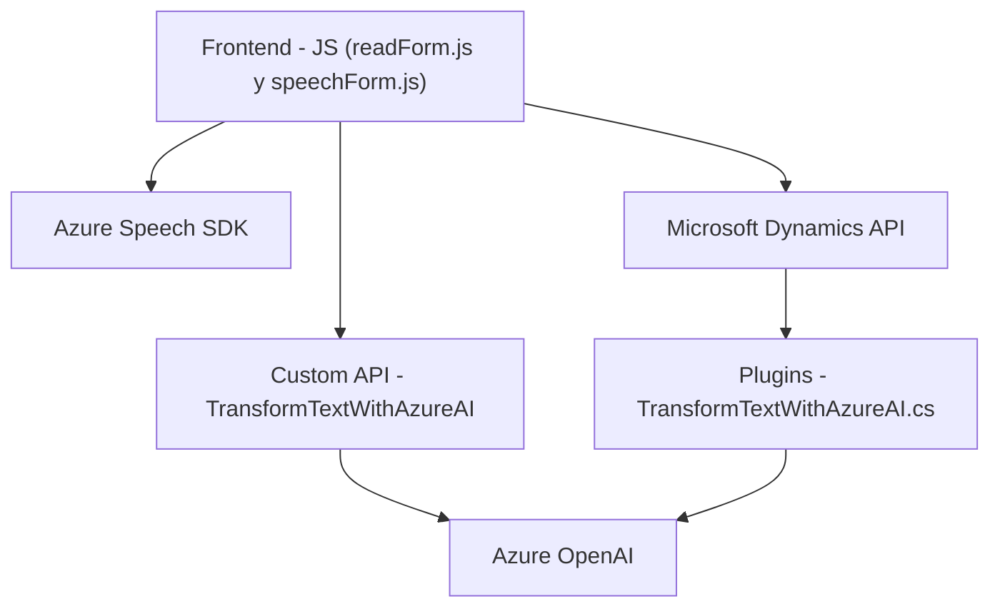

### Resumen técnico
El repositorio contiene principalmente código relacionado con el procesamiento de voz y texto con **Azure Speech SDK** y **Azure OpenAI**, extendiendo funcionalidades en un entorno de formularios dinámicos y Microsoft Dynamics CRM. Los archivos están orientados al manejo de datos de formularios mediante reconocimiento de voz, síntesis TTS (text-to-speech), y transformación estructurada con inteligencia artificial.

---

### Descripción de arquitectura
La solución tiene una **arquitectura modular de tres capas**:
1. **Frontend (JavaScript):** 
   - Implementa la lógica de interacción del usuario para reconocimiento y síntesis de voz utilizando **Azure Speech SDK**.
   - Gestiona la manipulación de formularios y llamadas a APIs externas personalizadas.
2. **Middleware (API/Plugins):**
   - Implementa plugins de Dynamics CRM que extienden las capacidades del sistema al integrar **Azure OpenAI** para procesar y transformar datos.
3. **Backend (Servicios Externos):**
   - Usa API REST de **Azure Speech SDK** y **Azure OpenAI** para el procesamiento de voz y texto.

### Tecnologías usadas
- **Frontend:**
  - JavaScript.
  - Azure Speech SDK.
- **Middleware (Plugins):**
  - C#.
  - Dynamics CRM API.
  - Azure OpenAI.
  - .NET Core (HttpClient, JsonDocument).
- **Backend:**
  - Azure-specific APIs (Speech SDK y OpenAI).
- Dependencias adicionales:
  - Newtonsoft.Json (serialización de JSON).
  - Microsoft Dynamics CRM extensibility framework.

### Patrones usados
- **Modularidad:** Separación clara de responsabilidades entre extracción de datos, procesamiento de voz, y manipulación de formularios.
- **Service-oriented Architecture (SOA):** Comunicación fluida entre la aplicación, Dynamics CRM, y servicios de Azure (Speech SDK y OpenAI).
- **Event-driven:** Interacción basada en eventos en el frontend y plugins de CRM (callback en SDK, execute de Dynamics CRM).
- **Encapsulación:** Lógica agrupada en funciones específicas.
- **Proxy pattern:** En el middleware, el servidor actúa como mediador entre Dynamics CRM y Azure OpenAI para procesar solicitudes.

---

## Diagrama Mermaid

---

### Conclusión final
Este repositorio define una solución modular centrada en el procesamiento de voz, manipulación de formularios y transformación de texto mediante servicios de Azure. La arquitectura en tres capas permite una separación efectiva de responsabilidades y simplifica las integraciones con servicios externos como Azure Speech SDK y OpenAI. Es ideal para entornos de gestión de datos dinámicos como CRM. 
Se beneficia del patrón SOA para garantizar flexibilidad y escalabilidad.