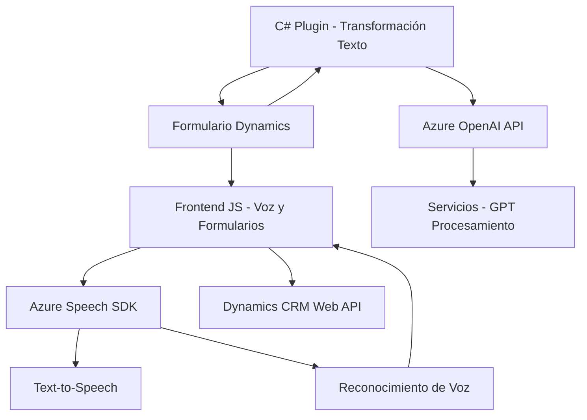

### Breve resumen técnico
El repositorio contiene tres archivos principales que implementan funcionalidades relacionadas con el reconocimiento de voz, la síntesis de texto a voz y la manipulación de datos en formularios dinámicos dentro de Dynamics CRM. Además, incluye un plugin para procesar textos con Azure OpenAI. 

### Descripción de arquitectura
La solución tiene una arquitectura híbrida:
1. **Multicapa**: Hay una separación clara entre la capa de presentación (frontend), la capa lógica (manipulación y procesamiento de datos desde formularios), y la capa de servicios externos (integración con Azure Speech SDK y Azure OpenAI).
2. **Microservicios/Integración**: La solución delega tareas específicas (reconocimiento de voz, text-to-speech, procesamiento IA) a servicios externos, logrando un esquema desacoplado y orientado a servicios.
3. **Plugin-Based Architecture**: En el caso de Dynamics 365, el archivo `TransformTextWithAzureAI.cs` sigue la estructura estándar de plugins, con una integración directa entre la lógica empresarial y APIs externas.

### Tecnologías, frameworks y patrones usados
1. **Frontend**:
   - **JavaScript**: Utilizado para lógica de formularios y carga dinámica de recursos.
   - **Azure Speech SDK**: Funciones integradas para reconocimiento de voz y síntesis de texto a voz.
   - **Dynamics CRM Web API**: Para interacción con el sistema CRM y manipulación de datos en formularios.

2. **Backend Plugin**:
   - **C#/.NET**: Desarrollo de plugins personalizados para ejecución dentro de Dynamics 365.
   - **Azure OpenAI API**: Procesamiento de texto estructurado mediante modelos de IA de OpenAI.
   - **Newtonsoft.Json & System.Text.Json**: Para crear, manipular y consumir JSON de las APIs.

3. **Patrones arquitectónicos**:
   - **Cargador dinámico de recursos**: Uso de `ensureSpeechSDKLoaded()` para incluir dependencias externas de manera dinámica.
   - **Delegación**: Lógica modular basada en callbacks y eventos dentro del frontend.
   - **Integración con servicios externos**: Uso robusto de APIs para lógica empresarial y funcionalidades especializadas.
   - **Encapsulación lógica**: Plugins para Dynamics 365 encapsulan la lógica empresarial específica.

### Dependencias o componentes externos
1. **Azure Speech SDK**: Reconocimiento de voz, síntesis de texto a voz.
2. **Azure OpenAI API**: Procesamiento de datos estructurados usando modelos GPT-4.
3. **Dynamics CRM Web API**: Manipulación de formularios y datos relacionados con entidades CRM.
4. **Librerías para JSON y HTTP**: `System.Net.Http`, `Newtonsoft.Json.Linq`.

---

### Diagrama Mermaid válido para GitHub

---

### Conclusión final
La solución es un sistema distribuido que implementa funcionalidades de integración entre un frontend JavaScript y servicios avanzados de Azure, como Speech SDK y OpenAI API. La arquitectura completa es una combinación de varias capas y patrones de integración:
1. En el frontend, las tareas se gestionan mediante funciones modulares para interacción de voz y manipulación de formularios.
2. En Dynamics 365, los plugins (en C#) se utilizan para extender la funcionalidad del CRM con servicios inteligentes mediante API externas.

Este repositorio es altamente extensible y especializado, adecuado para entornos corporativos que buscan automatizar procesos usando IA y tecnologías dinámicas.