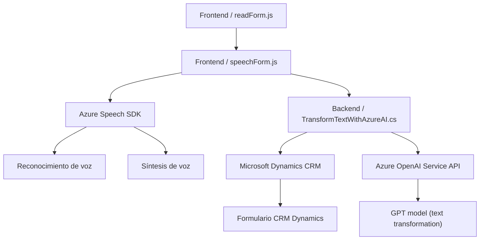

### Breve resumen técnico:
Este repositorio implementa una solución mixta que integra interfaces de usuario (frontend) y backend para Microsoft Dynamics CRM. Usa tecnología avanzada como **Azure AI Speech SDK** y **Azure OpenAI GPT**, permitiendo análisis, síntesis de voz y procesamiento de texto mediante APIs.

### Descripción de arquitectura:
La arquitectura muestra un modelo **n-capas**, compuesto por las siguientes:
1. **Capa de presentación (frontend)**: Archivos en JavaScript que implementan síntesis de voz, capturan datos de formularios y proporcionan interacción entre los usuarios y el sistema.
2. **Capa de lógica de negocio (backend)**: Plugins en Dynamics CRM que procesan reglas avanzadas y aplican IA para transformar los datos antes de enviarlos al CRM.
3. **Capa de integración y servicios externos**: Comunicación directa con servicios de **Azure Speech SDK** para síntesis de voz y reconocimiento, así como el uso de **Azure OpenAI Service** para transformación y análisis de texto.

### Tecnologías usadas:
1. **Frontend**:
   - JavaScript.
   - Azure Speech SDK (Reconocimiento/entrada de voz y síntesis).
   - DOM Manipulation en CRM Dynamics.
2. **Backend**:
   - Plugins desarrollados en C# sobre Dynamics CRM.
   - Servicios HTTP para consumir Azure OpenAI API.
3. **Servicios y APIs Externos**:
   - Azure Speech SDK.
   - Azure OpenAI GPT.
4. **Frameworks/Bibliotecas**:
   - Microsoft.Xrm.Sdk para la integración en CRM.
   - System.Net.Http y Newtonsoft.Json para manejar APIs y JSON en el backend.

### Diagrama **Mermaid**:

### Conclusión final:
Este repositorio representa una solución bien estructurada para integrar capacidades avanzadas de IA y voz en Microsoft Dynamics CRM. Utiliza patrones como arquitectura en capas, modularidad y consumo de APIs externas. Aunque funcional, el código presentado muestra desafíos como la exposición de claves sensibles, necesitando mejoras en seguridad y mejor gestión de configuraciones. La solución aporta características modernas a los flujos empresariales con un diseño armonioso entre frontend y backend.