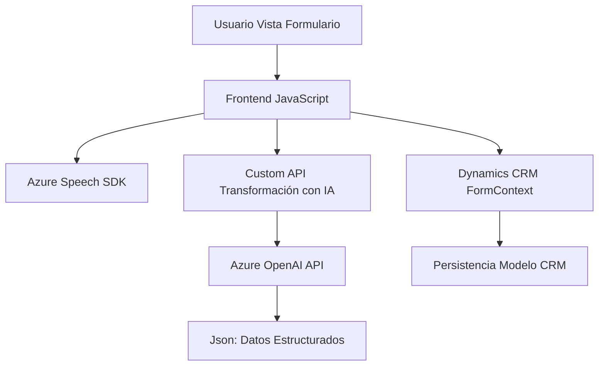

### Breve resumen técnico
El repositorio analizado contiene tres archivos que juntos forman una solución que integra reconocimiento y síntesis de voz, procesamiento dinámico de formularios, y transformación de texto con asistencia de IA empleando Azure servicios. Esta solución parece orientada a la automatización de procesos en Microsoft Dynamics 365 mediante interacción vocal y datos estructurados provenientes de OpenAI.

---

### Descripción de arquitectura
La arquitectura de la solución es **híbrida de microservicios y n-capas**, consistente en:
1. **Frontend (JavaScript)**: Interactúa directamente con el usuario y emplea herramientas como Azure Speech SDK para reconocimiento y síntesis de voz.
2. **Backend Plugins .NET**: Expone funcionalidades personalizadas en Dynamics CRM, como un servicio transformador (Azure OpenAI) basado en reglas.
3. **Servicios externos (Azure Speech SDK y OpenAI)**: Se encargan de realizar síntesis de voz, reconocimiento y procesamiento avanzado de texto.
4. **Integración dinámica del modelo de datos de Dynamics CRM**: Utiliza mapas dinámicos para vincular formularios interactivos con sus atributos internos en el CRM.

El diseño sigue patrones como modularidad, manejo de eventos asíncronos y desacoplamiento de servicios, permitiendo alta escalabilidad y flexibilidad.

---

### Tecnologías usadas
1. **Frontend**:
   - **JavaScript**: Utilizado para manejos dinámicos en el navegador y comunicación con APIs.
   - **Azure Speech SDK**: Síntesis y reconocimiento de voz en tiempo real.
   - **HTTP (APIs)**: Comunicación con servicios externos y APIs personalizadas (como OpenAI).

2. **Backend Plugins**:
   - **C#/.NET Framework**: Desarrollo de plugins para Microsoft Dynamics CRM.
   - **Dynamics CRM SDK**: Integración directa con el modelo de datos del CRM.
   - **Azure OpenAI API**: Procesamiento de texto avanzado basado en IA.

3. **Servicios externos**:
   - **Azure Speech Service (https://aka.ms/csspeech)**: Reconocimiento y síntesis de voz.
   - **Azure OpenAI API**: Transformación de texto en formato estructurado.

---

### Diagrama Mermaid

---

### Conclusión final
La solución analizada es una integración avanzada diseñada para Microsoft Dynamics CRM, que aprovecha tecnologías de reconocimiento y síntesis de voz, junto con IA avanzada mediante Azure OpenAI. Su arquitectura híbrida de microservicios y n-capas asegura escalabilidad, reutilización y un ecosistema flexible, ideal para automatización empresarial.

Aunque funcional y bien estructurada, presenta áreas de mejora, como la gestión segura de credenciales que actualmente son hardcodeadas en el código. Esto podría ser una vulnerabilidad crítica, especialmente al tratar con servicios externos de pago como Azure.

En general, la solución es robusta y muestra buenas prácticas de diseño, como modularidad, separación de responsabilidades y una arquitectura desacoplada.