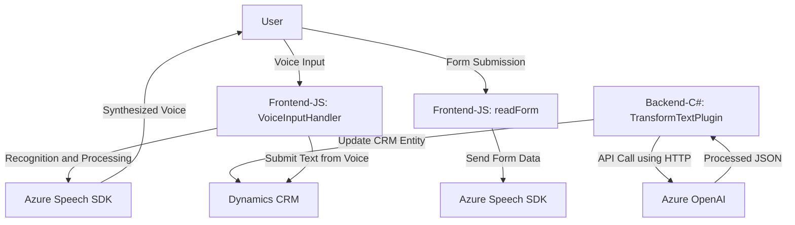

### Breve resumen técnico
La solución presentada se centra en integrar capacidades de síntesis de voz, procesamiento de entrada por voz y transformación de texto con inteligencia artificial en un entorno que parece ser Dynamics CRM (probablemente Dynamics 365). La arquitectura está dividida en tres componentes principales:
1. **Frontend**: Scripts para manejar formularios y experiencia de voz.
2. **Backend**: Un plugin .NET (Dynamics CRM) para integración con Azure OpenAI.
3. **APIs y servicios externos**: Uso del Azure Speech SDK y Azure OpenAI.

---

### Descripción de la arquitectura
La solución implementa un **arquitectura híbrida basada en servicios**. Aunque no es propiamente un sistema de microservicios, la interdependencia entre Dynamics CRM, el plugin .NET y los servicios en la nube lo posiciona como una solución bajo el esquema de "integración de servicios".

Además, en términos del diseño técnico del código:
- Los archivos frontend siguen una estructura **modular** basada en funciones, cada una responsable de una sola tarea (principio de responsabilidad única).
- El **backend** sigue el **patrón de repositorio y servicio**, interactuando con Dynamics CRM como repositorio y delegando la inteligencia artificial a un servicio externo (Azure OpenAI).

---

### Tecnologías usadas
1. **Frontend**:
   - JavaScript: Para la interacción dinámica con formularios.
   - Integración con el navegador: Trabaja con DOM APIs y carga dinámicamente el Azure Speech SDK.
   - **Azure Speech SDK**: Bibliotecas para reconocimiento y síntesis de voz integradas dinámicamente en el frontend.

2. **Backend**:
   - **C#**: Lenguaje de programación.
   - **Dynamics CRM SDK (Microsoft.Xrm.Sdk)**: Framework para implementar extensiones en CRM.
   - **HttpClient para llamadas externas a Azure OpenAI**.
   - **Newtonsoft.Json y JsonSerializer** para manejar las respuestas de la API OpenAI.

3. **Servicios en la nube**:
   - Azure Speech Service: Para reconocer y convertir textos a voz.
   - Azure OpenAI: Para procesamiento de lenguaje natural y generación de datos estructurados.

---

### Dependencias o componentes externos que podrían estar presentes
- **Servicios en la nube**.
  - Azure Speech Service (SDK de Javascript).
  - Azure OpenAI para procesamiento natural y generación estructurada.
- **Integración directa con Dynamics CRM APIs**:
  - Manejo de formularios mediante `FormContext`.
  - Lógica personalizada con Dynamics CRM plugin y el SDK de Dynamics.
- **JavaScript y DOM Manipulation**: Dependencia del navegador para la ejecución del código.
- **API personalizada**: Utilizando `Xrm.WebApi.online.execute`.

---

### Diagrama Mermaid válido para GitHub

---

### Conclusión final
La solución es un **ecosistema híbrido** que une funcionalidades de frontend en JavaScript (para integración con formularios y voz) con backend basado en **Dynamics CRM plugins** (en C#). Tanto el frontend como el backend dependen de **servicios en la nube** provistos por Azure: Speech SDK y OpenAI.

- **Fortalezas**: Modularidad, escalabilidad, y utilización de servicios cloud para procesamiento avanzado.
- **Áreas de mejora**: Considerar la seguridad en la comunicación con APIs de Azure, y potencialmente reducir la dependencia en cargas dinámicas de scripts en el frontend para garantizar mejor control operacional.