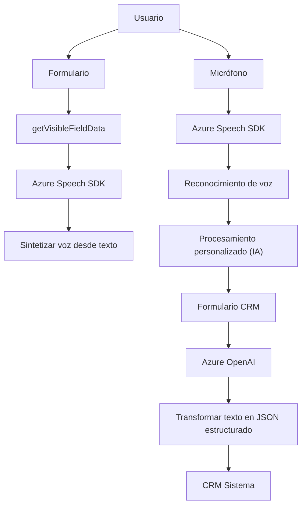

### Breve resumen técnico
El repositorio contiene tres archivos con funcionalidades relacionadas con la integración de servicios de reconocimiento de voz y generación de texto estructurado mediante tecnologías como **Azure Speech SDK**, **Azure OpenAI** y un entorno CRM basado en **Microsoft Dynamics 365**. Este enfoque evidencia la implementación de una solución híbrida que combina un **frontend** (para generación de audio y captura de voz) con un backend basado en **plugin** para procesamiento avanzado.

---

### Descripción de arquitectura
La solución es modular, diseñada para trabajar en un entorno de **Microsoft Dynamics CRM**, con funcionalidades distribuidas en tres componentes principales:
1. **Frontend:** Procesa formularios en una interfaz cliente, realiza lecturas y síntesis de audio interactuando con Azure SDK.
2. **Backend (Plugin):** Extiende la lógica del CRM, utilizando un patrón de **event-driven architecture** y **plugin design pattern**. Procesa el texto y lo transforma en un formato estructurado JSON.
3. **Integración de APIs:** La solución se apoya en servicios externos (Azure Speech SDK y Azure OpenAI) para extender capacidades de interacción.

La arquitectura del repositorio corresponde a **una solución híbrida basada en n capas**, donde cada componente cumple un rol específico:
- **Presentación (Frontend):** Procesa/recibe formularios y gestiona la interacción del usuario.
- **Capa intermedia:** Utiliza servicios API como Azure OpenAI y Azure Speech SDK para externalizar lógica compleja.
- **Capa de aplicación empresarial:** Extiende la funcionalidad de un sistema CRM con opciones personalizadas para manejar eventos y datos.

---

### Tecnologías usadas
1. **Azure Speech SDK**:
   - Reconocimiento de voz y síntesis de texto en audio.
   - Carga dinámica vía JavaScript.
2. **Azure OpenAI**:
   - Procesamiento de texto en lenguaje natural para generar JSON estructurado según reglas definidas.
3. **Microsoft Dynamics SDK**:
   - Implementación de plugins y manejo de eventos en el contexto de un CRM.
4. **JavaScript (Frontend)**:
   - Manipulación dinámica de DOM, manejo de datos de formularios, integración con SDK y APIs.
5. **C# (Plugin para CRM)**:
   - Transformación avanzada de datos utilizando servicios externos.
6. **HTTPS/REST API**:
   - Integración vía solicitudes HTTP para Azure OpenAI y APIs personalizadas.
7. **JSON Parsing**:
   - Manejo de estructuras JSON para comunicación entre APIs y CRM.
8. **Modular Design Patterns**:
   - Separación clara de funciones por responsabilidad.

---

### Diagrama **Mermaid**

---

### Conclusión final
La solución demuestra una integración robusta en entornos CRM, utilizando un enfoque modular de tres capas. El **frontend** simplifica la interacción del usuario con herramientas avanzadas como reconocimiento de voz. Por su parte, el **backend** permite transformar datos semiestructurados en JSON mediante lógica personalizada gracias a servicios externos como **Azure OpenAI**, mientras que la arquitectura impulsa la separación de responsabilidades y la extensibilidad.

Este enfoque es ideal para entornos que requieren procesamiento automatizado de datos de formularios en sistemas CRM avanzados, permitiendo una experiencia conversacional y personalizada basada en inteligencia artificial.