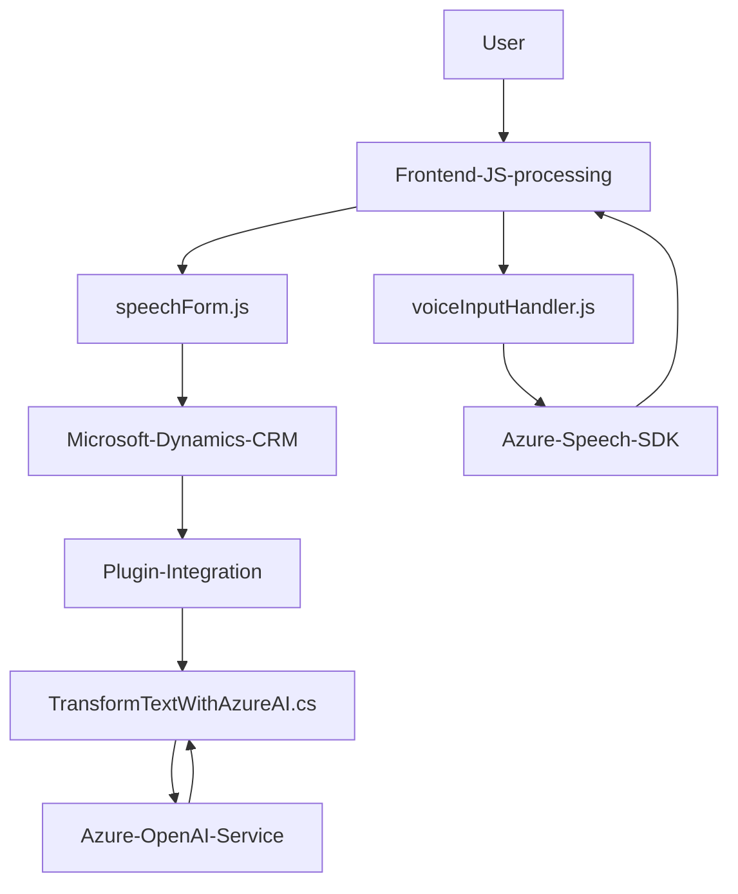

# Breve resumen técnico

El repositorio analiza un sistema orientado principalmente a la interacción entre usuarios y formularios, facilitando funcionalidades como la entrada y salida de datos mediante voz. Las tres secciones del código proporcionado (readForm.js, speechForm.js, TransformTextWithAzureAI.cs) combinan el frontend, un plugin de backend y una integración con servicios de Azure, aplicando lógicas de manipulación de datos en formularios y procesamiento dinámico gracias a inteligencia artificial (Azure OpenAI y Azure Speech SDK).

---

## Descripción de la arquitectura:

El sistema combina un **modelo de solución en capas**, con diferentes componentes (frontend y backend) que interactúan a través de interfaces definidas. Es posible identificar las siguientes partes arquitectónicas:

1. **Frontend:** Basado en JavaScript para manejar la visualización de datos del formulario y su lectura mediante integración con el Azure Speech SDK. Muestra características de aproximación modular para la lógica de lectura, entrada y salida de datos.
2. **Backend:** Define un plugin que se ejecuta como parte de Microsoft Dynamics CRM, transformando texto mediante la integración con la API de Azure OpenAI. Este plugin utiliza comunicación vía API REST y maneja datos en formato JSON.
3. **Servicios externos:** Integra servicios de Azure (Speech y OpenAI) para habilitar procesamiento avanzado de voz y reglas personalizadas para transformación de texto.

La arquitectura global corresponde a una solución **orientada a servicios (SOA)** donde el frontend actúa como el consumidor y la capa backend integra los servicios externos de Azure y añade lógica específica para interacción con Microsoft Dynamics CRM en un modelo de extensión basado en plugins.

---

## Tecnologías usadas

### Frontend
- **JavaScript (ES6)**: Para el manejo de la lógica del frontend y la interacción directa con el formulario.
- **Azure Speech SDK**: Utilizado para síntesis y reconocimiento de voz, cargado dinámicamente desde el CDN oficial.

### Backend
- **Microsoft Dynamics CRM SDK**: Utilizado para el desarrollo de plugins que interactúan con los datos en el entorno CRM y gestionan eventos internos.
- **Azure OpenAI Service**: Mejora del procesamiento de texto mediante inteligencia artificial, integrándose vía API REST.
- **Newtonsoft.Json y System.Text.Json**: Para la generación y tratamiento de estructuras de datos en formato JSON.
- **HTTP Client** (C#): Para establecer comunicación con servicios remotos (Azure OpenAI).

---

## Diagrama Mermaid

---

## Conclusión final

Este repositorio implementa un sistema modular y extensible, destinado a la interacción mediante voz con formularios en un entorno de Microsoft Dynamics CRM. Su diseño refleja un enfoque orientado a servicios (SOA), con dependencias externas en varios servicios de Azure que refuerzan la aplicación con inteligencia artificial (procesamiento de texto mediante OpenAI) y funcionalidades de síntesis y reconocimiento de voz (Azure Speech SDK). 

Ofrece oportunidades para mejorar la experiencia del usuario en aplicaciones empresariales basadas en CRM y muestra una concepción técnica sólida al estructurar cada funcionalidad con modularidad y emplear patrones como la delegación y la arquitectura plugin.