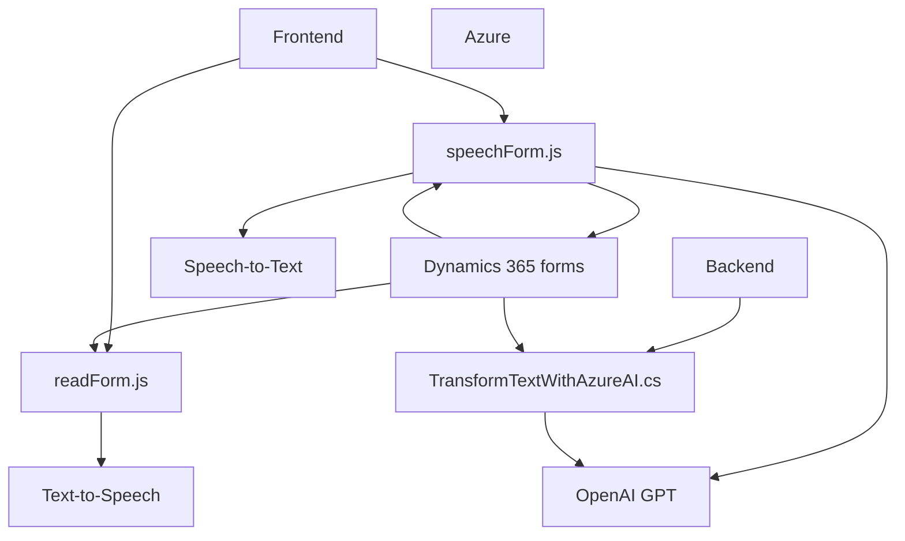

### Breve Resumen Técnico

La estructura del repositorio contiene tres archivos principales que colaboran en la implementación de una solución orientada a la accesibilidad y procesamiento inteligente en formularios de **Dynamics 365**. La solución se apoya en tecnologías de **Azure Speech SDK** y **Azure OpenAI** para la síntesis, reconocimiento y transformación de voz y texto, integrándolos directamente en Dynamics CRM mediante plugins y lógica de cliente en JavaScript.

---

### Descripción de Arquitectura

1. **Tipo de Solución**: Integración de servicios IA/cloud con una plataforma empresarial (**Dynamics 365**) para accesibilidad y automatización. Es una extensión funcional del frontend en Dynamics 365, que combina procesamiento de formularios locales y consultas/enriquecimiento de información mediante APIs cloud.

2. **Arquitectura**:
   - **Componente frontend (JavaScript)**: Presenta funciones modulares para interacción dinámica con el usuario en tiempo real, con llamadas de reconocimiento y síntesis de voz.
   - **Componente backend (C#)**: Plugin basado en Dynamics CRM que permite la transformación de entrada mediante el modelo GPT4 de Azure OpenAI. 
   - Se puede considerar un **Modelo de Arquitectura en n capas**, donde cada capa cumple una función específica: presentación (frontend), lógica de negocio (procesamiento de APIs / plugins) y comunicación con servicios externos.

3. **Patrones utilizados**:
   - **Modularidad**: Código fragmentado en funciones y métodos, cada uno con un propósito claro.
   - **Callback/Promesas**: Gestiona dependencias entre carga dinámica y operaciones de procesamiento de voz (frontend).
   - **Plugin Design Pattern**: Presentado en el componente backend.
   - **Service Integration Pattern**: Uso de múltiples APIs (Azure Speech y Azure OpenAI).
   - **Encapsulación y SRP (Single Responsibility Principle)**: Cada función y método tiene una funcionalidad bien definida.

4. **Tecnologías y Frameworks** utilizados:
   - **FrontEnd**:
     - **JavaScript**, usando programación modular y asíncrona (promesas, callbacks).
     - SDKs: **Azure Speech SDK** y APIs relacionadas para síntesis y reconocimiento de voz.
     - Dynamics 365 client API como interfaz principal.

   - **Backend**:
     - Lenguaje: **C#**
     - Framework y Tech Stack:
       - **Dynamics CRM Platform**: Plugins mediante la interfaz `IPlugin`.
       - SDK: `System.Net.Http`, `Newtonsoft.Json` para integrar con el servicio **Azure OpenAI**.

---

### Tecnologías, Frameworks y Dependencias Utilizadas

1. **Frontend**: 
   - **Azure Speech SDK**: Para reconocimiento y síntesis de voz.
   - **Dynamics 365 API**:
     - `Xrm.WebApi`: Para interacción con campos de formularios.

2. **Backend**:
   - **Dynamics CRM Plugin SDK**: Framework extensible para conectar y ejecutar lógica en eventos preconfigurados del CRM.
   - **Azure OpenAI Service Integration**: Para transformar texto en una estructura JSON mediante GPT generativo.
   - **Newtonsoft.Json** y `System.Text.Json`: Librerías para manejo de JSON.

3. **Integración de servicios externos y dependencias**:
   - Azure OpenAI (API para GPT-based workflows).
   - Dynamics 365 (Framework gestionado).

---

### Diagrama Mermaid

A continuación, se presenta un diagrama que describe las interacciones entre los módulos:

---

### Conclusión Final

La solución presentada ofrece una integración completa de tecnologías para accesibilidad y automatización. Se basa en una arquitectura modular con separación de responsabilidades: El frontend maneja la interacción y procesamiento rápido, mientras que un backend robusto permite operaciones más complejas como transformación de texto usando inteligencia artificial de Azure OpenAI.

#### Ventajas:
- Procesos bien separados (presentación, negocio y servicios externos).
- Uso de servicios cloud para expandir las capacidades del sistema.

#### Limitaciones:
- Hardcoded valores sensibles como claves de API en el plugin pueden ser un riesgo de seguridad.
- La solución depende de servicios externos (Azure Speech/OpenAI), por lo que agregar mecanismos de redundancia sería ideal para mejorar la resiliencia.

En conclusión, la solución refleja prácticas modernas de integración basada en eventos con servicios IA, y su arquitectura permite escalabilidad y extensibilidad en entornos empresariales como Dynamics 365.