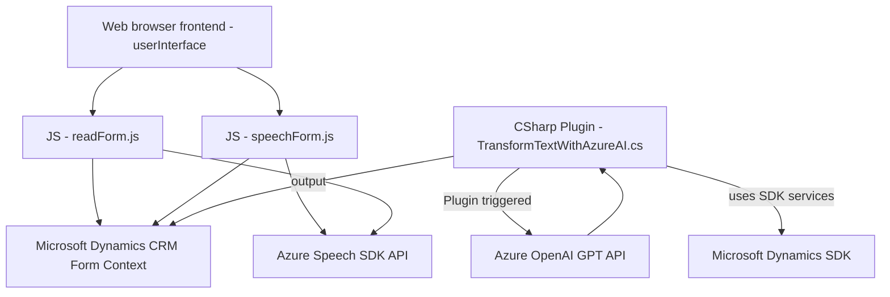

### Breve resumen técnico
Este repositorio describe la implementación de una solución híbrida orientada al procesamiento de datos en formularios y texto, utilizando APIs de Azure Speech SDK y Azure OpenAI en un entorno Dynamics 365. La solución abarca tanto un **frontend en JavaScript** como componentes de backend en **C# (plugin)**. La finalidad es integrar funciones de reconocimiento de voz, síntesis de voz, y transformación de texto mediante reglas específicas mediante Azure-powered intelligence.

---

### Descripción de arquitectura
1. **Arquitectura general**:
   - Es una solución **multicapas**, que incluye lógica **frontend** (procesamiento de voz y formulario) y **backend** (plugins en Dynamics). El frontend actúa como una capa de interacción para el usuario, mientras que el backend maneja la lógica avanzada integrada con Dynamics 365 y servicios de IA.
   
2. **Datos y flujo**:
   - El *frontend* convierte datos del formulario a texto y sintetiza voz mediante Azure Speech SDK.
   - El plugin en C# transforma texto basado en reglas mediante Azure OpenAI y devuelve JSON estructurado para ser consumido por Dynamics.

3. **Componentes principales**:
   - **Frontend** (manejo de formularios y síntesis/reconocimiento de voz).
   - **Backend plugin** (procesamiento avanzado de texto con Azure OpenAI).

4. **Patrones implementados**:
   - **Procedural programming** en el frontend: funciones modulares con alta cohesión.
   - **Plugin Architecture** en el backend: estructura diseñada para expandir Dynamics CRM.
   - **Event-Driven Integration**: Eventos del formulario o CRM activan procesos en frontend y backend.
   - **Layered Architecture**: Separación de responsabilidades entre capas (frontend/backend).

---

### Tecnologías usadas
1. **Frontend**:
   - **Azure Speech SDK** (síntesis/reconocimiento de voz en tiempo real).
   - **JavaScript** para el procesamiento del formulario y su integración con el SDK.
   - **Microsoft Dynamics** para interacción con formularios/formContext.

2. **Backend**:
   - **C#** como lenguaje para desarrollo de plugins.
   - **Dynamics SDK** (`Microsoft.Xrm.Sdk`) para interacción directa con datos del CRM.
   - **Azure OpenAI** para transformar texto con reglas avanzadas y generación de JSON estructurado.
   - **Newtonsoft.Json** para el manejo de datos JSON en plugins.

3. **Conexión a APIs**:
   - `Azure OpenAI API`: Procesamiento semántico de texto.
   - `Azure Speech SDK API`: Gestión de síntesis y reconocimiento de voz.
   - `Microsoft Dynamics Web services (Xrm.WebApi)`: Operaciones CRUD con datos del CRM.

---

### Diagrama Mermaid

---

### Conclusión final
La solución es una **multi-capa entre frontend y backend**, diseñada para una interacción avanzada mediante el reconocimiento y síntesis de voz en formularios y la inteligencia artificial para transformar datos textual en el contexto de Dynamics CRM. El frontend en **JavaScript** realiza la interfaz e interacción inicial con el usuario, mientras que el backend en **C#** maneja reglas estrictas de negocio y las operaciones de integración con servicios externos como Azure Speech SDK y Azure OpenAI.

La arquitectura es altamente modular, con cada componente orientado a una tarea específica (procesamieneto de voz, manipulación del formulario, transformación IA) y utilizando patrones como el diseño orientado a funciones y la arquitectura de plugins en Dynamics.

Esta solución representa un diseño moderno que se puede escalar fácilmente, integrándose con otros servicios en el futuro si se requiere procesamiento adicional avanzado o interacciones más ricas.