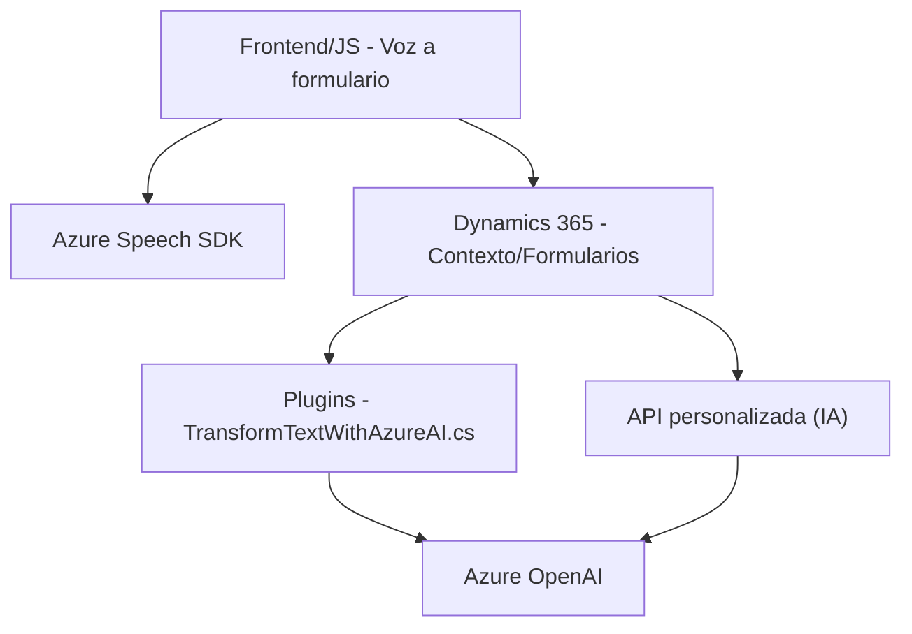

## Breve resumen técnico

Este conjunto de archivos describe un sistema basado en tecnologías web y cloud que interconecta una interfaz de usuario (frontend en JavaScript), un plugin para Dynamics CRM (`TransformTextWithAzureAI.cs`), y servicios de Azure (Azure Speech SDK y OpenAI API). La finalidad es proporcionar una interacción avanzada con formularios en aplicaciones web y en Dynamics 365 mediante entrada y salida de datos por voz y procesamiento de texto asistido por inteligencia artificial.

---

## Descripción de arquitectura

El sistema sigue una **n-capas** distribuida entre tres componentes principales:
1. **Frontend (JavaScript)**: Se encarga de la obtención y procesamiento de datos en formularios web, permitiendo su interacción mediante síntesis y reconocimiento de voz.
2. **Backend (Plugin de Dynamics CRM)**: Implementado con C#, este plugin interactúa con Dynamics CRM para aplicar reglas específicas de transformación de texto usando Azure OpenAI.
3. **Servicios externos (Azure)**:
   - **Azure Speech SDK** para reconocimiento y síntesis de voz directamente manejado desde el frontend.
   - **Azure OpenAI** para la transformación avanzada de texto desde el plugin.

Si bien muestra cierta separación de responsabilidades, aún no alcanza el nivel de independencia funcional y desacoplamiento propio de arquitecturas como microservicios o hexagonal. Es un sistema orientado a **componentes altamente integrados pero modularmente organizados**.

---

## Tecnologías usadas

1. **Frontend**:
   - **JavaScript ES6+** para lógica y manipulación del DOM.
   - **Azure Speech SDK** mediante CDN (`https://aka.ms/csspeech/jsbrowserpackageraw`).
   - **Promesas y asincronía** (manejo de `Promise` y callbacks) para la carga de dependencias y ejecución de SDKs.

2. **Backend**:
   - **Dynamics 365 (Microsoft.Xrm.Sdk)**: Framework para desarrollo de plugins y extensiones.
   - **C# (.NET)**: Base para el plugin `TransformTextWithAzureAI.cs`.
   - **Azure OpenAI API** para procesamiento avanzado de texto basado en modelos GPT-4.

3. **Servicios complementarios**:
   - **Newtonsoft.Json** y **System.Text.Json** para realizar operaciones con objetos JSON (ej. serialización/deserialización).

---

## Dependencias o componentes externos

1. **Componentes externos/Servicios Cloud**:
   - **Azure Speech SDK**: Para reconocimiento y síntesis de voz en frontend.
   - **Azure OpenAI Service**: Procesamiento avanzado de texto en backend (plugin Dynamics).
   - **Dynamics 365 Web API**: Interacción con formularios y entidades/sistemas CRM.

2. **Librerías y otros componentes**:
   - **JSON Libraries**: Para manejo eficiente de objetos JSON en C#.
   - **DOM**: Uso nativo del DOM en JavaScript para manipulación de formularios y carga dinámica de scripts.

3. **API personalizada**:
   - Posible comunicación desde `speechForm.js` con una API interna para enriquecer la transcripción mediante inteligencia artificial.

---

## Diagrama **Mermaid** compatible con GitHub Markdown

---

## Conclusión final

El sistema está diseñado para brindar una interacción fluida entre usuarios y formularios utilizando tecnologías avanzadas de reconocimiento de voz, síntesis de voz y procesamiento de texto. Con arquitectura orientada a componentes organizados en capas, aprovecha la modularidad para garantizar una clara separación de responsabilidades.

Aunque no alcanza el nivel de desacoplamiento extremo de arquitecturas hexagonales/microservicios, cuenta con buen potencial de escalabilidad integrando servicios cloud, como Azure Speech SDK y Azure OpenAI, y personalizaciones en Dynamics CRM.

Posibles mejoras futuras incluyen:
- Transición hacia una arquitectura basada en microservicios para mayor independencia funcional.
- Optimización de las llamadas a servicios externos mediante un patrón de mensajería asíncrona.
  