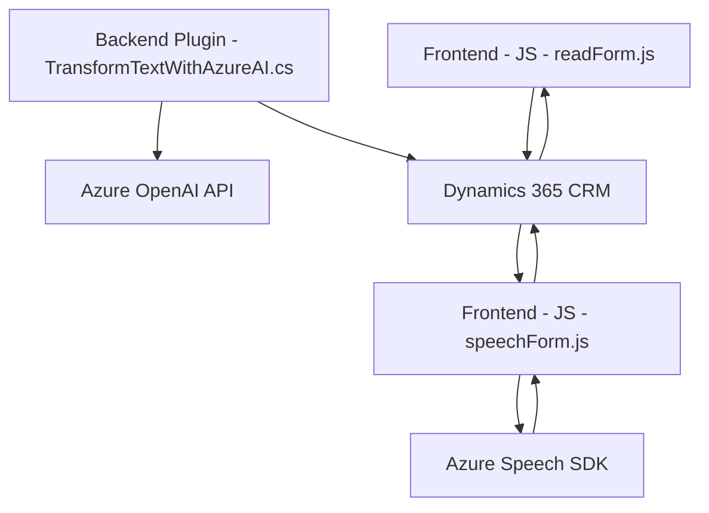

### Breve resumen técnico

El repositorio presenta una solución que integra múltiples componentes orientados a mejorar la experiencia de usuario en aplicaciones basadas en Microsoft Dynamics 365. Los scripts en la carpeta `FRONTEND/JS` implementan funcionalidades para reconocer, sintetizar y procesar datos relacionados a formularios utilizando Azure Speech SDK. Además, el archivo `Plugins/TransformTextWithAzureAI.cs` implementa un *plugin* para Dynamics CRM que interactúa con Azure OpenAI (GPT-4) para transformar texto en JSON estructurado.

---

### Descripción de arquitectura

1. **Tipo de solución:**  
   Se trata de un conjunto de módulos que implementan funcionalidades de interacción con formularios mediante herramientas como Azure Speech SDK y Azure OpenAI API. La solución combina un frontend para integración directa en formularios de Dynamics 365 junto con un plugin para la extensión del servidor.

2. **Descripción de arquitectura:**  
   La arquitectura general refleja un enfoque de **cliente-servidor**:
   - **Frontend:** Una aplicación cliente basada en scripts JavaScript (procesamiento de datos y síntesis/reconocimiento de voz).
   - **Integración en Dynamics:** Los scripts dependen del contexto de acciones en formularios de Dynamics 365.
   - **Backend Plugins:** Un plugin desarrollado en C# que opera en Dynamics CRM para la transformación de texto en datos estructurados vía Azure OpenAI API.
   - Modularidad y separación de responsabilidades: el frontend y el plugin operan independientemente pero integrados a través del marco Dynamics.

---

### Tecnologías usadas 

1. **Frontend:**  
   - **JavaScript:** Implementa lógica de interacción, reconocimiento y síntesis de voz.  
   - **Azure Speech SDK:** Solución para reconocimiento y síntesis de voz cargada dinámicamente desde un script externo.

2. **Backend Plugins:**  
   - **C#:** Implementación del plugin basado en la interfaz de Dynamics CRM.  
   - **Azure OpenAI (GPT-4):** Utilizado para procesamiento avanzado de texto.  
   - **Newtonsoft.Json y System.Text.Json:** Para trabajar con datos JSON.  
   - **System.Net.Http:** Comunicación HTTP con la API de OpenAI.  
   - **Microsoft.Xrm.Sdk:** Interacción estándar con servicios de Dynamics CRM.

3. **Plataformas de integración:**  
   - **Dynamics CRM (Microsoft Dynamics 365):** Base para formularios y contexto de datos.  
   - **Azure Services:** Speech SDK y OpenAI API.

---

### Diagrama Mermaid

---

### Conclusión final

El repositorio implementa una solución modular que aprovecha servicios en la nube (Azure) y estándares de Dynamics 365. Utiliza una arquitectura orientada a propósito:
- **Frontend:** Scripts diseñados para proporcionar accesibilidad y mejorar interacción mediante voz.  
- **Backend Plugin:** Un *plugin* que extiende la lógica de procesamiento mediante análisis semántico avanzado con OpenAI.

La integración de servicios como Azure Speech SDK y OpenAI permite que la solución sea extensible para escenarios futuros, como la ampliación del reconocimiento de datos o nuevos servicios de IA. La elección de tecnologías refleja patrones modernos de desarrollo: modularidad, cliente-servidor y externalización de servicios clave.