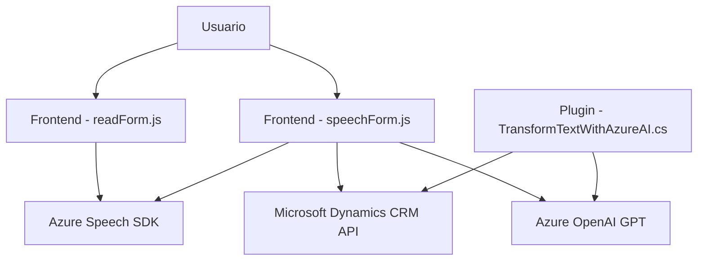

### Breve Resumen Técnico:

El repositorio contiene tres archivos principales:
1. **Frontend/JS/readForm.js**: Procesa datos visibles en formularios y los convierte en voz mediante Azure Speech SDK.
2. **Frontend/JS/speechForm.js**: Captura entrada de voz, la transcribe con Azure Speech SDK y la integra con formularios de Microsoft Dynamics CRM mediante una API personalizada.
3. **Plugins/TransformTextWithAzureAI.cs**: Plugin de Dynamics CRM que usa Azure OpenAI para transformar texto dinámico en JSON estructurado, basado en reglas definidas.

### Descripción de Arquitectura:

Se utiliza una arquitectura **multi-capa**:
- **Capa de presentación**: Representada por los archivos JavaScript que interactúan con formularios dinámicos y datos de entrada del usuario (voz y texto).
- **Capa lógica**: Gestiona la transformación y mapeo de datos entre entrada del usuario, Azure Services y formularios. Usa funciones modulares y un plugin para gestionar decisiones específicas.
- **Capa de integración**: Conecta APIs externas (Azure Speech, Azure OpenAI) y facilita mecanismos de autenticación, validación e invocación en tiempo de ejecución.

Además de la arquitectura multi-capa, el sistema también manifiesta características de una **arquitectura hexagonal**:
- Los componentes interactúan entre sí mediante puertos y adaptadores (contexto del formulario y APIs externas).
- Uso de plugins que pueden ser añadidos o sustituidos sin afectar directamente la aplicación principal.

### Tecnologías Usadas:

1. **Frontend:**
   - **Lenguaje:** JavaScript.
   - **Frameworks:** Microsoft Dynamics CRM API (Xrm.WebApi).
   - **SDK:** Azure Speech SDK (carga dinámica para navegadores).
   - **Patrones usados:**
     - Modularidad mediante funciones específicas.
     - Carga diferida de dependencias (optimizando tiempo de ejecución).
     - Integración de servicios externos mediante API.

2. **Backend (Plugin en .NET):**
   - **Lenguaje:** C#.
   - **Frameworks:**
     - Microsoft Dynamics SDK (`Microsoft.Xrm.Sdk`).
     - Newtonsoft.Json para procesar objetos JSON.
   - **Servicios usados:**
     - Azure OpenAI (modelos GPT) mediante solicitudes HTTP POST.
     - Autenticación con API Key administrada desde Azure.
   - **Patrones usados:**
     - Proxy Pattern para delegar la comunicación entre Dynamics CRM y Azure OpenAI.
     - Plugin-Based Architecture para extender funcionalidad sin modificar el core del CRM.

### Dependencias o Componentes Externos Posibles:
1. **Azure Speech SDK**: Para síntesis y procesamiento de voz.
2. **Azure OpenAI GPT Service**: Para transformar texto en JSON estructurado.
3. **Microsoft Dynamics CRM APIs**: Para gestionar formularios y datos dinámicos del CRM.
4. **Plugins en .NET**: Ampliación de funcionalidad del CRM.
5. **Librerías de soporte**:
   - Newtonsoft.Json para procesar JSON dinámico.
   - System.Text.Json y HTTP frameworks para solicitudes REST.

### Diagrama Mermaid:

### Conclusión Final:

Este repositorio implementa una solución híbrida basada en integración de servicios. 
- En el **Frontend**, la funcionalidad se centra en la interacción directa con los usuarios y el procesamiento de voz y texto mediante Azure Speech SDK. Esto permite una experiencia dinámica en formularios usando servicios modernos de síntesis de voz y API.
- El **Backend** utiliza un plugin especializado en Dynamics CRM para aplicar inteligencia artificial, enfocándose en la transformación avanzada de texto en JSON mediante Azure OpenAI.

La arquitectura es **multi-capa** con aspectos modulares y hexagonales, lo que garantiza una separación de responsabilidades, manteniendo la flexibilidad e integración con servicios externos. Ideal para sistemas empresariales complejos que requieren automatización y comunicación en tiempo real.