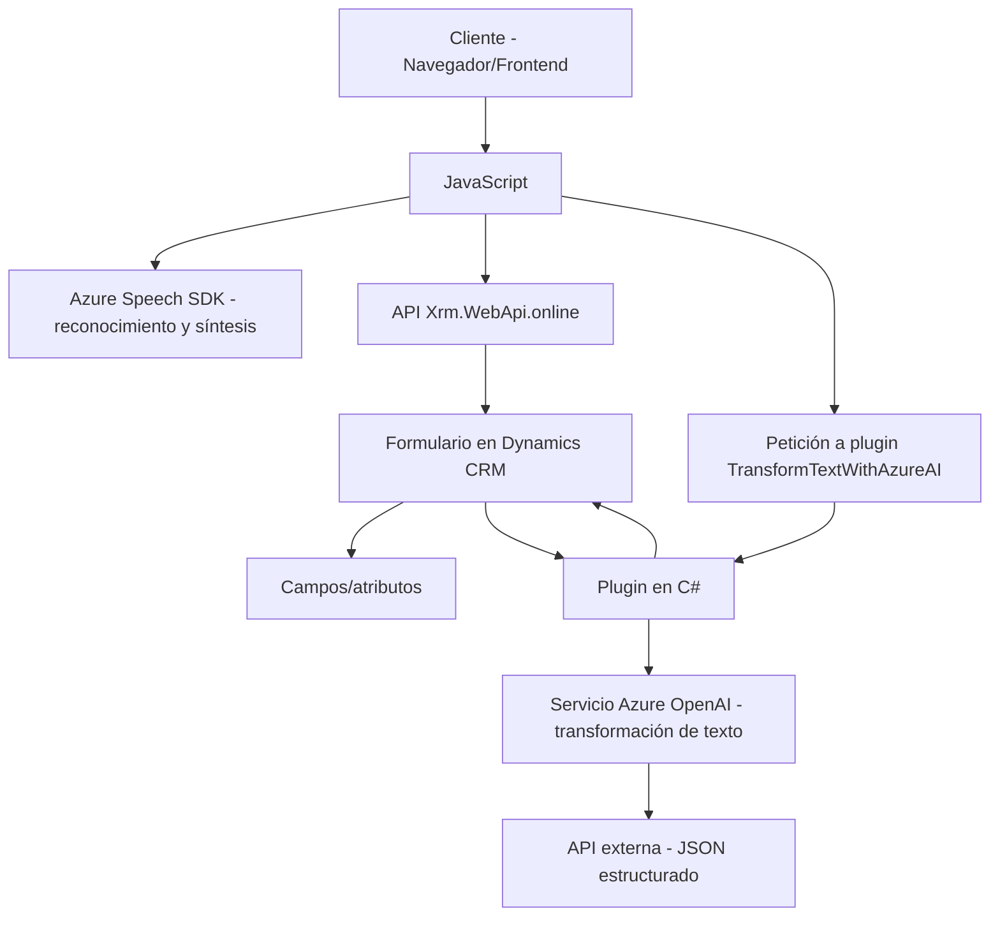

### Breve resumen técnico
El repositorio presenta una solución orientada a la integración entre aplicaciones cliente y servicios de terceros que utiliza **Azure Speech SDK** para síntesis y reconocimiento de voz, y **Azure OpenAI** para procesamiento avanzado de texto. La solución está diseñada para trabajar principalmente como complemento de Microsoft Dynamics CRM, habilitando la automatización de formularios mediante reconocimiento de voz, síntesis de audio y procesamiento inteligente de datos.

### Descripción de arquitectura
1. **Tipo de solución:** La solución tiene una arquitectura basada en cliente-servidor con componentes de frontend (JavaScript) y backend (.NET plugins para Dynamics CRM). La funcionalidad se centra en la integración de servicios de reconocimiento de voz, síntesis de audio y generación de texto estructurado mediante inteligencia artificial.
   
2. **Capas principales:**
   - **Frontend:** Se comunica con APIs externas (Azure Speech SDK) para manejo de reconocimiento y síntesis de voz. También interactúa con la API del formulario de Dynamics CRM para aplicar datos procesados a campos del formulario.
   - **Backend:** Implementa extensiones para Dynamics CRM mediante un plugin en C# que usa Azure OpenAI para realizar la transformación de texto.

### Tecnologías usadas
- **Frontend:**
  - **JavaScript** como lenguaje de programación principal.
  - **Azure Speech SDK:** Integración para servicios de síntesis de voz y reconocimiento de voz.
  - **Dynamics CRM API (`Xrm.WebApi.online`)**: Para gestionar formularios y campos del CRM.
- **Backend:**
  - **C#/.NET Framework:** Implementación de plugins para Dynamics CRM.
  - **Azure OpenAI Service:** API de procesamiento de lenguaje natural (Natural Language Processing - NLP).
  - Librerías específicas para HTTP requests, manipulación de JSON (Newtonsoft y System.Text.Json).

### Tipo de arquitectura
La solución combina varios estilos de arquitectura:
1. **Arquitectura cliente-servidor:** Comunicación entre los módulos frontend basados en cliente y APIs externas, así como el procesamiento en backend mediante plugins de Dynamics CRM.
2. **Arquitectura en capas (n-capas):** La solución cuenta con al menos tres capas:
   - **Capa de presentación:** Componente frontend que utiliza el navegador del cliente.
   - **Capa lógica:** Funciones específicas y reconocimiento/síntesis de voz en cliente.
   - **Capa de servicios:** APIs externas como Azure Speech SDK y Azure OpenAI, más la gestión en Dynamics CRM.
3. **Plugin-based Architecture:** El backend utiliza un plugin para Microsoft Dynamics CRM, que actúa como un punto de extensión para el sistema organizacional.

### Dependencias o componentes externos presentes
1. **Azure Speech SDK:** Para síntesis y reconocimiento de voz.
2. **Azure OpenAI Service:** Procesamiento de texto de entrada y transformación en datos estructurados.
3. **Microsoft Dynamics CRM API (`Xrm.WebApi`)**: Gestión de formularios y encuestas en el contexto de CRM.
4. **Servicios organizacionales (Dynamics CRM):** (*IPluginExecutionContext*, *IOrganizationService*).
5. **HTTP Requests:** Para interactuar con servicios externos como APIs de Azure OpenAI.

---

### Diagrama Mermaid válido para GitHub Markdown

---

### Conclusión final
El repositorio implementa una solución orientada a la automatización inteligente de formularios en Microsoft Dynamics CRM, utilizando herramientas modernas de reconocimiento y síntesis de voz (Azure Speech SDK) y procesamiento de lenguaje natural (Azure OpenAI). La arquitectura combina componentes frontend modernos con extensiones backend en Microsoft Dynamics CRM basadas en el diseño de plugins. El diagrama ilustra claramente las dependencias externas y el flujo de datos en el sistema. La secuencia lógica y modularización asegura que los componentes puedan escalarse o adaptarse fácilmente a otras plataformas relacionadas con la gestión empresarial y la automatización.