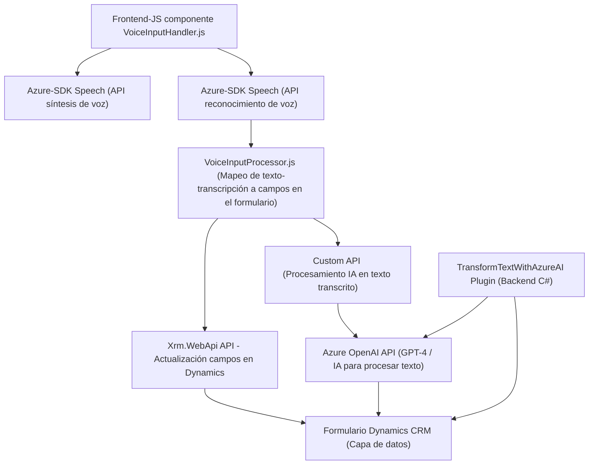

### Resumen técnico del repositorio

La estructura del repositorio sugiere una solución integral orientada a la integración de servicios de voz, inteligencia artificial y manipulación de formularios en Dynamics CRM, particularmente con interacción en el frontend y plugins en el backend. Las funcionalidades clave incluyen la síntesis de voz, el reconocimiento de voz y la transformación de texto mediante el servicio Azure OpenAI.

---

### 1. Tipo de solución

La solución incluye:
- **Frontend JavaScript**: Funciones para interacción directa con formularios de Dynamics CRM, integración del Azure Speech SDK y API personalizada.
- **Custom Plugin en C#:** Extensión directa a Dynamics CRM que realiza transformación de datos a través de Azure OpenAI y actualiza los formularios.
- **Microservicios API** (implícito en el uso de una “Custom API” mencionada en el código, probablemente registrada en Dynamics 365).

---

### 2. Tecnologías, frameworks y patrones utilizados

**Backend (C#)**:
- **Microsoft Dynamics CRM (Xrm.SDK)**: Framework para manipulación de datos en Dynamics CRM.
- **Azure OpenAI**: Conexión a servicios GPT-4 para transformación de texto.
- **Newtonsoft.Json**: Manejo avanzado de JSON.
- **HttpClient**: Para llamadas REST hacia Azure.

**Frontend**:
- **Azure Speech SDK**: Para integración de servicios de síntesis y reconocimiento de voz.
- **Javascript básico**: Interacción directa con el DOM y lógica personalizada.

**Patrones observados**:
1. **Callback Pattern:** En el frontend para gestionar eventos con SDKs externos.
2. **Service Integration:** Uso de APIs remotas como Azure Speech y Azure OpenAI para procesar datos.
3. **Plugin-Based Architecture:** Un plugin en el backend activa funcionalidades específicas en eventos de Dynamics.
4. **State Pattern:** Modularización lógica entre procesamiento normal y con inteligencia artificial.
5. **Modulo Funcional:** Dividir funcionalidades en bloques reutilizables.

---

### 3. Descripción de la arquitectura

La arquitectura muestra una solución **multicapa** que consta de:
- **Frontend (Presentation Layer)**: Implementada con JS, interactuando directamente con formularios de Dynamics CRM y conectándose a servicios de voz.
- **Backend Plugins (Business Layer)**: Extensiones en el backend de Dynamics, en forma de plugins que transforman los datos a través de Azure AI.
- **External Services (Third-Party Layer)**:
  - Azure Speech SDK para síntesis/reconocimiento de voz.
  - Azure OpenAI Service para transformación avanzada de textos.

La arquitectura global sigue un diseño aproximadamente de **n capas**:
1. **Capa de Presentación**: JavaScript para interacción directa.
2. **Capa de Negocio**: Funciones C# mediante plugins para lógica avanzada.
3. **Capa de Servicios Externos**: Integración con servicios en la nube de Azure.
4. **Capa de Datos**: Dynamics CRM como base de datos.

---

### 4. Dependencias externas identificadas

1. **Azure Speech SDK**:
   - Reconocimiento de voz.
   - Síntesis de voz.

2. **Azure OpenAI Service**:
   - Transformación de textos mediante IA.

3. **Dynamics CRM API (Xrm.WebApi)**:
   - Interacción con el modelo de datos de Dynamics.

4. **Newtonsoft.Json & System.Text.Json** (en el backend):
   - Manejo de serialización y deserialización JSON.

5. **HTTP REST**:
   - Comunicaciones remotas con el servicio Azure OpenAI.

---

### 5. Diagrama Mermaid

---

### Conclusión final

El repositorio representa una solución bien estructurada para la integración de servicios de voz y procesamiento de texto en Dynamics CRM, optimizando la interacción en formularios a través de capacidades modernas de Microsoft Azure. Con una arquitectura de n capas y uso extensivo de servicios externos, esta implementación refuerza la modularidad y la interoperabilidad del sistema. Sugiero que los desarrolladores mantengan la atención en la eficiencia de las llamadas externas y la latencia de los servicios conectados, ya que depender de múltiples servicios remotos puede afectar la experiencia del usuario en tiempo real.