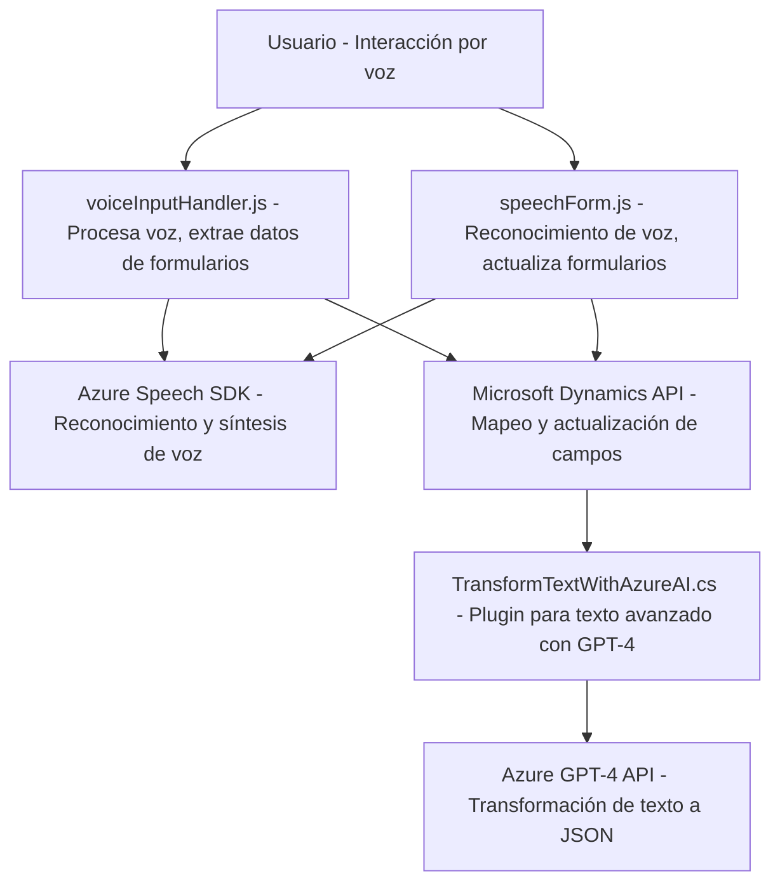

### Breve resumen técnico:
Los archivos proporcionados corresponden a una solución orientada principalmente hacia la interacción entre usuarios y formularios en Microsoft Dynamics CRM, mediante comandos de voz y el uso de redes inteligentes como **Azure Speech SDK** y **Azure OpenAI GPT-4**. La arquitectura incluye funcionalidades de reconocimiento de voz, síntesis de texto basado en comandos procesados por inteligencia artificial, y transformación de texto con reglas explícitas en el backend.

---

### Descripción de arquitectura:
La solución consiste en tres capas principales:
1. **Frontend**: Archivos en JS (como `voiceInputHandler.js` y `speechForm.js`) implementan lógica para capturar y sintetizar voz, actualizar formularios basados en reconocimiento de voz y reglas personalizadas, y comunicarse con APIs externas. Utiliza patrones de modularización y event-driven programming.
   
2. **Servicios Backend**: Plugin en C# (`TransformTextWithAzureAI.cs`) extiende Microsoft Dynamics CRM mediante el patrón plugin. Este capa delega operaciones relacionadas con procesamiento de texto avanzado a un servicio externo (Azure OpenAI GPT-4).

3. **Integraciones externas**: 
   - **Azure Speech SDK**: Reconocimiento y síntesis de voz.
   - **Azure OpenAI (GPT-4)**: Procesamiento y transformación de texto.

La arquitectura general corresponde a un **modelo híbrido entre n-capas** y un **patrón Hexagonal**: los servicios internos interactúan con APIs externas mediante plugins y funciones bien encapsuladas, permitiendo una extensibilidad organizada y modular.

---

### Tecnologías usadas:
1. **Frontend**:
   - JavaScript: Para la lógica de captura, procesamiento y síntesis de voz.
   - Azure Speech SDK: Reconocimiento y síntesis de voz.
   - Microsoft Dynamics SDK: Comunicación con APIs de Dynamics y actualización directa de formularios.

2. **Backend**:
   - C# .NET Framework: Implementación de un plugin para Dynamics CRM.
   - Azure OpenAI GPT-4: Procesamiento de textos y generación de salida en formato JSON.
   - Newtonsoft.Json: Manejo de datos en formato JSON.
   - Sistema REST: Integración con APIs (Azure OpenAI, Dynamics API).

3. **Patrones aplicados**:
   - Modularización: Funciones independientes y especializadas.
   - Plugin Pattern: Extensión de funcionalidades en Dynamics mediante plugins.
   - Service Delegation: Generación de JSON y uso de APIs como Azure Speech y OpenAI.
   - Clean Code Principles: Organización clara de funciones y manejo extensivo de errores/validación.

---

### Diagrama Mermaid (100% compatible con GitHub Markdown):

---

### Conclusión final:
La solución presentada es una **arquitectura robusta, extensible y modular** enfocada en la interacción de voz para formularios dentro de Microsoft Dynamics CRM. Mediante el uso de **Azure Speech SDK** y **Azure OpenAI GPT-4**, esta solución destaca por integrar reconocimiento, síntesis y transformación avanzada de datos. El uso de patrones modernos como modularización y plugin pattern garantiza escalabilidad y facilidad de mantenimiento.