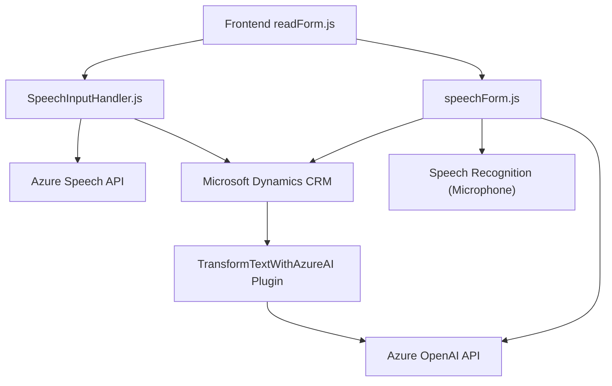

### Breve resumen técnico
El repositorio presenta una solución que se integra tanto con frontend como con backend de Microsoft Dynamics CRM, y utiliza servicios externos (Azure Speech SDK para síntesis y reconocimiento de voz, y Azure OpenAI para transformación de texto). Su propósito principal es habilitar la interacción por voz con formularios dinámicos y realizar transformaciones avanzadas de texto mediante IA.

---

### Descripción de arquitectura
1. **Componentes principales:**
   - **Frontend (JavaScript):** Proporciona funcionalidad para la síntesis y reconocimiento de voz, aplicaciones interactivas para manejar formularios, y la comunicación con Dynamics CRM y servicios externos (Azure Speech SDK y Custom API).
   - **Backend (Plugin en C#):** Ejecuta transformaciones textuales utilizando reglas predefinidas y servicios de Azure OpenAI. Este plugin actúa como extensión dinámica dentro de Microsoft Dynamics CRM.

2. **Arquitectura:**
   - La solución sigue una arquitectura híbrida con características de:
     - **Arquitectura orientada a servicios:** Integración de servicios externos (Azure Speech, OpenAI) vía API.
     - **Plugin-based architecture:** Extensiones específicas en el backend usando Microsoft Dynamics CRM.
     - **Modular architecture:** El código en el frontend está dividido en módulos y funciones para cumplir tareas independientes (síntesis de voz, reconocimiento).
     - Uso de **capas**: El frontend actúa como la capa de presentación, Dynamics CRM como la capa de lógica de negocio y los servicios en la nube como capa de recursos externos.

---

### Tecnologías usadas
1. **Frontend:**
   - **JavaScript**: Lenguaje de programación utilizado para la lógica de síntesis/registro de voz y las llamadas hacia servicios externos.
   - **Azure Speech SDK**: Utilizado para implementar reconocimiento y síntesis de voz.
   - **Microsoft Dynamics CRM schema**: Para manipular datos en formularios dinámicos.

2. **Backend:**
   - **C#**: Lenguaje utilizado en plugins personalizados para Dynamics.
   - **Azure OpenAI**: Servicio de IA para procesamiento avanzado de texto.
   - **Microsoft.Xrm.Sdk**: Framework para la integración con Dynamics CRM.
   - **Newtonsoft.Json**: Biblioteca para manipular y construir objetos JSON.
   - **HttpClient (System.Net.Http)**: Para invocaciones de APIs RESTful hacia servicios externos.

3. **Patrones:**
   - **Patrón estructural modular** en el frontend (división por funciones con definiciones claras de responsabilidad).
   - **Plugin-based architecture** (backend).
   - **Orientación al servicio** (interacción con APIs externas como Azure Speech y Azure OpenAI).
   - **Procedural programming** para el workflow de acciones en el código.

---

### Diagrama Mermaid válido para GitHub Markdown

---

### Conclusión final
La solución presentada se enfoca en habilitar funcionalidades de interacción por voz, con énfasis en el manejo de formularios dinámicos y la integración con APIs externas para reconocimiento de voz, síntesis de voz y transformación de texto. A nivel de arquitectura, se destaca por su enfoque modular en el frontend, complementado con un potente backend basado en plugins de Dynamics CRM. Aunque está bien diseñado, se observa una dependencia fuerte de servicios externos como Azure Speech y Azure OpenAI, lo que podría requerir un monitoreo y control apropiado para garantizar la disponibilidad del sistema.