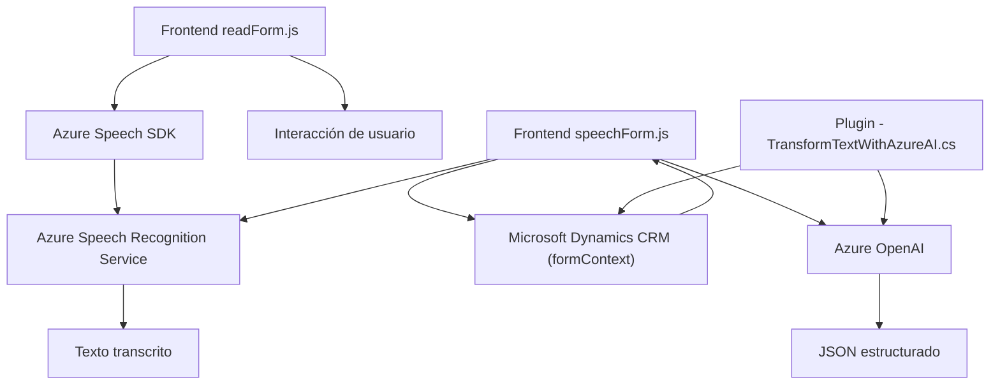

### Breve Resumen Técnico
El repositorio integra una solución enfocada en reconocimiento y síntesis de voz como parte de aplicaciones empresariales basadas en formularios (muy probablemente sobre Microsoft Dynamics). Está compuesto por módulos orientados a implementar funcionalidad inteligente con interacción de voz, incluyendo transcripción, síntesis y procesamiento de texto mediante integración con servicios de Azure como Speech SDK y OpenAI.

---

### Descripción de Arquitectura
La solución se organiza como una arquitectura **modular n capas** caracterizada por:
- **Capa interfaz/UI**: Scripts que manejan interacción y procesamiento de voz en formularios dinámicos.
- **Capa de negocio**: Plugins que extienden la lógica del CRM para integrar servicios externos de IA y procesamiento avanzado de texto.
- **Capa de servicios externos**: Servicios de Azure (Speech SDK y OpenAI GPT-4) que realizan procesamiento especializado (transcripción de voz, generación de texto estructurado).

Se combina con patrones como **event-driven architecture** y **clientes de APIs externas**, permitiendo fluidez en las capacidades del front-end (transcripción, síntesis, interacciones de usuario) y la extensibilidad del backend (transformaciones y lógica avanzada en el CRM).

---

### Tecnologías Usadas
1. **Frontend**:
   - JavaScript.
   - Azure Speech SDK (importado desde un CDN).
   - Métodos de interacción con formularios de Dynamics CRM vía `executionContext` y `formContext`.

2. **Backend**:
   - C# para crear un plugin que interactúa directamente con Microsoft Dynamics CRM.
   - Microsoft XRM API.
   - System.Net.Http y JSON parsing libraries (`Newtonsoft.Json.Linq`, `System.Text.Json`).

3. **Servicios externos**:
   - Azure Speech SDK para síntesis y transcripción de voz.
   - Azure OpenAI para transformación avanzada de texto y generación de JSON estructurado.

4. **Patrones aplicados**:
   - Modularización: Funciones y clases separadas por responsabilidad.
   - Event-Driven Architecture: Uso de eventos y callbacks para responder a acciones de voz en la UI.
   - API Client: Comunicación eficiente con APIs externas como Azure Speech SDK y Azure OpenAI.
   - Hexagonal Architecture (parcial): Uso de puertos (interfaces) para desacoplar lógica interna del acceso a APIs externas.

---

### Diagrama Mermaid
El flujo y la arquitectura del repositorio se modelan en el siguiente diagrama:

- **A**: El archivo `readForm.js` gestiona la lectura de un formulario y la síntesis de voz.
- **B**: Carga dinámica del `Azure Speech SDK` para buscar soporte en la nube y procesar comandos de voz.
- **D**: Azure Speech Recognition Service convierte la entrada de audio en texto.
- **E**: El resultado de la transcripción.
- **F**: El archivo `speechForm.js` que maneja informes dinámicos mediante procesamiento.
- **G**: Contexto de formulario dentro de Microsoft Dynamics.
- **H**: Azure OpenAI transforma el texto en un formato JSON adecuado.
- **J**: Plugin en .NET para Dynamics CRM.
- **K**: Resultado final (información procesada en JSON estructurado).

---

### Conclusión Final
La solución está diseñada como una **aplicación modular de n capas**, compuesta de una interacción estrecha entre un frontend basado en JavaScript y un backend desarrollado como un plugin para Dynamics CRM en C#. Tecnologías como **Azure Speech SDK** y **Azure OpenAI** demuestran un uso avanzado de reconocimiento y procesamiento de voz para mejorar las capacidades de manejo de formularios dinámicos. 

El diseño sigue un enfoque orientado a microservicios con una arquitectura escalable y altamente adaptable para integraciones empresariales emergentes. La solución es ideal para entornos que deseen aumentar la productividad mediante métodos de entrada natural como la voz y procesamiento cognitivo basado en Inteligencia Artificial.