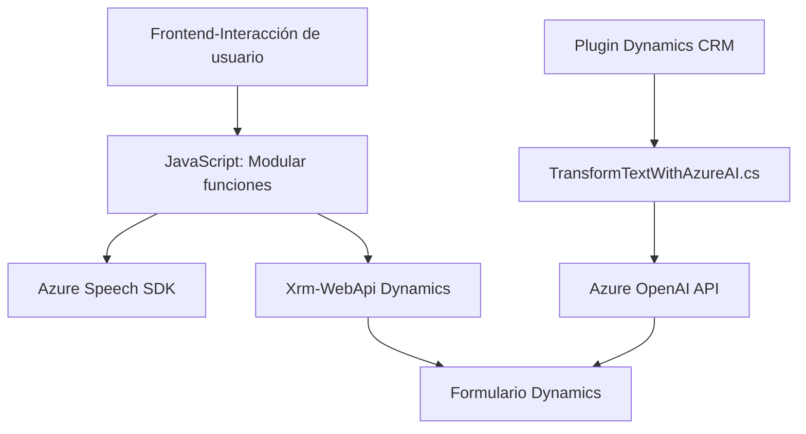

### Breve resumen técnico:
Este repositorio presenta una solución que integra funcionalidades de entrada y síntesis de voz con Azure Speech SDK, manipulación de formularios en Microsoft Dynamics CRM y procesamiento mediante IA (Azure OpenAI). Los principales archivos muestran una solución orientada al manejo de interfaces de usuario (frontend) y servicios backend para procesamiento avanzado con IA.

---

### Descripción de arquitectura:
La arquitectura de este repositorio combina múltiples capas y patrones:
1. **Frontend:** Manejo de interacción con el usuario mediante funciones de JavaScript, integrando Azure Speech SDK para entrada de voz y síntesis de texto a voz.
2. **Backoffice o backend:** Uso de plugins en Dynamics CRM que interactúan con Azure OpenAI API para transformar texto según reglas específicas.
3. **Patrones de arquitectura:**
   - **N-capas:** Separación explícita entre el frontend y el backend.
   - **Interacción con APIs externas:** Azure Speech SDK y Azure OpenAI API.
   - **Modularidad:** Código en el frontend y el backend estructurado como funciones/archivos separados con responsabilidades específicas.
   - **Event-driven architecture:** Actividades desencadenadas por interacción del usuario (eventos de voz, transcripción, etc.).

---

### Tecnologías usadas:
1. **Frontend:**
   - JavaScript (modularidad mediante funciones).
   - Azure Speech SDK (API de síntesis de voz y manejo de entrada de voz).
   - Xrm.WebApi de Dynamics CRM para comunicación con formularios.

2. **Backend:**
   - .NET Framework (C#) con Microsoft Dynamics CRM SDK.
   - Azure OpenAI API (GPT-4) para procesamiento de texto con inteligencia artificial.
   - Newtonsoft.Json para manejo de estructuras JSON.
   - Peticiones HTTP para servicios remotos.

---

### Dependencias:
1. **Externas:**
   - Azure Speech SDK (integrado dinámicamente en el frontend).
   - Azure OpenAI API para procesamiento y transformación textual en JSON.
   - Microsoft Dynamics CRM SDK para plugins de backend.
   - Newtonsoft.Json y namespaces estándar de .NET para operaciones de manejo de datos.

2. **Internas:**
   - Funciones JavaScript modulares que contribuyen al manejo de formularios (p. ej., extracción y actualización de datos visibles, conexión con APIs externas).
   - Plugins .NET para la integración funcional con servicios de backend (Dynamics CRM y Azure IA).

---

### Diagrama Mermaid:

---

### Conclusión final:
Este repositorio permite la interacción de usuarios mediante entrada de voz y la automatización avanzada de formulación textual en Microsoft Dynamics CRM con uso de servicios y APIs de Azure. La arquitectura reflejada es una solución de **n-capas** con características de modularidad y comunicación con servicios externos, potenciadas por inteligencia artificial. Tiene una estructura bien dividida y usa patrones relevantes como SOA y event-driven en sus componentes. Es un modelo efectivo para soluciones de negocio automatizadas en entornos específicos como CRM y manejo de voz.