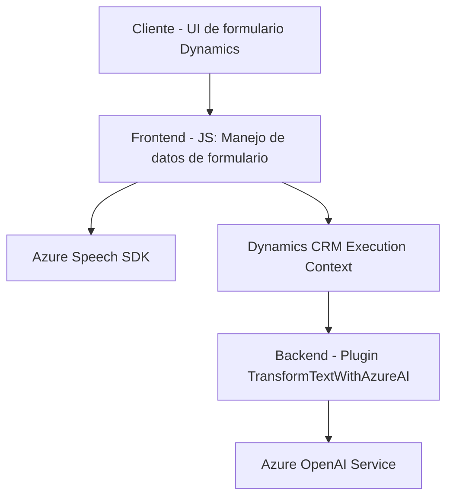

### Breve resumen técnico
El repositorio parece estar destinado a una solución que combina procesamiento de voz, integración con formularios y uso de servicios de inteligencia artificial de Azure. Es un sistema que interactúa con formularios en **Microsoft Dynamics CRM**, utiliza el **Azure Speech SDK** para convertir datos entre texto y voz, e integra el **Azure OpenAI Service** para el procesamiento avanzado de texto en un plugin. Está orientado hacia la mejora de interacción con el usuario mediante tecnologías avanzadas de reconocimiento y síntesis de voz.

---

### Descripción de arquitectura

La solución adopta una arquitectura híbrida:
- **Servicios distribuidos en capas**:
  - Frontend: Interpretación de datos y voz en los formularios integrados de Dynamics CRM, usando funcionalidades JavaScript asincrónicas y el Azure Speech SDK.
  - Backend: Implementación de un plugin en C# configurado en Dynamics CRM para aplicar procesamiento de texto mediante Azure OpenAI.
- **Patrón middleware**: Las funciones de frontend cargan dinámicamente dependencias como el Azure Speech SDK y manejan eventos de usuario con lógica asincrónica.
- **Hexagonal en el backend**: La estructura del plugin sigue un enfoque desacoplado donde interactúa con un puerto externo (el servicio Azure OpenAI) y un adaptador interior (CRM).

---

### Tecnologías usadas
1. **Frontend (JavaScript)**:
   - **Azure Speech SDK**: Para reconocimiento y síntesis de voz.
   - **Microsoft Dynamics CRM (Xrm.WebApi)**: Manipulación de datos de formularios y llamadas de Custom APIs.
   - **Programación basada en eventos y callbacks**: Implementación de flujos asincrónicos para reconocimiento y síntesis de voz.
   - **Promesas (async/await)**: Procesamiento asincrónico de datos como conexión con APIs externas.
   - **Manipulación de JSON**: Procesamiento de información estructurada (transcripciones, datos de formularios, etc.).

2. **Backend (C#)**:
   - **Azure OpenAI Service**: Transformación avanzada de texto en formato JSON.
   - **Newtonsoft.Json** y **System.Text.Json**: Serialización y deserialización de datos JSON.
   - **Microsoft.Xrm.Sdk**: Interacción con Dynamics CRM mediante el patrón estándar de plugins.
   - **HTTP Client**: Comunicación HTTP con servicios externos como Azure OpenAI.

---

### Diagrama Mermaid

---

### Conclusión final

Este repositorio implementa una solución que combina el uso de tecnologías avanzadas de Microsoft (Speech SDK, OpenAI, Dynamics CRM API) para enriquecer la interacción entre el usuario y un sistema CRM. La arquitectura modular facilita la integración de servicios externos. En el frontend, se observa un diseño funcional con gran uso de programación basada en eventos, mientras que el backend sigue un patrón de diseño basado en plugins que extienden funcionalidades internas del CRM mediante un enfoque desacoplado.

Aunque la solución es potente, existen áreas de mejora:
- **Resiliencia:** La dependencia de URL estáticas (Azure SDK) podría generar problemas si el recurso no está disponible.
- **Estructura del frontend:** La ausencia de un framework robusto para organizar el código (ej. Angular, Vue) puede dificultar el mantenimiento del código JavaScript.
- **Errores en red/servicios externos:** No se observa un manejo robusto de errores para fallos en la conexión a APIs externas (Azure OpenAI y Speech SDK).