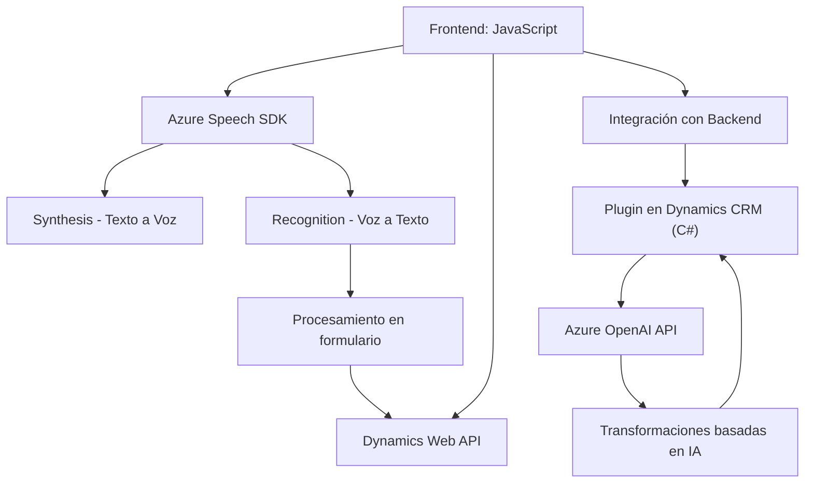

### Breve resumen técnico
El repositorio parece implementar una solución que utiliza **Azure Speech SDK** y **Azure OpenAI API** para habilitar funcionalidades de entrada por voz, síntesis textual (texto a voz) y procesamiento dinámico en formularios interactivos de Dynamics CRM. Además, incluye un plugin personalizado para transformar texto con la ayuda de OpenAI.

---

### Descripción de arquitectura
La solución global muestra un **arquitectura modular** y desacoplada. Cada componente tiene un propósito específico:
1. **Frontend (cliente):** Gestiona entrada/salida de datos desde formularios, incluyendo interacción por voz y IA.
2. **Plugin de Dynamics CRM:** Permite integraciones personalizadas para lógica avanzada en el backend.
3. **Dependencia de microservicios de Azure:** Utiliza servicios externos como **Azure Speech SDK** para entrada/salida por voz y **Azure OpenAI API** para transformación avanzada de texto.

Sigue el modelo **event-driven** mediante la ejecución basada en triggers en el frontend y en el backend, como plugins y funciones asincrónicas. La interacción con Dynamics CRM sugiere una **arquitectura de n capas** donde el backend (CRM y plugins) procesa lógica especializada, mientras que el frontend gestiona la interacción del usuario.

---

### Tecnologías usadas
1. **Frontend:**
   - **JavaScript** para lógica de cliente.
   - **Azure Speech SDK** para síntesis y transcripción de voz.
   - **Dynamics Web API** para integración con formularios interactivos en Dynamics CRM.
   - Modularidad orientada a responsabilidades claras dentro de funciones.
   
2. **Backend:**
   - **C# plugins** para Dynamics CRM.
   - **Azure OpenAI API (GPT)** para procesar texto usando IA.
   - Librerías como `Newtonsoft.Json` para manipulación de JSON y `System.Net.Http` para solicitudes HTTP.

3. **Patrones:**
   - **Modularidad:** Separación funcional en módulos independientes.
   - **Event-driven architecture:** Procesos reaccionan a eventos (entrada de voz, cambios en formularios, etc.).
   - **Microservicios:** Uso de servicios externos para funcionalidades específicas como voz y procesamiento con IA.

---

### Diagrama Mermaid válido para GitHub Markdown

---

### Conclusión final
La solución es una combinación de una **aplicación frontend** para interacción visual y experiencias por voz, y un backend conectado a Dynamics CRM con extensiones personalizadas. La arquitectura **n capas** junto con el uso estratégico de microservicios escalables (Azure Speech SDK y OpenAI API) garantiza modularidad, flexibilidad y capacidad de adaptación. Esta solución es ideal para integraciones robustas en sistemas empresariales que requieren soporte tanto de entrada por voz como capacidades avanzadas de procesamiento de texto.