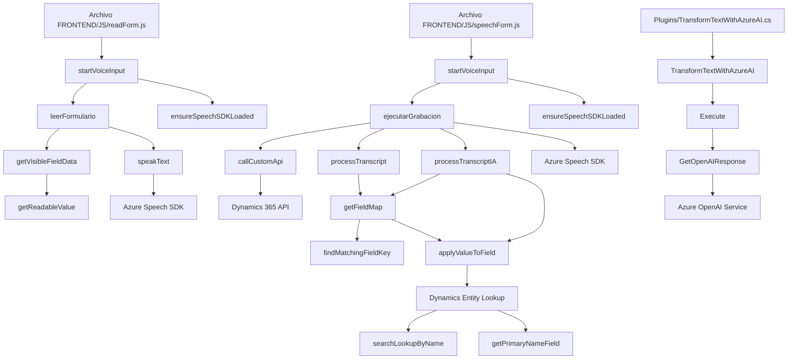

### Análisis y descripción técnica

#### **Resumen técnico**
Los archivos proporcionados forman parte de una solución IT para enriquecer la funcionalidad de formularios en Dynamics 365 mediante reconocimiento de voz, síntesis de voz y procesamiento de texto con AI. El proyecto implementa capacidades de accesibilidad (speech-to-text, text-to-speech) y transformación de datos con integración entre cliente y servicios en la nube (Azure Speech SDK y Azure OpenAI).

---

#### **Tipo de solución**
La solución parece dividirse en dos partes principales:
1. **Frontend (JS)**: Funciones que permiten interacción del usuario con formularios de Dynamics CRM utilizando reconocimiento de voz, síntesis de voz y mapeo dinámico de datos.
2. **Plugin backend (.NET)**: Lógica de servidor en Dynamics para procesamiento con AI, destacando la integración con Azure OpenAI para transformar y estructurar texto.

Por lo tanto, esta solución se clasifica como **aplicación cliente-servidor orientada a extensiones de Dynamics 365** con funcionalidades de accesibilidad y AI.

---

#### **Tecnologías usadas**
1. **Frontend:**
   - **JavaScript**: Lenguaje principal para lógica de cliente.
   - **Azure Speech SDK**: Para las capacidades de síntesis y reconocimiento de voz.
   - **Microsoft Dynamics CRM API**: Acceso al modelo de datos y manipulación del formulario vía Xrm.WebApi.

2. **Backend:**
   - **.NET Framework**: Lógica del servidor en forma de plugin.
   - **Azure OpenAI Service**: Modelos de procesamiento del lenguaje natural (NLP) para transformar texto.
   - **Bibliotecas .NET**:
     - Newtonsoft.Json.Linq y System.Text.Json para JSON.
     - HttpClient para comunicación con APIs externas.

---

#### **Tipo de arquitectura**
La solución tiene varios componentes heterogéneos que interactúan, predominando:
1. En el **frontend**:
   - **Arquitectura cliente-servidor basada en n capas**:
      - Lógica de cliente basada en capas de abstracción de datos: entrada (reconocimiento de voz), procesamiento (formateo/mapeo de datos) y salida (voz/speech).
   - **Patrón de fachada**: Delegación de responsabilidades en funciones secuenciales, encapsulando la lógica específica como métodos reutilizables.

2. En el **backend**:
   - **Arquitectura orientada a servicios API (SaaS)**:
      - Procesamiento mediante plugins integrables en Dynamics 365 usando el patrón de "event-driven plugin".
   - **Uso explícito de recursos RESTful (APIs)** para comunicación con OpenAI.

---

#### **Dependencias y componentes externos**
1. **Azure Speech SDK**:
   - Para la conversión de datos de formulario a audio (text-to-speech) y reconocimiento de comandos hablados (speech-to-text).
2. **Azure OpenAI Service**:
   - Modelos NLP para transformar texto en JSON predefinido.
3. **Microsoft Dynamics API**:
   - Para extensión y manipulación de formularios y modelos de datos.
4. **Xrm.WebApi**:
   - Solicitudes y operaciones CRUD en Dynamics 365.
5. **Newtonsoft.Json**:
   - Parsing y generación de JSON para comunicación con APIs externas.

---

#### **Diagrama Mermaid**
A continuación, presento una representación en Mermaid que cumple con las reglas solicitadas:

---

#### **Conclusión final**
La solución presentada combina tecnologías modernas como Azure Speech SDK y OpenAI con la arquitectura extensible de Dynamics 365. La implementación aborda múltiples aspectos (accesibilidad, inteligencia artificial y extensibilidad de formularios), organizándose en diferentes capas y patrones:
- **Frontend**: Modulos JS altamente independientes para reconocimiento y síntesis de voz.
- **Backend**: Plugin extensible en Dynamics para procesamiento avanzado de texto con normas específicas utilizando APIs REST.

Su diseño refleja una fuerte orientación hacia modularidad, eficiencia de comunicación cliente-servidor y accesibilidad en aplicaciones empresariales.