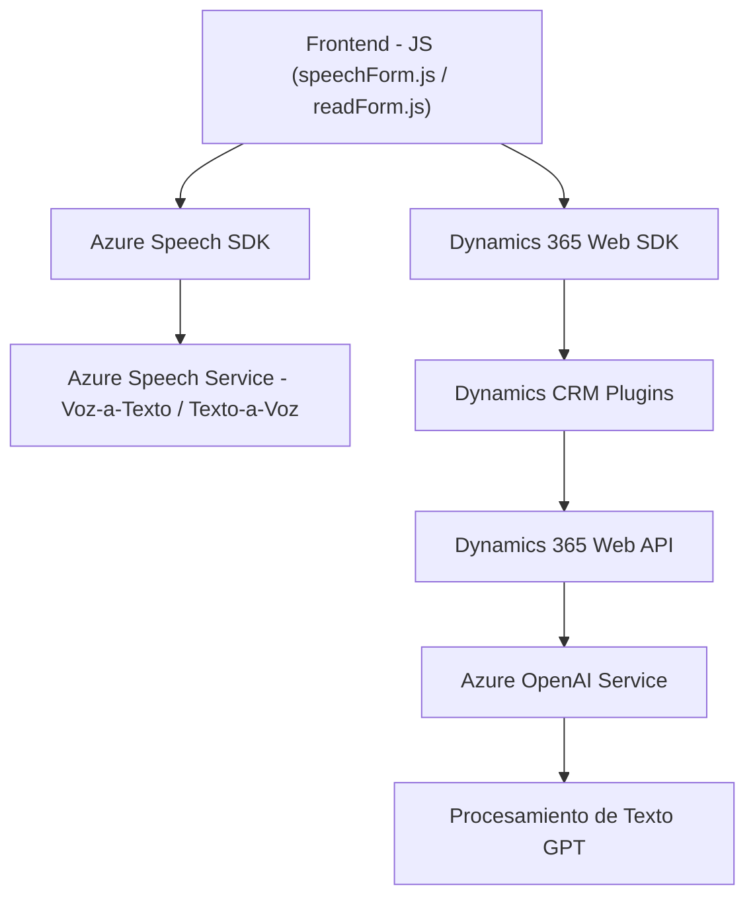

### Breve Resumen Técnico
El repositorio describe un sistema que integra servicios de síntesis y reconocimiento de voz con funcionalidades dinámicas dentro de formularios de Dynamics 365. Utiliza arquitecturas basadas en SDK y servicios en la nube (Azure Speech y OpenAI) para llevar a cabo lecturas en voz alta, reconocimiento de voz y transformaciones avanzadas de texto.

---

### Descripción de Arquitectura
La solución emplea una **arquitectura híbrida** donde se combinan módulos de procesamiento en cliente (frontend) y procesamiento en servidor (plugins y servicios REST en Dynamics CRM). 
- El diseño de los módulos de frontend sigue un enfoque de **n capas** donde cada módulo tiene responsabilidades específicas para lectura y procesamiento de voz. La lógica está encapsulada en funciones individuales, siguiendo principios de separación de responsabilidades.
- Los plugins para Dynamics 365 (en C#) implementan un patrón **orientado a evento**, ejecutando lógica personalizada a partir de los eventos generados por CRM.
- Los componentes externos (Azure Speech SDK y Azure OpenAI) son utilizados para gestionar capacidades adicionales como el reconocimiento de voz y la inteligencia artificial.

---

### Tecnologías Usadas
1. **Frontend:**
   - **Lenguajes**: JavaScript.
   - **Frameworks y librerías**: Azure Speech SDK, Dynamics 365 Web SDK.
   - **Patrones**:
     - Lazy Initialization: Carga del SDK de Azure Speech bajo demanda al iniciarse la acción de lectura.
     - Modularidad: Funciones divididas por responsabilidad.
     - Integración con API: Uso directo de Azure Speech API y Dynamics 365 Web API.

2. **Backend (Dynamics CRM Plugin):**
   - **Lenguajes**: C#.
   - **Tecnologías**:
     - Microsoft.Xrm.Sdk (Dynamics CRM Context API).
     - Newtonsoft.Json para manejo de JSON.
     - System.Net.Http y System.Text.Json para realizar solicitudes HTTP a Azure OpenAI Service.
   - **Servicios externos**:
     - Azure OpenAI Service para procesamiento de lenguaje natural.
   - **Patrones**:
     - Plugin-based Architecture: Responde a eventos en Dynamics CRM.
     - Encapsulación: Métodos separados para la lógica del plugin y la conexión externa.

---

### Dependencias o Componentes Externos
1. **Azure Speech SDK**: Procesamiento de voz (síntesis y reconocimiento).
   - Cargado dinámicamente en archivos frontend desde `https://aka.ms/csspeech/jsbrowserpackageraw`.
2. **Dynamics 365 Web API**: Interacción entre formularios y modelos dinámicos en CRM.
3. **Azure OpenAI Service**: Procesamiento avanzado de texto usando IA.
4. **Newtonsoft.Json**: Manejo y transformación de respuestas estructuradas en JSON.
5. **System.Net.Http**: Realización de solicitudes HTTP para integración de servicios externos.

---

### Diagrama **Mermaid**

---

### Conclusión Final
El sistema combina el uso de servicios basados en la nube de Azure, como Speech y OpenAI, con funcionalidades de Dynamics 365 para formularios interactivos. Esto permite una solución de interfaz usuario altamente dinámica y enriquecida por IA, basada en una arquitectura modular con patrones claros de integración de servicios externos. El código muestra buen diseño estructural tanto en el procesamiento cliente como servidor, utilizando principios como `Lazy Initialization`, modularidad y separación de responsabilidades. Sin embargo, las credenciales en el código del plugin podrían representar un riesgo y sería necesario trasladarlas a un entorno seguro.