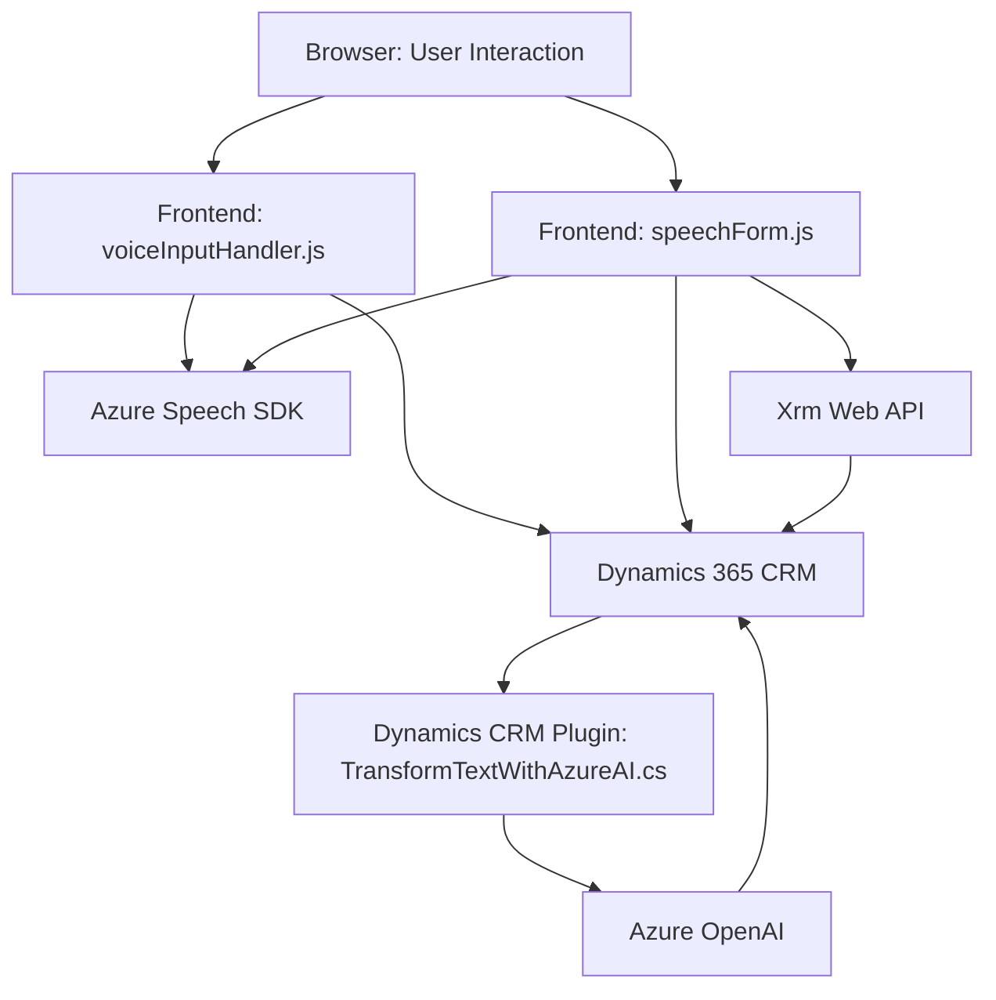

### Breve Resumen Técnico
El repositorio combina lógica del frontend y backend para integrar el **Azure Speech SDK**, **Dynamics 365 CRM** y **Azure OpenAI**. La solución está diseñada para interactuar con formularios, leer y modificar datos mediante la entrada de voz, y aplicar inteligencia artificial para transformar o interpretar el texto.

---

### Descripción de Arquitectura
La solución implementa una arquitectura híbrida basada en **n-capas**:
1. **Frontend (FRONTEND/JS):** 
   - Contiene lógica cliente, encargada de leer, procesar y manipular datos visibles en formularios CRM. 
   - Implementación basada en JavaScript y el navegador (utilizando Web APIs).
   - Apoya el consumo del servicio de conversión de texto a voz (Azure Speech SDK).

2. **Backend (Plugins):** 
   - Implementado como extensiones para Dynamics CRM usando plugins (C#).
   - Encapsula la lógica de comunicación entre el CRM y servicios externos como Azure OpenAI.
   - Procesa modelos de datos y reglas predefinidas para generar datos estructurados.

El modelo general puede ser identificado como una arquitectura **n-capas**, donde:
- Frontend maneja la interacción con usuarios, formularios y Azure SDK.
- Backend realiza integraciones con servicios externos y maneja la lógica empresarial/transformación.

---

### Tecnologías y Frameworks Usados
1. **Frontend:**
   - **JavaScript:** Base para la lógica de procesamiento en el navegador.
   - **Web APIs:** Para manipulación del DOM y carga dinámica del SDK.
   - **Azure Speech SDK:** Implementa funcionalidades de reconocimiento y síntesis de voz.

2. **Backend (Dynamics CRM Plugin):**
   - **C#:** Lenguaje para la implementación del plugin.
   - **Dynamics CRM SDK (Microsoft.Xrm.Sdk):** Para crear plugins y conectarse con la instancia de CRM.
   - **Azure OpenAI:** Procesamiento de texto utilizando modelos avanzados de IA.
   - **System.Net.Http/Json:** Para comunicación (llamadas API) y manejo de datos serializados.
   - **Newtonsoft.Json.Linq:** Procesamiento dinámico de respuestas JSON.

3. **Externos:**
   - Azure Speech SDK (integrado dinámicamente).
   - Azure OpenAI (comunicación API).
   - Dynamics 365 Web API (Xrm.WebApi).

---

### Diagrama Mermaid

---

### Conclusión Final
La solución integra frontend, backend y servicios externos (Azure Speech SDK, Dynamics CRM Web API y Azure OpenAI) para ofrecer un sistema innovador de interacción de voz y procesamiento inteligente. Su arquitectura se basa en un modelo de **n-capas**, separando lógica de frontend (interacción, SDK) y backend (procesamiento, transformación de texto).

El diseño modular permite escalabilidad, facilidad de mantenimiento y una integración eficiente con servicios externos como Azure. Está orientado a ser parte de sistemas avanzados, como CRMs, que requieren interacción dinámica con los usuarios.