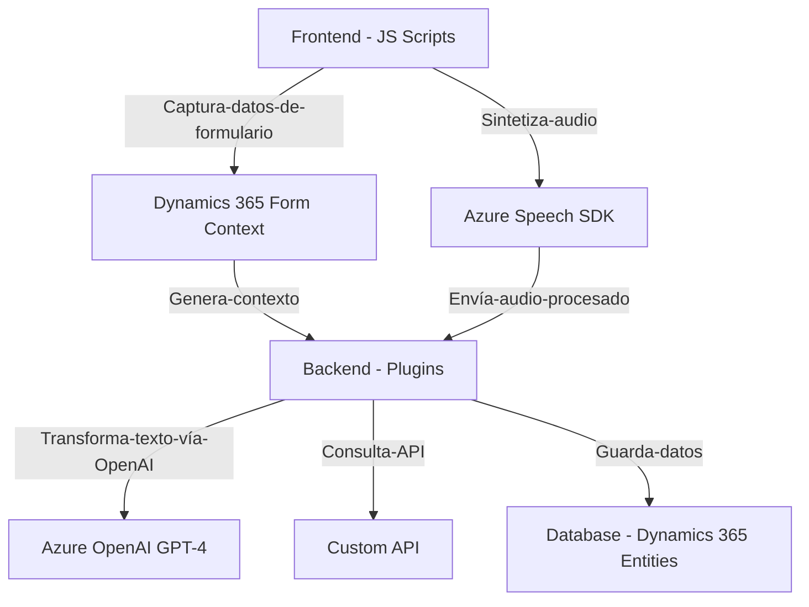

# Análisis técnico del repositorio:

## Breve resumen técnico:
El repositorio está vinculado principalmente a la gestión de datos de voz, formularios interactivos y transformación de texto, utilizando servicios de Azure y tecnologías de Microsoft Dynamics 365. Su finalidad es mejorar el procesamiento de datos de entrada y salida en un entorno empresarial dinámico, mediante reconocimiento de voz, APIs externas y plugins.

---

## Descripción de arquitectura:
El sistema está diseñado en torno a una **arquitectura de integración de servicios**, donde el frontend y los plugins de backend interactúan con servicios externos de Azure. Las principales características incluyen el uso de dinámicas asincrónicas, servicios proveedores (Dynamics 365 + Azure Speech/OpenAI) y modularidad. La arquitectura se aproxima al modelo de **n capas**:
1. **Capa del cliente (Frontend)**: Realiza tareas de interfaz basadas en JavaScript, gestiona formularios dinámicos y ofrece las capacidades de voz/audio con Azure Speech SDK.
2. **Capa de lógica empresarial (Plugins y servicios)**: Implementa procesos intensivos como transformación de texto en JSON utilizando Azure OpenAI y lógica de asignación de datos.
3. **Capa de integración (Funciones Azure)**: Comunicación con servicios REST externos (Azure APIs).
4. **Capa de datos (Dynamics 365)**: Gestión de datos persistentes en entidades y atributos de CRM.

---

## Tecnologías usadas:
1. **Frontend:** 
   - **Azure Speech SDK** para captura y síntesis de voz.
   - **JavaScript** para manejo de formularios dinámicos y lógica de interfaz.
   - **DOM API** para manipulación de campos.
   - Funciones asincrónicas (Promises).

2. **Backend/Plugins:**
   - **Microsoft Dynamics 365** como plataforma principal de CRM.
   - **Azure OpenAI GPT-4 API** para procesamiento avanzado de texto y generación de JSON.
   - **C# .NET Framework/Core** para implementación de plugins y lógica de negocio.
   - **Newtonsoft.Json** y **System.Text.Json** para serialización/deserialización de datos JSON.
   - **System.Net.Http** para manejo de solicitudes REST.

3. **General:**
   - **RESTful APIs** para integración con Azure.
   - **Plugin Pattern** para ejecutar lógica en eventos del sistema de Dynamics 365.

---

## Diagrama Mermaid válido para GitHub:

---

## Conclusión final:
El repositorio está diseñado para optimizar procesos empresariales mediante la integración de tecnologías de reconocimiento de voz, procesamiento de texto con IA y manejo de datos dinámicos en Microsoft Dynamics 365. La arquitectura es modular y basada en n capas, facilitando su escalabilidad y mantenimiento. Es un ejemplo claro de interacción efectiva con servicios externos (Azure Speech y OpenAI) para aportar capacidades avanzadas al usuario final.