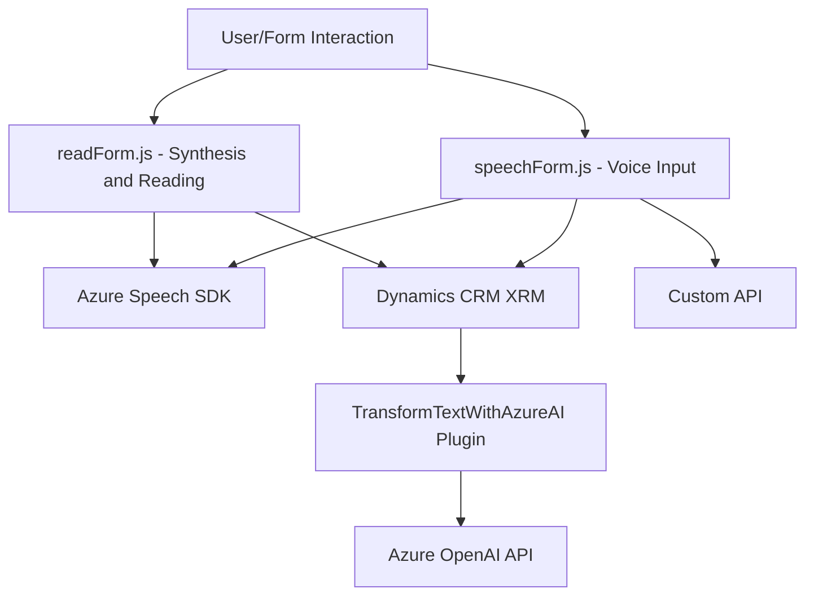

### Breve resumen técnico
Este repositorio contiene archivos que interactúan con servicios externos, como Azure Speech SDK y Azure OpenAI, para implementar funcionalidades de entrada por voz y procesamiento de texto en aplicaciones basadas en Microsoft Dynamics CRM. Los módulos están orientados al manejo de formularios, accesibilidad por voz y transformación de datos textuales mediante inteligencia artificial.

---

### Descripción de arquitectura
La solución sigue principios de arquitectura modular y desacoplada:
1. **Front-End**:
   - Los archivos de JavaScript (como `readForm.js` y `speechForm.js`) están destinados al manejo dinámico de formularios y entrada de voz, utilizando APIs externas y el SDK de Azure Speech.
   - Modularidad con funciones separadas para cada tarea específica (lectura de formularios, síntesis de voz, reconocimiento de entrada de voz).

2. **Back-End**:
   - El archivo `TransformTextWithAzureAI.cs` contiene un plugin que opera en dinámicas de Microsoft Dynamics CRM. Su responsabilidad es transformar texto mediante Azure OpenAI utilizando una arquitectura de servicios.

La solución presenta una estructura **híbrida**, combinando **microservicios** (procesos aislados en Azure) y una **arquitectura en capas** para gestionar interacción entre frontend, backend y servicios externos.

---

### Tecnologías usadas
1. **Front-End**:
   - JavaScript y modularidad.
   - Azure Speech SDK para integración del reconocimiento y síntesis de voz (`https://aka.ms/csspeech/jsbrowserpackageraw`).
   - XRM/WebAPI (API de Dynamics CRM para manipulación de entidades).

2. **Back-End**:
   - .NET Framework/C# para plugins.
   - Microsoft Dynamics CRM SDK para implementar lógica de negocio en plugins.
   - Azure OpenAI API para procesamiento de texto.
   - Librerías de manejo de JSON (`System.Text.Json`, `Newtonsoft.Json`).
   - Regex para manipulación de cadenas.

3. **Servicios Externos**:
   - Azure Speech SDK para voz.
   - Azure OpenAI para transformación de texto.

---

### Diagrama Mermaid

---

### Conclusión Final
La solución muestra una integración efectiva entre servicios externos de Azure y funcionalidades específicas relacionadas con la interacción basada en voz y el procesamiento dinámico de datos en Microsoft Dynamics CRM. Su arquitectura es **modular**, extendida mediante **servicios desacoplados** (SDK y APIs remotas), y combina tecnologías modernas tanto en el frontend como en el backend.

- Es ideal para casos de accesibilidad, automatización de procesos y transformación inteligente de datos.
- La seguridad en el manejo de claves (Azure Speech y OpenAI) será crucial para la implementación en producción.
- Escalabilidad: Se puede migrar hacia una solución basada en **microservicios** si los módulos de frontend y plugins se separan completamente.