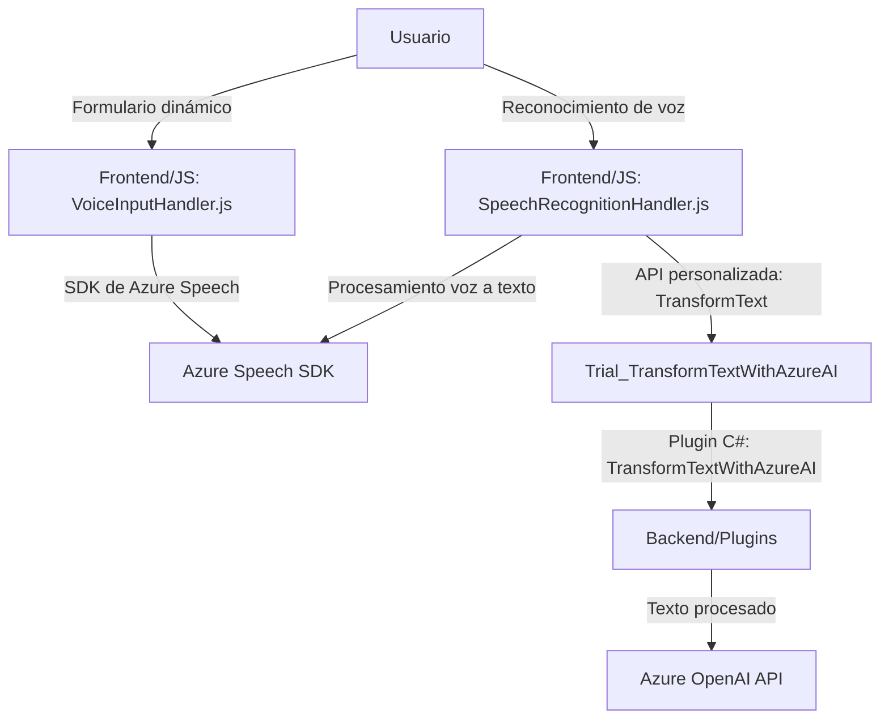

### Breve resumen técnico

El repositorio contiene una solución centrada en la integración de formularios de Dynamics 365 con servicios de reconocimiento y síntesis de voz basados en Azure Speech SDK, además de un plugin para transformar textos mediante Azure OpenAI. Los archivos se dividen en un **frontend** JavaScript, que implementa funcionalidades como lectura y reconocimiento de voz, y un **plugin backend C#**, que realiza procesamiento avanzado de texto.  

---

### Descripción de arquitectura

La solución utiliza una **arquitectura de n capas** donde:

1. **Capa presentación:** Los archivos JS manejan directamente la interfaz y los formularios de Dynamics 365, interactuando con Azure Speech SDK para entrada de voz y síntesis.
2. **Capa lógica:** Las funciones en JavaScript procesan datos del formulario (formContext) y los integran con servicios externos, como APIs de IA para reconocimiento de voz personalizada.
3. **Capa de servicios/backend:** El plugin C# en Dynamics CRM se ejecuta como un evento plugin para transformar y enriquecer el texto usando Azure OpenAI API.

El diseño exhibe un híbrido entre patrones **modularización**, **adaptación** (para manipular tipos de datos o interactuar con APIs externas), y **plugin design**.

---

### Tecnologías usadas

1. **Frontend JavaScript:**
   - **Azure Speech SDK:** Para sintetizar entrada y salida de voz.
   - **Manipulación DOM:** Para interactuar con formularios dinámicos.
2. **Backend C#:**
   - **Dynamics CRM SDK:** Enlace directo para extender funcionalidad de Dynamics CRM.
   - **Azure OpenAI API:** GPT-4 para procesamiento avanzado de texto.
   - **Newtonsoft.Json y System.Text.Json:** Para manejar JSON entre componentes de CRM y servicios externos.
3. **API externas:** Uso de APIs señaladas como Azure Speech SDK y OpenAI API.
4. **Navegador basado en ejecución dinámica:** Scripts cargados dinámicamente para el Azure Speech SDK.

---

### Diagrama Mermaid válido para GitHub

---

### Conclusión final

La solución implementa una integración robusta entre interfaces de usuario basadas en formularios dinámicos y servicios avanzados de voz e IA. La arquitectura es de **n capas** con una mezcla de patrones de modularización y adaptación. El uso de servicios externos como Azure Speech SDK y OpenAI introduce componentes externos críticos que deben gestionarse adecuadamente (por ejemplo, manejo seguro de credenciales y claves).

La solución podría mejorarse implementando estrategias de seguridad para los valores sensibles (como claves API) y optimizando el manejo de errores en la interacción entre capas y dependencias externas.