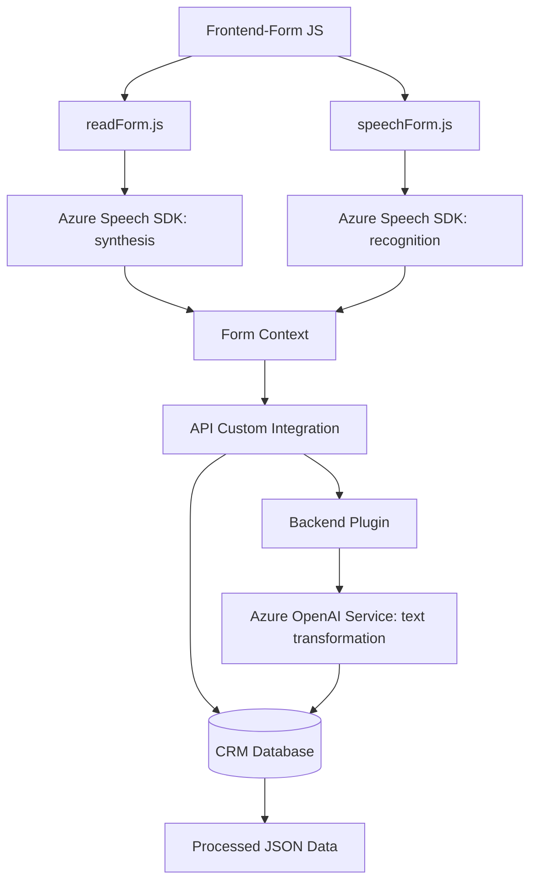

### Breve Resumen Técnico

El repositorio parece ser parte de una solución integral que combina un **frontend**, APIs externas, y plugins para un sistema de **CRM Dynamics**. Las funcionalidades giran en torno al procesamiento de datos mediante comandos de voz y texto con **Azure Speech SDK** y **Azure OpenAI Service**. Está diseñado para integrar datos directamente hacia un sistema CRM, lo que refuerza una arquitectura orientada a servicios y eventos.

---

### Descripción de Arquitectura

La arquitectura del sistema tiene componentes claramente separados:
1. **Frontend**: Archivos JavaScript (`readForm.js`, `speechForm.js`) para interacción en tiempo real con formularios y procesamiento de comandos de voz. Usa un modelo modular basado en eventos y dependencias externas como **Azure Speech SDK**.
2. **Integración con API personalizada**: Durante el procesamiento de voz o texto, se interactúa con APIs externas y personalizadas para transformar datos y enviarlos al backend.
3. **Plugin Backend**: El plugin (`TransformTextWithAzureAI.cs`) sigue un patrón **n capas** al facilitar una integración entre CRM Dynamics y el servicio Azure OpenAI. Este archivo es un claro caso de arquitectura orientada a servicios (SOA).

**Patrones identificados**:
- **Modularidad (frontend)**: Funciones bien definidas para cargar modulares SDKs, procesar campos visibles, y automatizar el manejo de datos del formulario.
- **Lazy Loading (frontend)**: Carga dinámica de dependencias como Azure Speech SDK para optimizar la memoria y el rendimiento.
- **Event-Driven**: El frontend responde a eventos de formularios en el CRM.
- **SOA (Service-Oriented Architecture)**: El repositorio integra múltiples servicios externos (Azure Speech SDK y OpenAI Service) con sistemas CRM.

**Arquitectura General**:
La solución sigue una arquitectura **n-capas** con separation of concerns:
  - **Presentación**: Frontend (procesamiento local de voz y datos).
  - **Aplicación**: Invocación de APIs personalizadas para tareas avanzadas como normalización de comandos.
  - **Backend**: Plugin para CRM Dynamics que utiliza servicios externos como OpenAI y gestiona respuestas JSON.

---

### Tecnologías Usadas

1. **Frontend (JavaScript)**:
   - **Azure Speech SDK** para síntesis y reconocimiento de voz.
   - **Eventos dinámicos** para interacción con formularios (CRM Execution Context).

2. **Backend (C#)**:
   - Microsoft Dynamics CRM SDK (`IPlugin` y `Xrm.Sdk`).
   - **Azure OpenAI Service** para transformaciones avanzadas de texto.
   - Serialización JSON (`Newtonsoft.Json`, `System.Text.Json`).
   - `HttpClient` para solicitudes HTTP.

3. **Patrones**:
   - Modularización de funciones en el frontend para simplificación y reutilización.
   - Lazy-loading en el frontend para optimizar recursos.
   - Separation of Concerns y SOA en el backend y plugins.
   - Singleton para la gestión de solicitudes HTTP en el backend.

---

### Dependencias o Componentes Externos

- **Azure Speech SDK**:
  - Reconocimiento y síntesis de voz.
  - Carga dinámica desde `https://aka.ms/csspeech/jsbrowserpackageraw`.

- **Azure OpenAI Service**:
  - Transformación de texto en modelos de lenguaje con APIs de GPT.
  - Requiere un endpoint y `deployment` configurado (como `gpt-4o`).

- **Microsoft Dynamics CRM**:
  - Gestión de datos de formularios mediante `executionContext`.
  - Integración directa con APIs personalizadas (`Xrm.WebApi.online.execute`).

---

### Diagrama Mermaid

---

### Conclusión Final

Este repositorio defines una **n-capas arquitectónica** solución que combina frontend (basado en JavaScript y SDKs dinámicos), APIs externas, y plugins directamente integrados en el ecosistema **Microsoft Dynamics CRM**. Las funcionalidades clave se centran en manejar entradas de voz y texto, transformarlas mediante servicios inteligentes de Azure, y vincularlas con formularios CRM.

Esta solución es altamente extensible, con componentes bien desacoplados, adoptando patrones como **modularidad, asincronía** y **SOA**. Sin embargo, habría espacio para mejorar la seguridad de las claves de API y garantizar modelos más robustos para autenticación en sistemas distribuidos.