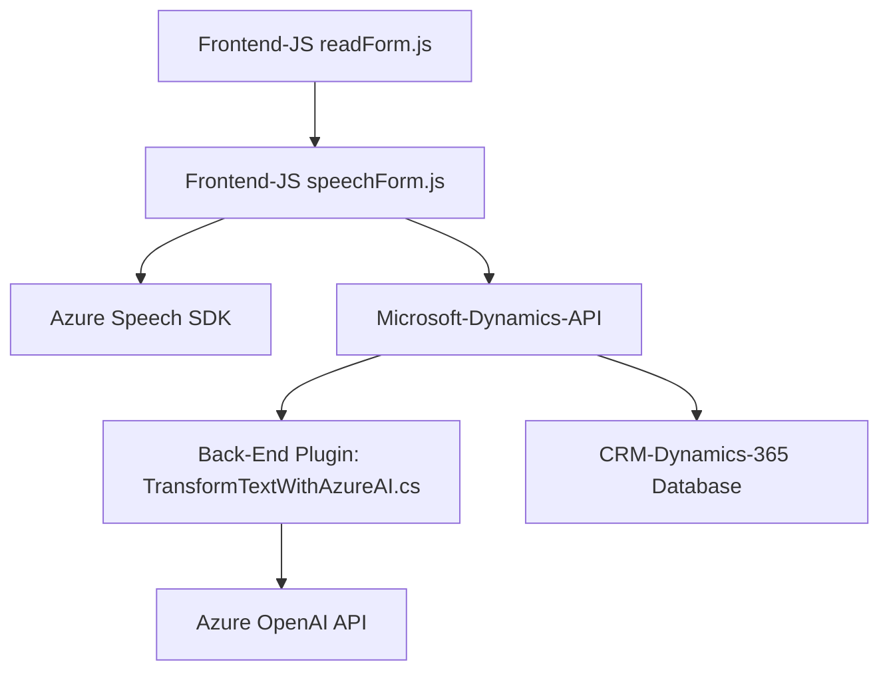

### Breve resumen técnico:

El repositorio incluye archivos destinados a la interacción entre un sistema CRM (Dynamics 365) y servicios externos, como **Azure Speech SDK** y **Azure OpenAI API**. Estas herramientas son empleadas para habilitar funcionalidades como reconocimiento de voz, síntesis de voz y transformación de texto utilizando inteligencia artificial.

---

### Descripción de la arquitectura:

**Tipo de solución:**  
La solución puede ser clasificada en dos componentes:  
1. **Frontend:** Archivos JavaScript (`readForm.js`, `speechForm.js`) implementados para integrarse con los formularios de Microsoft Dynamics 365. Muestran una estructura modular enfocada en la manipulación de la interfaz de usuario que permite la síntesis y reconocimiento de voz en tiempo real.  
2. **Backend/plugin:** Archivo C# (`TransformTextWithAzureAI.cs`) desarrollado como un plugin para Dynamics CRM, que ejecuta lógica personalizada en el servidor y conecta con la API de Azure OpenAI.  

**Arquitectura:**  
La solución presenta una arquitectura basada en **n capas** con integración de terceros:  
1. **Frontend (Presentation Layer):** Utiliza JavaScript para interactuar con formularios dinámicos en Dynamics 365.  
2. **Backend (Application Layer):** Plugin de Dynamics CRM en C# que integra el servicio Azure OpenAI para procesamiento y transformación de texto.  
3. **Integration Layer:** Comunicación entre frontend, backend y servicios externos como Azure Speech SDK y API de Dynamics 365.  

---

### Tecnologías y patrones utilizados:

**Tecnologías:**  
1. **Azure Speech SDK:** Para la síntesis de voz y reconocimiento de voz.  
2. **Azure OpenAI API:** Para la transformación de texto mediante IA.  
3. **Microsoft Dynamics 365 API:** Para la manipulación de datos y formularios en el CRM.  

**Frameworks:**  
- **JavaScript**: Base del frontend.  
- **C#/.NET**: Backend.  

**Patrones arquitectónicos:**  
1. **Modular Design:** Separación de funciones y responsabilidades en los scripts JavaScript para facilitar el mantenimiento y reutilización.  
2. **Facade pattern:** Simplificación de interacciones complejas con el SDK y APIs mediante funciones encapsuladas.  
3. **Plugin Architecture:** Implementación del patrón definido por Dynamics CRM mediante `IPlugin`.  
4. **Integration pattern:** Comunicación con servicios externos como Azure Speech y OpenAI para tareas específicas.  
5. **Asynchronous Programming:** Uso de promesas y callbacks para manejar operaciones dependientes de servicios externos.  

---

### Dependencias o componentes externos:

**1. Externas:**  
   - **Azure Speech SDK:** Cargado dinámicamente desde la URL de Microsoft (`https://aka.ms/csspeech/jsbrowserpackageraw`).  
   - **Azure OpenAI API:** Usada dentro del plugin de Dynamics CRM para transformación de texto.  
   - **HTTP client libraries:** Para enviar y procesar solicitudes HTTP en el plugin (`System.Net.Http`).  

**2. Internas:**  
   - **Microsoft Dynamics 365 API (`Xrm.WebApi`)**  
   - **Newtonsoft.Json.Linq:** Manejo del JSON para integrar respuestas entre el backend y los servicios externos.  

---

### Diagrama Mermaid:

---

### Conclusión final:

La solución presentada define una integración entre un sistema de Microsoft Dynamics 365 y funcionalidades avanzadas de inteligencia artificial provistas por **Azure Speech SDK** y **Azure OpenAI API**. Utiliza una arquitectura de **n capas** y aplica patrones como modularidad, facade y asincronía para optimizar la interacción entre un frontend dinámico basado en JavaScript y un backend implementado como plugin en C#.

Su diseño es adecuado para entornos corporativos que requieren enriquecimiento de formularios mediante voz y automatización de procesos dinámicos con IA. Sin embargo, algunas áreas que podrían ser optimizadas incluyen la adición de tests unitarios/mocks para garantizar la estabilidad ante cambios en servicios externos y mejoras en documentación o logging para depuración más sencilla.