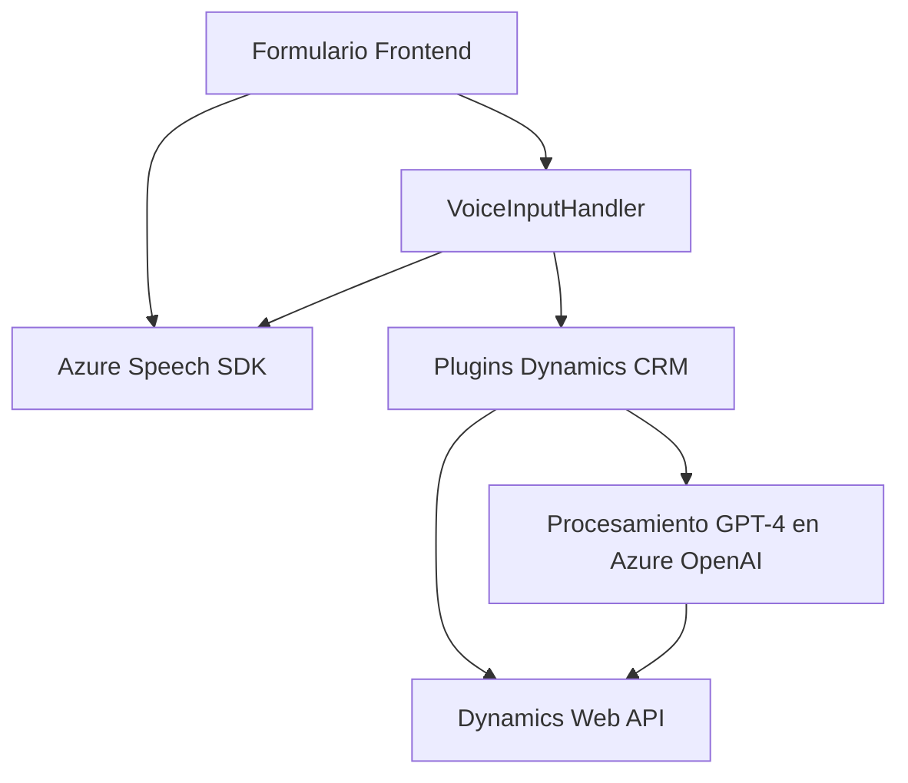

### Breve resumen técnico:
El repositorio presentado incluye tres componentes principales:
1. **Frontend:** Basado en JavaScript, para generar síntesis de voz usando Azure Speech SDK. Implementa lógica de interacción con formularios y entrada por voz.
2. **Plugin para Dynamics CRM:** Desarrollado en C#, para transformar texto utilizando Azure OpenAI Service y mejorar las interacciones en Dynamics mediante IA.
3. **Interacción con APIs**: Todo se centra en utilizar servicios de Azure como Speech SDK y OpenAI (GPT-4).

### Descripción de arquitectura:
La solución tiene una arquitectura **híbrida centrada en servicios**, donde:
1. El **Frontend** sigue un modelo modular con funciones independientes que se integran a través de APIs de Azure Speech.
2. El **Backend/Plugin** está diseñado bajo el enfoque de **Plugin Architecture** para extender Dynamics CRM directamente.
3. Los archivos interactúan con servicios externos distribuidos en Azure, lo que refuerza el enfoque de **arquitectura basada en servicios**.

### Tecnologías usadas:
- **Frontend:** JavaScript, Azure Speech SDK.
- **Backend Plugin:** C#, Dynamics CRM SDK, Azure OpenAI Service.
- **Servicios externos:** Dynamics CRM Web API, Azure Cloud services (Speech, OpenAI).
- **Librerías adicionales:** `System.Net.Http`, `System.Text.Json`, `Newtonsoft.Json`.

### Dependencias o componentes externos presentes:
1. **Azure Speech SDK:** Para manejo de síntesis de voz.
2. **Azure OpenAI Service:** Para procesamiento de lenguaje natural usando GPT-4.
3. **Dynamics CRM SDK:** Para extender CRM y manipular datos internos.
4. **APIs y servicios de Azure:** Integración con servicios REST (ejemplo: transformación de texto, generación de respuestas).
5. **Librerías adicionales:** Herramientas basadas en .NET para gestión de JSON y comunicación con servicios REST.

---

### Diagrama **Mermaid** válido para GitHub:

---

### Conclusión final:
La solución presentada tiene un enfoque modular y una arquitectura basada en servicios. Se divide técnicamente en partes que trabajan de forma orquestada:
1. El **Frontend** actúa como la interfaz interactiva de entrada/salida para los usuarios mediante reconocimiento de voz y manipulación del formulario.
2. Los **Plugins en Dynamics CRM** forman el núcleo lógico en el backend, extendiendo su funcionalidad con la integración IA de Azure OpenAI.
3. La solución depende en gran medida de **servicios externos en la nube** (Azure), lo que implica una arquitectura orientada a servicios.

Aunque la solución muestra un diseño inteligente y funcional, puede beneficiarse de ajustes como:
- Gestión segura de secretos mediante almacenamiento en servicios como Azure Key Vault.
- Validación de conexiones seguras para endpoints API.
- Descentralización de la lógica crítica para mejorar la escalabilidad (úsese contenedores como Docker si se aplica).

Definitivamente, este diseño es prometedor para integrar tecnologías modernas basadas en IA y voz en sistemas CRM tradicionales.